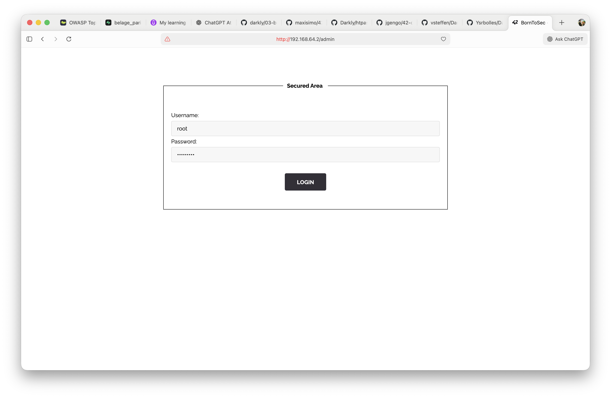

# 취약점 #1: robots.txt를 통한 민감한 데이터 노출

## 🎯 취약점 유형
**정보 노출 + 인증 우회 (Information Disclosure + Authentication Bypass)**
- **OWASP 분류**: A05:2021 - Security Misconfiguration (보안 설정 오류)
- **CWE 분류**: CWE-200 - Exposure of Sensitive Information (민감한 정보 노출)

---

## 🔍 취약점 발견 과정

### 1단계: robots.txt 확인
웹사이트에서 가장 먼저 확인해야 할 파일 중 하나가 `robots.txt`입니다.

**접속 URL**: `http://192.168.64.2/robots.txt`


**발견 내용**:
```
User-agent: *
Disallow: /whatever
Disallow: /.hidden
```

**문제점**:
- `robots.txt`는 검색엔진 크롤러에게 "이 경로는 크롤링하지 마세요"라고 알려주는 파일입니다
- 하지만 이 파일은 **누구나 접근 가능**하며, 공격자에게 **숨겨진 디렉토리의 위치**를 알려주는 로드맵 역할을 합니다
- 보안 메커니즘으로 사용되어서는 안 됩니다!

### 2단계: 금지된 디렉토리 탐색
robots.txt에서 발견한 `/whatever/` 경로로 이동해봤습니다.

**접속 URL**: `http://192.168.64.2/whatever/`


**발견 내용**:
- 디렉토리 리스팅이 **활성화**되어 있어 폴더 내 모든 파일이 보입니다
- `htpasswd` 파일 (38 bytes, 2021년 6월 29일)이 노출되어 있습니다

**문제점**:
- **디렉토리 리스팅**은 웹 서버의 기본 설정 오류입니다
- Apache/Nginx에서 `Options -Indexes` 설정을 해야 이를 막을 수 있습니다

### 3단계: 인증 정보 파일 다운로드
`htpasswd` 파일을 다운로드했습니다.

**접속 URL**: `http://192.168.64.2/whatever/htpasswd`

**파일 내용**:
```
root:437394baff5aa33daa618be47b75cb49
```

**분석**:
- `root`: 사용자 이름
- `437394baff5aa33daa618be47b75cb49`: 비밀번호의 해시값 (32자 = MD5)

**문제점**:
1. **htpasswd 파일이 웹 루트에 노출**: 이 파일은 웹 서버의 public 디렉토리 밖에 있어야 합니다
2. **MD5 해싱 사용**: MD5는 2004년부터 취약한 것으로 알려진 해시 알고리즘입니다
3. **Salt 없음**: 레인보우 테이블 공격에 취약합니다

### 4단계: MD5 해시 크랙
온라인 해시 크랙 서비스를 이용해 비밀번호를 복호화했습니다.

**사용 도구**: [CrackStation.net](https://crackstation.net/)


**결과**:
- 해시값 `437394baff5aa33daa618be47b75cb49`
- 실제 비밀번호: **`qwerty123@`**

**왜 크랙이 가능했나?**:
- MD5는 일방향 해시 함수이지만, 많이 사용되는 비밀번호는 이미 데이터베이스에 저장되어 있습니다
- CrackStation은 수십억 개의 해시값을 저장한 데이터베이스를 가지고 있습니다
- `qwerty123@`는 흔한 패턴 (단어 + 숫자 + 특수문자)이라 데이터베이스에 포함되어 있었습니다

### 5단계: 관리자 페이지 발견
일반적으로 웹사이트의 관리자 페이지는 예측 가능한 경로에 위치합니다.

**시도한 경로**: `http://192.168.64.2/admin/`



**발견 내용**:
- "Secured Area" 라는 제목의 로그인 폼 발견
- Username과 Password 입력란이 있습니다

**문제점**:
- `/admin`, `/administrator`, `/login` 같은 **예측 가능한 경로** 사용
- 접근 제어 없이 누구나 로그인 페이지에 접근 가능
- IP 제한이나 추가 보안 계층이 없습니다

### 6단계: 인증 우회 성공
앞서 크랙한 인증 정보로 로그인을 시도했습니다.

**입력 정보**:
- Username: `root`
- Password: `qwerty123@`

**결과**: ✅ **로그인 성공!** 플래그 획득

**Flag**: `d19b4823e0d5600ceed56d5e896ef328d7a2b9e7ac7e80f4fcdb9b10bcb3e7ff`

---

## 💥 공격 체인 (Attack Chain)

이 취약점은 **여러 보안 실수가 연쇄적으로 연결**되어 발생했습니다:

```
robots.txt (정보 노출)
    ↓
/whatever/ 발견 (디렉토리 리스팅)
    ↓
htpasswd 파일 다운로드 (민감 파일 노출)
    ↓
MD5 해시 크랙 (약한 해싱)
    ↓
/admin/ 로그인 (예측 가능한 경로)
    ↓
완전한 관리자 권한 획득
```

**핵심 교훈**: 보안은 가장 약한 고리만큼만 강합니다. 한 곳의 실수가 전체 시스템을 위험에 빠뜨릴 수 있습니다.

---

## 🛡️ 보안 문제 상세 분석

### 1️⃣ robots.txt의 잘못된 사용
**문제**:
- robots.txt는 검색엔진 크롤러를 위한 가이드일 뿐, 보안 메커니즘이 아닙니다
- 공격자는 robots.txt를 무시하고 숨겨진 경로에 접근할 수 있습니다
- 오히려 "여기에 중요한 것이 있다"고 광고하는 격입니다

**영향**:
- 숨기고 싶은 디렉토리가 오히려 공개됩니다
- 공격자에게 탐색 시간을 절약시켜줍니다

### 2️⃣ 디렉토리 리스팅 활성화
**문제**:
- Apache/Nginx 기본 설정에서는 `index.html`이 없으면 파일 목록을 보여줍니다
- `/whatever/` 디렉토리에 인덱스 파일이 없어 모든 파일이 노출되었습니다

**영향**:
- 공격자가 서버의 파일 구조를 한눈에 파악할 수 있습니다
- 백업 파일, 설정 파일 등 민감한 파일이 노출될 수 있습니다

### 3️⃣ 민감 파일이 웹 루트에 위치
**문제**:
- `htpasswd` 파일은 인증 정보를 담고 있어 절대로 공개되어서는 안 됩니다
- 웹 서버가 접근할 수 있는 위치에는 두되, 웹 브라우저가 직접 접근할 수 없는 곳에 위치해야 합니다

**올바른 위치 예시**:
```
❌ 잘못됨: /var/www/html/whatever/htpasswd
✅ 올바름: /etc/apache2/.htpasswd
```

### 4️⃣ 약한 해싱 알고리즘 (MD5)
**문제**:
- MD5는 1991년에 만들어진 오래된 알고리즘입니다
- 2004년 이후로 충돌 공격이 가능한 것으로 알려졌습니다
- 현대의 GPU로는 초당 수십억 개의 MD5 해시를 계산할 수 있습니다

**현대적 대안**:
- `bcrypt`: 느린 해싱으로 brute force 공격을 어렵게 만듭니다
- `Argon2`: 2015년 암호 해싱 대회 우승 알고리즘
- `scrypt`: 메모리 기반 해싱으로 GPU 공격 방어

### 5️⃣ 약한 비밀번호
**문제**:
- `qwerty123@`는 일반적인 패턴입니다: `[단어][숫자][특수문자]`
- 사전에 있는 단어를 사용했습니다
- 길이가 짧습니다 (11자)

**더 강한 비밀번호 예시**:
```
❌ 약함: qwerty123@
✅ 강함: Tr0ub4dor&3 (xkcd 스타일)
✅ 더 강함: correct-horse-battery-staple (긴 패스프레이즈)
✅ 가장 강함: Q7$mK9#nP2@xL5&wR8^tY3! (랜덤 + 긴 길이)
```

### 6️⃣ 예측 가능한 관리자 경로
**문제**:
- `/admin`, `/administrator`, `/login`은 가장 먼저 시도되는 경로입니다
- 추가 보안 계층이 없습니다 (IP 제한, 2FA, rate limiting 등)

**개선 방안**:
- 예측하기 어려운 경로 사용: `/x7k9m2p5/`
- IP 화이트리스트 적용
- 2단계 인증 (2FA) 필수화
- Rate limiting으로 brute force 방지

---

## 🔧 재현 방법 (평가 시 시연용)

### 방법 1: curl 명령어로 재현

```bash
# 1단계: robots.txt 확인
curl http://192.168.64.2/robots.txt
# 출력: Disallow: /whatever

# 2단계: 디렉토리 리스팅 확인
curl http://192.168.64.2/whatever/
# 출력: htpasswd 파일 목록

# 3단계: htpasswd 다운로드
curl http://192.168.64.2/whatever/htpasswd
# 출력: root:437394baff5aa33daa618be47b75cb49

# 4단계: 해시 타입 확인
echo "437394baff5aa33daa618be47b75cb49" | wc -c
# 출력: 32 (MD5 해시)

# 5단계: 온라인 크랙
# https://crackstation.net/ 방문
# 해시 입력 → 결과: qwerty123@

# 6단계: 관리자 페이지 확인
curl -I http://192.168.64.2/admin/
# 출력: 200 OK (페이지 존재)

# 7단계: 브라우저로 로그인
# http://192.168.64.2/admin/
# Username: root
# Password: qwerty123@
```

### 방법 2: dirb로 디렉토리 스캔

```bash
# 자동화된 디렉토리 스캔 도구
dirb http://192.168.64.2/ /usr/share/dirb/wordlists/common.txt

# 발견되는 경로들:
# - /admin/
# - /whatever/
# - /robots.txt
# ... 등등
```

---

## 🩹 해결 방법 (Remediation)

### 즉시 조치 사항

#### 1. htpasswd 파일 이동 및 권한 설정
```bash
# 웹 루트 밖으로 이동
sudo mv /var/www/html/whatever/htpasswd /etc/apache2/.htpasswd

# 파일 권한 제한 (읽기 전용, 소유자만)
sudo chmod 640 /etc/apache2/.htpasswd
sudo chown www-data:www-data /etc/apache2/.htpasswd
```

#### 2. 디렉토리 리스팅 비활성화
**Apache 설정** (`/etc/apache2/apache2.conf` 또는 `.htaccess`):
```apache
<Directory /var/www/html>
    Options -Indexes
    # 또는
    Options -Indexes +FollowSymLinks
</Directory>
```

**Nginx 설정** (`/etc/nginx/sites-available/default`):
```nginx
location / {
    autoindex off;
}
```

#### 3. 강력한 비밀번호 해싱 사용
```bash
# bcrypt 알고리즘 사용 (권장)
sudo htpasswd -c -B /etc/apache2/.htpasswd root

# 새 비밀번호 입력 요청됨
# 예: W8$mK9#nP2@xL5&wR3^tY7!q (최소 16자)
```

#### 4. robots.txt 수정
**잘못된 방법** (현재):
```
User-agent: *
Disallow: /whatever
```

**올바른 방법 1**: 민감한 경로를 robots.txt에 넣지 않기
```
User-agent: *
Disallow: /temp/
Disallow: /cache/
# /admin, /whatever 같은 민감한 경로는 명시하지 않음
```

**올바른 방법 2**: 웹 서버 설정으로 접근 제어
```apache
<Directory /var/www/html/admin>
    AuthType Basic
    AuthName "Restricted Area"
    AuthUserFile /etc/apache2/.htpasswd
    Require valid-user
</Directory>
```

### 장기적 보안 강화

#### 1. 관리자 페이지 추가 보호
```apache
<Directory /var/www/html/admin>
    # 기본 인증
    AuthType Basic
    AuthName "Admin Area"
    AuthUserFile /etc/apache2/.htpasswd
    Require valid-user

    # IP 제한 추가
    Require ip 192.168.1.0/24
    Require ip 10.0.0.0/8

    # 또는 특정 IP만 허용
    # Require ip 192.168.1.100
</Directory>
```

#### 2. Rate Limiting 설정 (Brute Force 방지)
**Apache (mod_evasive 사용)**:
```apache
<IfModule mod_evasive20.c>
    DOSHashTableSize    3097
    DOSPageCount        10
    DOSSiteCount        50
    DOSPageInterval     1
    DOSSiteInterval     1
    DOSBlockingPeriod   10
</IfModule>
```

**Nginx (limit_req 사용)**:
```nginx
# nginx.conf에 추가
limit_req_zone $binary_remote_addr zone=login:10m rate=5r/m;

location /admin/ {
    limit_req zone=login burst=5 nodelay;
}
```

#### 3. 보안 헤더 추가
```apache
Header set X-Content-Type-Options "nosniff"
Header set X-Frame-Options "DENY"
Header set X-XSS-Protection "1; mode=block"
Header set Strict-Transport-Security "max-age=31536000; includeSubDomains"
```

#### 4. 2단계 인증 (2FA) 구현
- Google Authenticator 통합
- SMS 기반 OTP
- Email 기반 확인

#### 5. 로그 모니터링 설정
```bash
# 로그인 실패 모니터링
sudo tail -f /var/log/apache2/error.log | grep "authentication failure"

# fail2ban 설정으로 자동 차단
sudo apt-get install fail2ban
```

---

## 📚 추가 학습 자료

### OWASP 리소스
- [OWASP Top 10 2021 - A05: Security Misconfiguration](https://owasp.org/Top10/A05_2021-Security_Misconfiguration/)
- [OWASP Authentication Cheat Sheet](https://cheatsheetseries.owasp.org/cheatsheets/Authentication_Cheat_Sheet.html)

### CWE 참고
- [CWE-200: Exposure of Sensitive Information](https://cwe.mitre.org/data/definitions/200.html)
- [CWE-521: Weak Password Requirements](https://cwe.mitre.org/data/definitions/521.html)

### 도구 문서
- [Apache htpasswd 공식 문서](https://httpd.apache.org/docs/2.4/programs/htpasswd.html)
- [Nginx 인증 가이드](https://docs.nginx.com/nginx/admin-guide/security-controls/configuring-http-basic-authentication/)

---

## 📊 요약

### 취약점 체인
| 단계 | 취약점 | 위험도 |
|------|--------|--------|
| 1 | robots.txt 정보 노출 | 낮음 |
| 2 | 디렉토리 리스팅 활성화 | 중간 |
| 3 | 민감 파일 공개 노출 | 높음 |
| 4 | 약한 MD5 해싱 | 높음 |
| 5 | 약한 비밀번호 | 높음 |
| 6 | 예측 가능한 관리자 경로 | 중간 |
| **최종** | **완전한 인증 우회** | **치명적** |

### CVSS 3.1 점수
**9.1 (Critical)**
- **공격 복잡도**: 낮음 (Low) - 누구나 쉽게 재현 가능
- **필요 권한**: 없음 (None) - 인증 없이 공격 가능
- **사용자 상호작용**: 없음 (None) - 자동화 가능
- **영향**: 높음 (High) - 관리자 권한 획득

---

## 🏁 Flag
```
d19b4823e0d5600ceed56d5e896ef328d7a2b9e7ac7e80f4fcdb9b10bcb3e7ff
```

---

**발견 일시**: 2025년 10월 31일
**심각도**: CRITICAL (치명적)
**재현 난이도**: 매우 쉬움 (자동화 도구 이용 가능)
