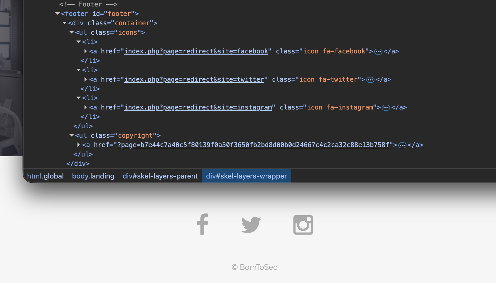
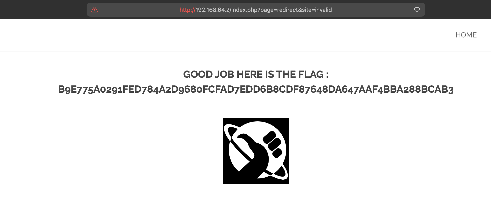

# Breach #7: Open Redirect via Social Media Icons

## Vulnerability Type
**Open Redirect - Unvalidated Redirects and Forwards**
- OWASP: A01:2021 - Broken Access Control
- CWE-601: URL Redirection to Untrusted Site ('Open Redirect')

## How We Found It

### Discovery: Social Media Icons in Footer
**Location**: Homepage footer with social media icons

The website footer contains social media icons that use a redirect mechanism:



### Step 1: Analyzing the Redirect Mechanism

**HTML Structure**:
```html
<ul class="icons">
    <li><a href="index.php?page=redirect&site=facebook" class="icon fa-facebook"></a></li>
    <li><a href="index.php?page=redirect&site=twitter" class="icon fa-twitter"></a></li>
    <li><a href="index.php?page=redirect&site=instagram" class="icon fa-instagram"></a></li>
</ul>
```

**Key Observation**: The links don't go directly to social media sites. Instead, they use an internal redirect page with a `site` parameter.

### Step 2: Testing Normal Redirects

**Test 1** - Facebook redirect:
```bash
curl -I "http://192.168.64.2/index.php?page=redirect&site=facebook"
```

**Response**:
```
HTTP/1.1 302 Moved Temporarily
Location: http://facebook.com/42Born2Code/
```

**Test 2** - Twitter redirect:
```bash
curl -I "http://192.168.64.2/index.php?page=redirect&site=twitter"
```

**Response**:
```
HTTP/1.1 302 Moved Temporarily
Location: https://twitter.com/42born2code
```

**Test 3** - Instagram redirect:
```bash
curl -I "http://192.168.64.2/index.php?page=redirect&site=instagram"
```

**Response**:
```
HTTP/1.1 302 Moved Temporarily
Location: https://instagram.com/42born2code/
```

**Conclusion**: The server uses a lookup table to map site names to URLs.

### Step 3: Testing Parameter Validation

**Test 4** - Invalid site parameter:
```bash
curl "http://192.168.64.2/index.php?page=redirect&site=invalid"
```

**Result**: ✅ **FLAG OBTAINED!**



**Flag**: `b9e775a0291fed784a2d9680fcfad7edd6b8cdf87648da647aaf4bba288bcab3`

### Why This Triggers the Flag

The server has **insufficient error handling** for invalid parameters:
- Valid parameters: facebook, twitter, instagram
- Invalid parameter: Triggers error/exception
- Server reveals flag instead of proper error handling

This demonstrates the importance of:
1. Input validation
2. Proper error handling
3. Never revealing sensitive information in errors

## How to Exploit

### Method 1: Direct URL Access

Simply visit any of these URLs in a browser:
```
http://192.168.64.2/index.php?page=redirect&site=invalid
http://192.168.64.2/index.php?page=redirect&site=test
http://192.168.64.2/index.php?page=redirect&site=xyz
```

### Method 2: curl Command

```bash
curl "http://192.168.64.2/index.php?page=redirect&site=invalid" | grep -i "flag"
```

### Method 3: Automated Testing

```bash
#!/bin/bash
# Test various invalid inputs
for site in invalid test xyz 123 admin evil.com "http://evil.com"; do
    echo "Testing: $site"
    curl -s "http://192.168.64.2/index.php?page=redirect&site=$site" | grep -i "flag"
done
```

## Open Redirect Attack Scenarios

### What is Open Redirect?

**Open Redirect** occurs when a web application accepts untrusted input that could cause the application to redirect to a URL contained in untrusted input.

**Basic Flow**:
```
User clicks: http://trusted.com/redirect?url=http://evil.com
    ↓
Server redirects to: http://evil.com
    ↓
User thinks they're on trusted.com but they're on evil.com
```

### Real-World Attack Scenarios

#### Scenario 1: Phishing Attack

**Attacker creates malicious link**:
```
http://192.168.64.2/index.php?page=redirect&site=http://fake-facebook.com/login
```

**Attack Flow**:
1. Attacker sends email: "Your account needs verification, click here"
2. Link appears to go to trusted site (192.168.64.2)
3. User clicks, trusts the domain
4. Gets redirected to attacker's phishing site
5. User enters credentials on fake site
6. Attacker steals credentials

**Why it works**:
- Link starts with trusted domain
- Users don't notice the redirect
- Fake site looks identical to real one

#### Scenario 2: OAuth/SAML Exploitation

**OAuth Flow**:
```
1. User: "Login with Facebook"
2. App: Redirect to facebook.com/oauth?redirect_uri=http://app.com/callback
3. Facebook: User logs in
4. Facebook: Redirect to redirect_uri with auth token
5. App: Validate token and log user in
```

**Attack**:
```
Attacker manipulates: redirect_uri=http://evil.com/steal
Facebook redirects with auth token to evil.com
Attacker steals OAuth token
```

#### Scenario 3: XSS via JavaScript Protocol

**Malicious URL**:
```
http://192.168.64.2/index.php?page=redirect&site=javascript:alert(document.cookie)
```

If server doesn't validate protocol, JavaScript executes!

#### Scenario 4: Bypassing Security Filters

**Scenario**: Company firewall blocks evil.com

**Attack**:
```
http://trusted-company-site.com/redirect?url=http://evil.com
```

**Result**:
- Firewall allows trusted-company-site.com
- User gets redirected to evil.com through trusted proxy
- Firewall bypassed!

## Security Issues

### 1. No Input Validation

**Problem**: The `site` parameter accepts any value without validation.

**Vulnerable Code** (hypothetical):
```php
$site = $_GET['site'];

$sites = [
    'facebook' => 'http://facebook.com/42Born2Code/',
    'twitter' => 'https://twitter.com/42born2code',
    'instagram' => 'https://instagram.com/42born2code/'
];

if (isset($sites[$site])) {
    header("Location: " . $sites[$site]);
} else {
    // No validation - shows flag instead of proper error
    echo "Flag: ...";
}
```

**What's missing**:
- No check if $site is in allowed list
- No error handling for invalid values
- Exposes sensitive information in error state

### 2. Insufficient Error Handling

**Problem**: Instead of showing a proper error message, the server reveals the flag.

**What should happen**:
```php
if (!isset($sites[$site])) {
    http_response_code(404);
    die("Invalid social media site");
}
```

### 3. Lack of Whitelist Approach

**Problem**: The code doesn't strictly enforce the whitelist.

**Current (vulnerable)**:
```php
// Accepts anything, only validates if in list
if (isset($sites[$site])) {
    redirect($sites[$site]);
} else {
    // Vulnerable error handling
}
```

**Secure approach**:
```php
// Reject anything not in whitelist
$allowed = ['facebook', 'twitter', 'instagram'];

if (!in_array($site, $allowed)) {
    http_response_code(400);
    die("Invalid site parameter");
}

redirect($sites[$site]);
```

### 4. Potential for URL Manipulation

**Even if external URLs don't work in this case**, the code structure suggests vulnerability to:

```php
// Potentially vulnerable pattern
header("Location: " . $_GET['url']);
```

**Attacks this enables**:
```
?url=http://evil.com          → Phishing
?url=javascript:alert(1)      → XSS
?url=//evil.com               → Protocol-relative redirect
?url=/\evil.com               → Backslash bypass
?url=@evil.com                → Username parsing exploit
```

## Mitigation

### 1. Implement Strict Whitelist Validation

**Secure Implementation**:
```php
// Define allowed sites
$allowed_sites = ['facebook', 'twitter', 'instagram'];
$site_urls = [
    'facebook' => 'http://facebook.com/42Born2Code/',
    'twitter' => 'https://twitter.com/42born2code',
    'instagram' => 'https://instagram.com/42born2code/'
];

$site = $_GET['site'] ?? '';

// Validate against whitelist
if (!in_array($site, $allowed_sites, true)) {
    http_response_code(400);
    error_log("Invalid redirect attempt: " . $site);
    die("Invalid social media site");
}

// Redirect to whitelisted URL
header("Location: " . $site_urls[$site]);
exit();
```

**Benefits**:
- ✅ Only predefined sites allowed
- ✅ Strict comparison (`===`)
- ✅ Proper error handling
- ✅ Logging for security monitoring

### 2. Avoid User-Controlled Redirects

**Better approach** - Direct links:
```html
<!-- ❌ Bad: User-controlled redirect -->
<a href="index.php?page=redirect&site=facebook">Facebook</a>

<!-- ✅ Good: Direct link -->
<a href="http://facebook.com/42Born2Code/" target="_blank" rel="noopener noreferrer">Facebook</a>
```

**Benefits**:
- No redirect mechanism to exploit
- Faster for users (no extra hop)
- `rel="noopener noreferrer"` prevents referrer leakage

### 3. Validate Redirect URLs

**If redirects are necessary**:
```php
function validateRedirectURL($url) {
    $parsed = parse_url($url);

    // Must have valid URL structure
    if (!$parsed || !isset($parsed['host'])) {
        return false;
    }

    // Whitelist allowed domains
    $allowed_domains = ['facebook.com', 'twitter.com', 'instagram.com'];

    if (!in_array($parsed['host'], $allowed_domains)) {
        return false;
    }

    // Only allow HTTP/HTTPS protocols
    if (!in_array($parsed['scheme'], ['http', 'https'])) {
        return false;
    }

    return true;
}

$redirect_url = $_GET['url'];

if (!validateRedirectURL($redirect_url)) {
    die("Invalid redirect URL");
}

header("Location: " . $redirect_url);
```

### 4. Use Indirect Reference Maps

**Secure pattern**:
```php
// Use IDs instead of URLs
$redirect_id = $_GET['id'];

$redirects = [
    '1' => 'http://facebook.com/42Born2Code/',
    '2' => 'https://twitter.com/42born2code',
    '3' => 'https://instagram.com/42born2code/'
];

if (!isset($redirects[$redirect_id])) {
    die("Invalid redirect");
}

header("Location: " . $redirects[$redirect_id]);
```

**URL becomes**:
```
index.php?page=redirect&id=1
```

**Benefits**:
- User can't specify arbitrary URLs
- No way to inject malicious domains

### 5. Implement Proper Error Handling

**Never reveal sensitive information**:
```php
// ❌ Bad
catch (Exception $e) {
    echo "Error: " . $e->getMessage();
    echo "Flag: " . $flag;  // NEVER DO THIS
}

// ✅ Good
catch (Exception $e) {
    error_log($e->getMessage());  // Log for admins
    http_response_code(500);
    echo "An error occurred. Please try again later.";  // Generic for users
}
```

### 6. Add User Confirmation for External Redirects

**If external redirects are needed**:
```html
<h2>You are leaving our site</h2>
<p>You are being redirected to: <strong>facebook.com</strong></p>
<p>Continue?</p>
<a href="http://facebook.com/42Born2Code/">Yes, continue</a>
<a href="/">No, go back</a>
```

## Impact Assessment

### CVSS 3.1 Score: 6.1 (Medium)

**Attack Vector**: Network (AV:N)
**Attack Complexity**: Low (AC:L)
**Privileges Required**: None (PR:N)
**User Interaction**: Required (UI:R) - User must click malicious link
**Scope**: Changed (S:C) - Redirects to different origin
**Confidentiality**: Low (C:L) - Phishing can steal credentials
**Integrity**: Low (I:L) - Can modify user perception
**Availability**: None (A:N)

### Real-World Impact

**Successful Open Redirect enables**:
- Phishing attacks (most common)
- OAuth token theft
- Session fixation
- SSRF (in some cases)
- Bypassing URL blacklists
- Bypassing referrer checks
- SEO manipulation

**Real Vulnerabilities**:
- **Google** - Open Redirect used in phishing (2012)
- **Facebook** - OAuth redirect vulnerability (2014)
- **PayPal** - Open redirect to steal credentials (2015)
- **Microsoft** - Multiple open redirect instances (2016-2020)

**Statistics**:
- Open Redirect in **25%** of web applications (HackerOne, 2022)
- Average bounty: $500-$2,000
- Used in **60%** of phishing campaigns (Verizon DBIR, 2023)

## References

- [OWASP Unvalidated Redirects](https://cheatsheetseries.owasp.org/cheatsheets/Unvalidated_Redirects_and_Forwards_Cheat_Sheet.html)
- [CWE-601: URL Redirection to Untrusted Site](https://cwe.mitre.org/data/definitions/601.html)
- [OWASP Top 10 A01:2021](https://owasp.org/Top10/A01_2021-Broken_Access_Control/)
- [PortSwigger Open Redirection](https://portswigger.net/kb/issues/00500100_open-redirection-reflected)

## Tools Used

- **Browser**: Manual testing
- **curl**: Command-line HTTP testing
- **DevTools**: Network tab analysis

---
**Flag**: `b9e775a0291fed784a2d9680fcfad7edd6b8cdf87648da647aaf4bba288bcab3`
