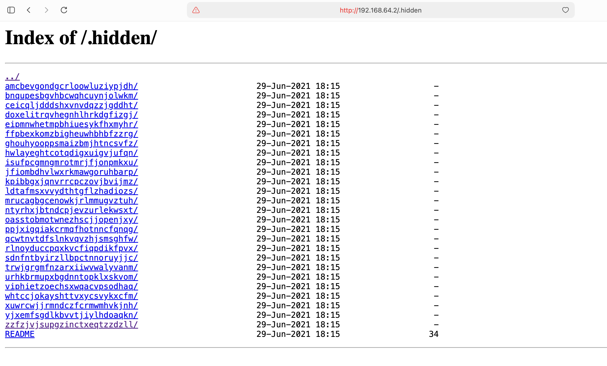
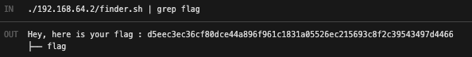

# Breach #08: Hidden Directory Exposure

## Vulnerability Overview

**Vulnerability Type**: Information Disclosure, Directory Indexing
**Risk Level**: Medium
**Attack Vector**: Web Crawling, Forced Browsing

The website exposes a hidden directory `/.hidden/` that contains sensitive information. Although `robots.txt` indicates this directory should not be crawled, it is not a security mechanism and can be easily bypassed.

## Discovery Process

### Step 1: Check robots.txt
**URL**: `http://192.168.64.2/robots.txt`

**Content**:
```
User-agent: *
Disallow: /whatever
Disallow: /.hidden
```

The `robots.txt` file reveals the existence of a `/.hidden` directory.

**Key Insight**: `robots.txt` is a recommendation for web crawlers, not a security control. It does not prevent direct access.


### Step 2: Access the Hidden Directory
**URL**: `http://192.168.64.2/.hidden/`

The directory is accessible and shows directory indexing is enabled, revealing numerous subdirectories.



### Step 3: Recursive Download
Use `wget` to recursively download all files from the `.hidden` directory:

```bash
wget --recursive --no-parent --execute robots=off http://192.168.64.2/.hidden/
```

**Command Breakdown**:
- `--recursive`: Download directory contents recursively
- `--no-parent`: Don't ascend to parent directories
- `--execute robots=off`: Ignore robots.txt restrictions

### Step 4: Search for the Flag
The downloaded directory structure contains multiple `README` files. Use the finder script to locate the flag:

```bash
./192.168.64.2/finder.sh | grep flag
```

**Result**:
```
Hey, here is your flag : d5eec3ec36cf80dce44a896f961c1831a05526ec215693c8f2c39543497d4466
```



## Vulnerability Explanation

### What is Directory Indexing?
Directory indexing occurs when a web server lists the contents of a directory when no index file (like `index.html`) is present. This allows users to browse and access all files in that directory.

### Why is robots.txt Not Security?
`robots.txt` is part of the [Robots Exclusion Protocol](https://en.wikipedia.org/wiki/Robots_exclusion_standard):
- **Purpose**: Polite suggestion for search engine crawlers
- **Not Enforced**: Any client can ignore it
- **Information Leak**: Reveals locations you want to hide
- **Common Misconception**: Often mistaken as access control

### Security Issues
1. **Information Disclosure**: Sensitive files accessible to anyone
2. **Directory Traversal**: Easy to explore entire structure
3. **No Authentication**: Public access to "hidden" content
4. **robots.txt Paradox**: Advertising hidden locations

## Prevention Measures

### 1. Disable Directory Indexing
**Apache (.htaccess)**:
```apache
Options -Indexes
```

**Nginx (nginx.conf)**:
```nginx
autoindex off;
```

### 2. Implement Proper Access Control
- Use `.htaccess` or server configuration for authentication
- Implement application-level access controls
- Use proper file permissions

### 3. Don't Rely on robots.txt for Security
```
❌ Wrong: Using robots.txt to "hide" sensitive directories
✅ Correct: Using authentication and authorization mechanisms
```

### 4. Secure Directory Structure
- Store sensitive files outside web root
- Use proper authentication for private content
- Implement whitelist-based access control

## References

- [OWASP - Forced Browsing](https://owasp.org/www-community/attacks/Forced_browsing)
- [CWE-548: Directory Indexing](https://cwe.mitre.org/data/definitions/548.html)
- [Robots Exclusion Protocol](https://en.wikipedia.org/wiki/Robots_exclusion_standard)

## Flag

```
d5eec3ec36cf80dce44a896f961c1831a05526ec215693c8f2c39543497d4466
```
