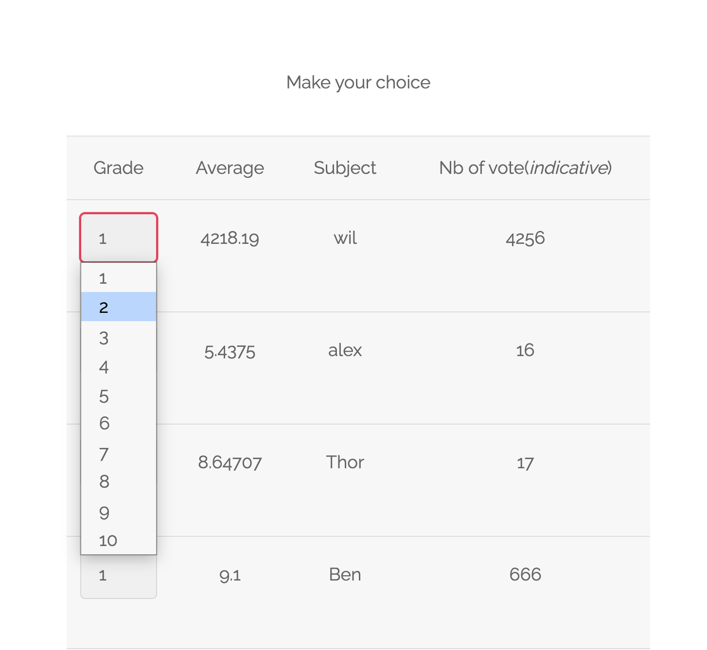
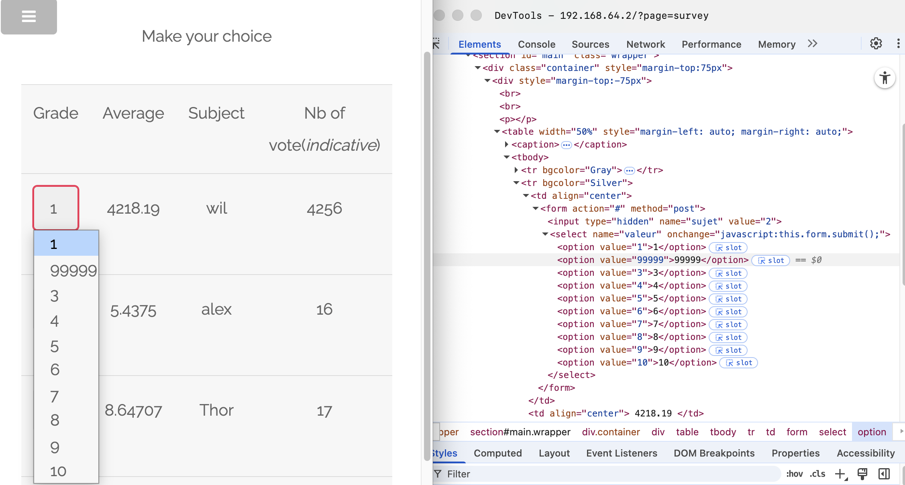
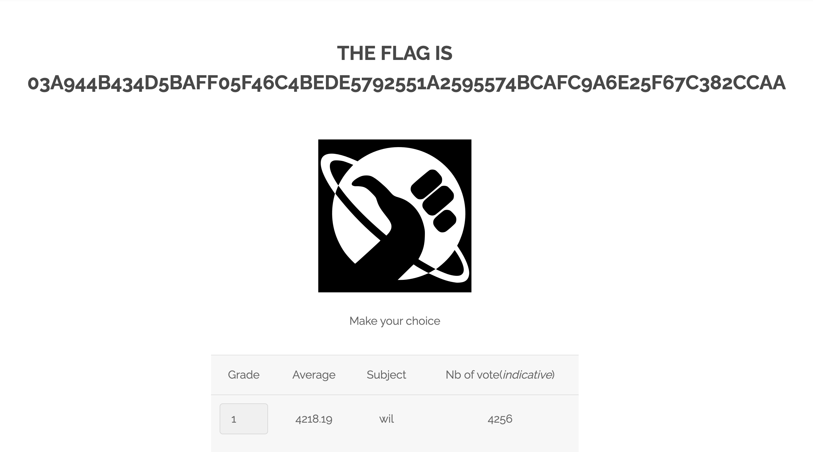

# Breach #09: 정수 입력값 검증 우회

## 취약점 개요

**취약점 유형**: 입력값 검증 우회, 클라이언트 측 보안 제어
**위험도**: 중간
**공격 벡터**: HTML 조작, 직접 HTTP 요청

설문조사 페이지가 등급 검증을 클라이언트 측에서만 구현하고 있어(HTML `max` 속성), 공격자가 HTML을 조작하거나 직접 HTTP 요청을 보내서 의도된 범위를 벗어난 값을 제출할 수 있습니다.

## 취약점 발견 과정

### 1단계: 설문조사 폼 확인
**URL**: `http://192.168.64.2/index.php?page=survey`

설문조사 페이지에는 1-10으로 제한된 등급 선택 폼이 있습니다.



### 2단계: HTML 검사
브라우저 개발자 도구로 등급 입력 요소를 검사:

```html
<select name="valeur">
  <option value="1">1</option>
  <option value="2">2</option>
  ...
  <option value="10">10</option>
</select>
```

또는 input 필드인 경우:
```html
<input type="number" name="valeur" min="1" max="10">
```

**핵심 발견**: 검증이 HTML에서만 이루어지고, 서버에서는 검증하지 않음.

### 3단계: DevTools로 우회
**방법 1: HTML 속성 수정**
1. 개발자 도구(F12) 열기
2. `valeur` 입력 요소 찾기
3. option 값 수정 (예: `value="2"`를 `value="9999"`로 변경)
4. 수정한 값(9999) 선택
5. 폼 제출



### 4단계: 플래그 획득
수정한 값을 제출하면 서버가 이를 수락하고 플래그를 반환합니다:



### 대안: curl로 우회
**방법 2: 직접 HTTP POST 요청**

프론트엔드를 완전히 우회하여 직접 POST 요청 전송:

```bash
curl -X POST http://192.168.64.2/index.php?page=survey \
     -H "Content-Type: application/x-www-form-urlencoded" \
     -d "sujet=2&valeur=100"
```

**응답**:
```html
<h2>The flag is 03a944b434d5baff05f46c4bede5792551a2595574bcafc9a6e25f67c382ccaa</h2>
```

## 취약점 상세 설명

### 클라이언트 측 vs 서버 측 검증

#### 클라이언트 측 검증 (UX 전용)
- **목적**: 사용자 경험 개선, 즉각적인 피드백 제공
- **구현**: HTML 속성(`min`, `max`, `required`), JavaScript
- **보안 가치**: **없음** - 공격자가 쉽게 우회 가능

#### 서버 측 검증 (보안)
- **목적**: 비즈니스 규칙과 보안 제약 강제
- **구현**: 백엔드 검증 로직
- **보안 가치**: **필수** - 마지막 방어선

### 신뢰 경계 문제

```
┌─────────────────┐         ┌─────────────────┐
│   브라우저       │         │   서버          │
│  (신뢰 불가)     │────────>│   (신뢰 가능)    │
└─────────────────┘         └─────────────────┘
   클라이언트 측               서버 측
      검증                      검증
   ❌ 우회 가능               ✅ 강제됨
```

**클라이언트 입력을 절대 신뢰하지 말 것** - 클라이언트로부터 받는 모든 데이터는 서버에서 검증해야 합니다.

### 이 취약점이 존재하는 이유

#### 1. 클라이언트 측 검증만 존재
**문제점**:
- HTML `max` 속성만 사용
- JavaScript 검증만 의존
- 이는 UX용이지 보안용이 아님

**우회 방법**:
- DevTools로 HTML 수정
- JavaScript 비활성화
- curl/fetch 등으로 직접 요청

#### 2. 서버 측 검증 누락
**검증 부재**:
- `valeur`에 대한 어떤 값이든 서버가 수락
- 타입 검사 없음 (정수인지)
- 범위 검증 없음 (0-10)
- 입력값 살균(sanitization) 없음

#### 3. 인증 부재
**문제점**:
- 투표 전 사용자 확인 없음
- 누구나 임의의 데이터 제출 가능
- 중복 투표 방지 메커니즘 없음

## 공격 시나리오

### 시나리오 1: 등급 조작
```bash
# 최대한 높은 등급 제출
curl -X POST http://192.168.64.2/index.php?page=survey \
     -d "sujet=1&valeur=999999"
```

**영향**: 설문조사 결과 왜곡, 통계 조작

### 시나리오 2: 음수 값
```bash
# 음수 등급 제출
curl -X POST http://192.168.64.2/index.php?page=survey \
     -d "sujet=1&valeur=-100"
```

**영향**: 평균 점수 급락, 데이터 무결성 파괴

### 시나리오 3: 비정수 값
```bash
# 비숫자 데이터 제출
curl -X POST http://192.168.64.2/index.php?page=survey \
     -d "sujet=1&valeur=abc"
```

**영향**: SQL 오류, 애플리케이션 크래시 가능

### 시나리오 4: 자동화 공격
```bash
# 대량 투표 자동화
for i in {1..1000}; do
    curl -X POST http://192.168.64.2/index.php?page=survey \
         -d "sujet=1&valeur=10"
done
```

**영향**: 투표 결과 조작, 서비스 거부 공격(DoS)

## 방어 방법

### 1. 서버 측 입력값 검증

**PHP 예시**:
```php
<?php
// 입력값 수신
$valeur = $_POST['valeur'];

// 타입 검증
if (!is_numeric($valeur)) {
    http_response_code(400);
    die(json_encode(['error' => '등급은 숫자여야 합니다']));
}

// 정수 변환
$valeur = intval($valeur);

// 범위 검증
if ($valeur < 1 || $valeur > 10) {
    http_response_code(400);
    die(json_encode(['error' => '등급은 1에서 10 사이여야 합니다']));
}

// 유효한 입력값 처리
saveGrade($valeur);
?>
```

**Node.js 예시**:
```javascript
const valeur = parseInt(req.body.valeur);

// 타입 및 범위 검증
if (isNaN(valeur) || valeur < 1 || valeur > 10) {
    return res.status(400).json({
        error: '등급은 1에서 10 사이의 정수여야 합니다'
    });
}

// 유효한 입력값 처리
saveGrade(valeur);
```

### 2. 심층 방어(Defense in Depth) 구현

```
계층 1: 클라이언트 측 (UX)
  ↓ HTML 검증, JavaScript 검사

계층 2: 서버 측 (보안) ← 필수!
  ↓ 타입 검증, 범위 검사

계층 3: 비즈니스 로직 (무결성)
  ↓ 인증, 권한 부여

계층 4: 데이터베이스 (제약)
  ↓ CHECK 제약조건, 데이터 타입
```

### 3. 검증 프레임워크 사용

**PHP with Respect/Validation**:
```php
use Respect\Validation\Validator as v;

$gradeValidator = v::intVal()->between(1, 10);

if (!$gradeValidator->validate($valeur)) {
    throw new InvalidArgumentException('유효하지 않은 등급입니다');
}
```

**Node.js with Joi**:
```javascript
const Joi = require('joi');

const schema = Joi.object({
    valeur: Joi.number().integer().min(1).max(10).required()
});

const { error, value } = schema.validate(req.body);
if (error) {
    return res.status(400).json({
        error: error.details[0].message
    });
}
```

### 4. 데이터베이스 수준 제약조건

```sql
CREATE TABLE survey_responses (
    id INT PRIMARY KEY AUTO_INCREMENT,
    user_id INT NOT NULL,
    subject_id INT NOT NULL,
    grade INT NOT NULL,
    created_at TIMESTAMP DEFAULT CURRENT_TIMESTAMP,

    -- 등급 범위 제약
    CHECK (grade >= 1 AND grade <= 10),

    -- 중복 투표 방지
    UNIQUE KEY unique_vote (user_id, subject_id)
);
```

### 5. 인증 및 권한 부여 구현

```php
// 설문조사 응답 수락 전 인증 필요
session_start();
if (!isset($_SESSION['user_id'])) {
    http_response_code(401);
    die(json_encode(['error' => '인증이 필요합니다']));
}

$userId = $_SESSION['user_id'];
$subjectId = intval($_POST['sujet']);

// 사용자가 이미 투표했는지 확인
if (hasUserVoted($userId, $subjectId)) {
    http_response_code(403);
    die(json_encode(['error' => '이미 투표하셨습니다']));
}

// 유효한 투표 처리
saveVote($userId, $subjectId, $valeur);
```

### 6. Rate Limiting 구현

```php
// IP 기반 요청 제한
$ip = $_SERVER['REMOTE_ADDR'];
$rateLimit = getRateLimitForIP($ip);

if ($rateLimit->isExceeded()) {
    http_response_code(429);
    die(json_encode(['error' => '너무 많은 요청입니다. 나중에 다시 시도하세요']));
}

$rateLimit->increment();
```

## 실제 영향 사례

### 유사 취약점 사례

#### 1. 가격 조작
**사례**: E-커머스 사이트가 클라이언트 측 가격 수락
```html
<!-- 클라이언트에서 수정 가능 -->
<input type="hidden" name="price" value="1000">
```
**영향**: 공격자가 $1000 제품을 $1에 구매

#### 2. 권한 상승
**사례**: 관리자 플래그를 폼 조작으로 설정
```html
<!-- DevTools로 추가 -->
<input type="hidden" name="is_admin" value="1">
```
**영향**: 일반 사용자가 관리자 권한 획득

#### 3. 재고 조작
**사례**: 재고 시스템이 음수 수량 수락
```bash
curl -X POST /api/inventory \
     -d "product_id=123&quantity=-100"
```
**영향**: 재고 관리 시스템 마비, 데이터 무결성 파괴

#### 4. 투표/평점 조작
**사례**: 서버 검증 없는 투표 시스템
```bash
# 자동화된 대량 투표
for i in {1..10000}; do
    curl -X POST /api/vote -d "rating=5&product_id=123"
done
```
**영향**: 제품 평점 인위적 조작, 경쟁 업체 방해

### 실제 발생 사건
- **2019**: 주요 전자상거래 플랫폼에서 DevTools를 통한 가격 조작 발견
- **2020**: 소셜 미디어 사이트에서 음수 "좋아요" 수 허용
- **2021**: 설문조사 플랫폼에서 클라이언트 검사 우회로 무제한 응답 가능

## 보안 체크리스트

### 개발 단계
- [ ] 모든 사용자 입력에 서버 측 검증 구현
- [ ] 타입, 범위, 형식 검증 포함
- [ ] 검증 프레임워크 사용 고려
- [ ] 데이터베이스 제약조건 설정
- [ ] 에러 메시지에 민감 정보 포함 금지

### 테스트 단계
- [ ] 범위 밖 값 테스트 (음수, 최댓값 초과)
- [ ] 타입 불일치 테스트 (문자열, 특수문자)
- [ ] SQL 인젝션 패턴 테스트
- [ ] 자동화 공격 시뮬레이션
- [ ] 인증 우회 시도

### 배포 단계
- [ ] WAF(Web Application Firewall) 설정
- [ ] Rate limiting 구현
- [ ] 로깅 및 모니터링 설정
- [ ] 침입 탐지 시스템(IDS) 구성

## 참고 자료

- [OWASP - Input Validation Cheat Sheet](https://cheatsheetseries.owasp.org/cheatsheets/Input_Validation_Cheat_Sheet.html)
- [CWE-20: Improper Input Validation](https://cwe.mitre.org/data/definitions/20.html)
- [CWE-602: Client-Side Enforcement of Server-Side Security](https://cwe.mitre.org/data/definitions/602.html)
- [OWASP Top 10 2021 - A03:2021 Injection](https://owasp.org/Top10/A03_2021-Injection/)

## 플래그

```
03a944b434d5baff05f46c4bede5792551a2595574bcafc9a6e25f67c382ccaa
```
