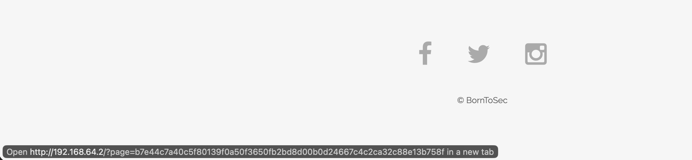
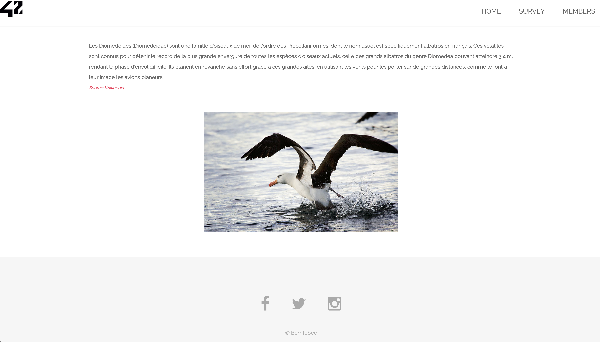
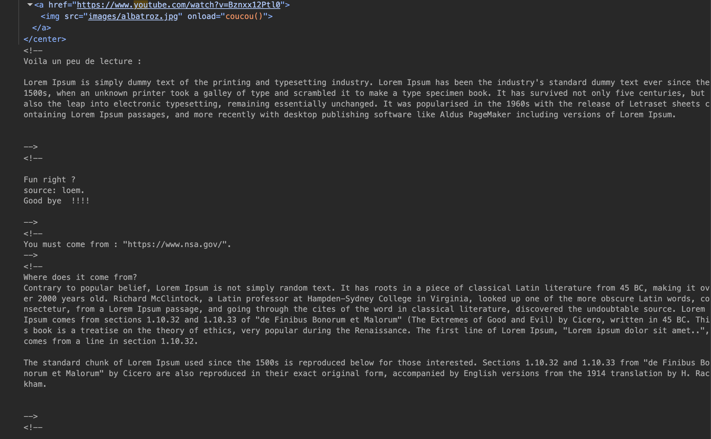
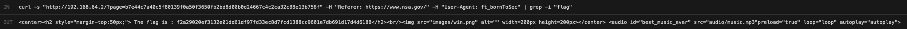

# Breach #9: HTTP Header Manipulation

## Vulnerability Type
**Insufficient HTTP Header Validation**
- OWASP: A01:2021 - Broken Access Control
- CWE-346: Origin Validation Error

## How We Found It

### Discovery: Copyright Link in Footer
**Location**: Homepage footer with copyright notice

The website footer contains a copyright link that leads to a hidden page.



**Link**: `© BornToSec` → `?page=b7e44c7a40c5f80139f0a50f3650fb2bd8d00b0d24667c4c2ca32c88e13b758f`

### Step 1: Accessing the Albatross Page

**URL**: `http://192.168.64.2/?page=b7e44c7a40c5f80139f0a50f3650fb2bd8d00b0d24667c4c2ca32c88e13b758f`



**Page Contents**:
- Albatross image
- Lorem Ipsum text
- Audio player
- No obvious flag or sensitive information

### Step 2: Analyzing HTML Source Code

**Method**: Right-click → "View Page Source"



**Key Findings in HTML Comments**:

```html
<!--
You must come from : "https://www.nsa.gov/".
-->
```

```html
<!--
Let's use this browser : "ft_bornToSec". It will help you a lot.
-->
```

**Analysis**:
- Server expects `Referer` header: `https://www.nsa.gov/`
- Server expects `User-Agent` header: `ft_bornToSec`

**Security Issue**: Sensitive access requirements exposed in HTML comments!

### Step 3: Exploiting with Modified Headers

**Command**:
```bash
curl -s 'http://192.168.64.2/?page=b7e44c7a40c5f80139f0a50f3650fb2bd8d00b0d24667c4c2ca32c88e13b758f' \
  -H 'Referer: https://www.nsa.gov/' \
  -H 'User-Agent: ft_bornToSec' \
  | grep -i flag
```



**Result**: ✅ **FLAG OBTAINED!**

**Flag**: `f2a29020ef3132e01dd61df97fd33ec8d7fcd1388cc9601e7db691d17d4d6188`

## How to Exploit

### Method 1: curl (Demonstrated)

```bash
curl 'http://192.168.64.2/?page=b7e44c7a40c5f80139f0a50f3650fb2bd8d00b0d24667c4c2ca32c88e13b758f' \
  -H 'Referer: https://www.nsa.gov/' \
  -H 'User-Agent: ft_bornToSec'
```

**Key Points**:
- `-H` flag sets custom HTTP headers
- Referer header indicates where request came from
- User-Agent header identifies the browser/client

### Method 2: Browser DevTools (Fetch API)

```javascript
fetch('?page=b7e44c7a40c5f80139f0a50f3650fb2bd8d00b0d24667c4c2ca32c88e13b758f', {
    headers: {
        'Referer': 'https://www.nsa.gov/'
        // Note: User-Agent cannot be set via JavaScript for security reasons
    }
})
.then(r => r.text())
.then(html => {
    document.body.innerHTML = html;
});
```

**Limitation**: Modern browsers block User-Agent modification via JavaScript.

### Method 3: Browser Extensions

**ModHeader (Chrome/Firefox)**:
1. Install ModHeader extension
2. Add Request Headers:
   - `Referer`: `https://www.nsa.gov/`
   - `User-Agent`: `ft_bornToSec`
3. Refresh the page
4. Flag appears

### Method 4: Burp Suite

1. Access page normally
2. Intercept request in Burp Suite
3. Modify headers:
   - Change/Add `Referer: https://www.nsa.gov/`
   - Change `User-Agent: ft_bornToSec`
4. Forward request
5. View flag in response

## Security Issues

### 1. Trusting Client-Controlled Headers

**Problem**: Server uses HTTP headers for access control.

**Vulnerable Code** (hypothetical):
```php
$referer = $_SERVER['HTTP_REFERER'] ?? '';
$userAgent = $_SERVER['HTTP_USER_AGENT'] ?? '';

// Insecure validation
if (strpos($referer, 'nsa.gov') !== false &&
    strpos($userAgent, 'ft_bornToSec') !== false) {
    echo "Flag: ...";
} else {
    echo "Access denied";
}
```

**Why it fails**:
- HTTP headers are completely controlled by the client
- Trivial to spoof with curl, browser extensions, or proxies
- Should never be used for authentication or authorization

### 2. Exposing Requirements in HTML Comments

**Problem**: Sensitive information in client-visible HTML comments.

**Found in source**:
```html
<!-- You must come from : "https://www.nsa.gov/". -->
<!-- Let's use this browser : "ft_bornToSec". -->
```

**Why it's dangerous**:
- Comments are visible to anyone viewing source
- Reveals exact bypass requirements
- Helps attackers understand security mechanisms

### 3. No Proper Authentication

**Problem**: Relying on headers instead of proper authentication.

**Missing**:
- Session-based authentication
- Token-based authentication (JWT, OAuth)
- Certificate-based authentication
- IP whitelisting (still weak, but better)

### 4. Weak Access Control

**Problem**: Security through obscurity.

**Issues**:
- Long hash in URL doesn't provide security
- Anyone with the URL can access if they modify headers
- No rate limiting on header manipulation attempts

## Real-World Attack Scenarios

### Scenario 1: Bypassing Geographic Restrictions

**Target**: Service restricted to specific countries

**Attack**:
```bash
curl 'http://restricted-service.com/content' \
  -H 'X-Forwarded-For: 192.0.2.1' \
  -H 'Referer: http://approved-country-site.com/'
```

**Result**: Access geo-restricted content.

### Scenario 2: Referrer-Based Paywall Bypass

**Target**: Articles requiring referral from specific sites

**Attack**:
```bash
curl 'http://news-site.com/premium-article' \
  -H 'Referer: https://google.com/'
```

**Result**: Free access to paywalled content.

### Scenario 3: User-Agent Based Access

**Target**: API requiring specific client application

**Attack**:
```bash
curl 'http://api.example.com/data' \
  -H 'User-Agent: OfficialMobileApp/1.0'
```

**Result**: Unauthorized API access.

## Mitigation

### 1. Never Trust HTTP Headers for Security

**Bad Practice** ❌:
```php
// Don't do this!
if ($_SERVER['HTTP_REFERER'] == 'https://trusted-site.com') {
    grantAccess();
}
```

**Good Practice** ✅:
```php
// Use proper authentication
if (verifySessionToken($_COOKIE['session_token'])) {
    grantAccess();
}
```

### 2. Remove Sensitive Information from HTML

**Before** ❌:
```html
<!-- Password is: admin123 -->
<!-- API endpoint: /api/v2/secret -->
<!-- Must come from: nsa.gov -->
```

**After** ✅:
```html
<!-- Public information only -->
<!-- Or remove comments entirely in production -->
```

**Implementation**:
```javascript
// Build process: Strip comments
const html = originalHTML.replace(/<!--[\s\S]*?-->/g, '');
```

### 3. Implement Proper Authentication

**Server-Side Session**:
```php
session_start();

// After login
$_SESSION['user_id'] = $user_id;
$_SESSION['authenticated'] = true;

// Check on protected pages
if (!isset($_SESSION['authenticated']) || !$_SESSION['authenticated']) {
    http_response_code(401);
    die("Unauthorized");
}
```

**Token-Based (JWT)**:
```php
use Firebase\JWT\JWT;

// After login
$token = JWT::encode([
    'user_id' => $user_id,
    'exp' => time() + 3600
], $secret_key, 'HS256');

// Verify on protected pages
$token = $_SERVER['HTTP_AUTHORIZATION'] ?? '';
$decoded = JWT::decode($token, $secret_key, ['HS256']);
```

### 4. Validate Headers Properly (If Needed)

**If you must check headers** (e.g., CORS):

```php
// Whitelist approach
$allowed_origins = [
    'https://app1.example.com',
    'https://app2.example.com'
];

$origin = $_SERVER['HTTP_ORIGIN'] ?? '';

if (in_array($origin, $allowed_origins)) {
    header("Access-Control-Allow-Origin: $origin");
}
```

**For Referer (logging/analytics only)**:
```php
// Use for analytics, NOT security
$referer = $_SERVER['HTTP_REFERER'] ?? 'direct';
logAnalytics(['referer' => $referer, 'page' => $current_page]);
```

### 5. Minify and Obfuscate Production Code

**Build Process**:
```bash
# Remove comments, minify HTML
html-minifier --remove-comments --collapse-whitespace index.html
```

**Benefits**:
- Smaller file sizes
- Removes sensitive comments
- Makes reverse engineering harder

### 6. Implement Rate Limiting

```php
$ip = $_SERVER['REMOTE_ADDR'];
$attempts = getAttempts($ip);

if ($attempts > 10) {
    http_response_code(429); // Too Many Requests
    die("Rate limit exceeded");
}

incrementAttempts($ip);
```

### 7. Use Security Headers

```apache
# Apache configuration
Header set X-Frame-Options "DENY"
Header set X-Content-Type-Options "nosniff"
Header set Referrer-Policy "strict-origin-when-cross-origin"
Header set Content-Security-Policy "default-src 'self'"
```

## Impact Assessment

### CVSS 3.1 Score: 5.3 (Medium)

**Attack Vector**: Network (AV:N)
**Attack Complexity**: Low (AC:L)
**Privileges Required**: None (PR:N)
**User Interaction**: None (UI:N)
**Scope**: Unchanged (S:U)
**Confidentiality**: Low (C:L)
**Integrity**: None (I:N)
**Availability**: None (A:N)

### Real-World Impact

**Successful header manipulation enables**:
- Bypassing access controls
- Accessing restricted content
- Evading geographic restrictions
- Circumventing paywalls
- Unauthorized API access

**Statistics**:
- Header-based vulnerabilities in **20%** of web applications
- Commonly combined with other vulnerabilities
- Often overlooked in security reviews

## References

- [OWASP Access Control](https://owasp.org/www-project-web-security-testing-guide/latest/4-Web_Application_Security_Testing/05-Authorization_Testing/01-Testing_Directory_Traversal_File_Include)
- [CWE-346: Origin Validation Error](https://cwe.mitre.org/data/definitions/346.html)
- [HTTP Headers Security](https://cheatsheetseries.owasp.org/cheatsheets/HTTP_Headers_Cheat_Sheet.html)

## Tools Used

- **curl**: Command-line HTTP client with header manipulation
- **Browser DevTools**: View source and inspect HTML comments

---
**Flag**: `f2a29020ef3132e01dd61df97fd33ec8d7fcd1388cc9601e7db691d17d4d6188`
